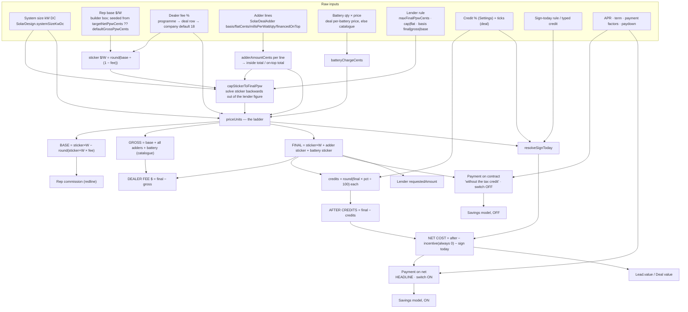

# Solar proposal pricing logic: single source of truth

> **What this is.** A read-only audit of how a solar proposal's money is calculated, written from the code alone. Nothing here changes behaviour. Where the code is ambiguous or contradicts itself, this document says so rather than picking an answer.
>
> **Which code.** `origin/main` at **`ed3b832`** (2026-09-15). Every `file:line` below refers to that commit. The audit was first written at `c0a1a7e` and moved onto `ed3b832` the same day. Citations were carried across with the diff between the two commits, and every rule the diff touched was re-read.
>
> **What changed between the two commits, for pricing:**
> - **On-top adders now carry the dealer fee** (f7b704f). `financedOnTop` only keeps a line outside the lender's price rule.
> - **The battery is always inside the fee.** The per-lender `batteryInsideFee` switch is retired (ea6e55e); its column is kept but read by nothing (2ae782d).
> - **Energy community and domestic content default OFF** on a new deal; the ITC defaults ON.
> - **A signed deal's economics are locked** (04e7be3), apart from a 30-minute super-admin unlock.
> - **`Project.contractValue` is stamped** with the reported version's pre-credit contract.
>
> **Two roles.** §0–§7 and the appendix describe the code **as it is on `ed3b832`**. §8 is the approved plan for changing it, and is updated as each stage lands.
>
> **How it was checked.** Every figure in §4 was produced by running the real pricing functions (`pricePurchase`, `compareOffers`, `financeRowForProduct`, `buildProposalSnapshot`, `resolveSignToday`, …) at `ed3b832` on the sample deal, not by hand. The Stage 0 golden tests pin the same figures (§8.6).
>
> **Scope.** The solar vertical: cash, loan, lease, PPA and storage-only. Roofing is out of scope.

---

## 0. Read this first: units and the vocabulary trap

### Units used by the code

| Kind | Stored as | Example | Evidence |
|---|---|---|---|
| Money | integer **cents** | `6493333` = $64,933.33 | everywhere; e.g. `src/lib/solar-money.ts:391-455` |
| Price per watt | **cents per watt** (Int in the DB; fractional inside breakdowns) | `400` = $4.00/W | `prisma/schema.prisma:4634-4635`; `solar-money.ts:436` |
| Energy rate | **mills per kWh** (1 mill = 0.1¢) | `180` = $0.180/kWh | `solar-money.ts:204`; `schema.prisma:4690` |
| Per-watt adder rate, rep per-watt pay | **mills per watt** | `100` = $0.10/W | `src/lib/solar-adders.ts:182`; `src/lib/solar-pay.ts:476` |
| Payment factor | **millionths** | `5712` = 0.005712 | `src/lib/solar-loan.ts:32,89` |
| Percentages: dealer fee, APR, escalator, credit %, paydown %, lead take | **0–100** (30 means 30%) | `dealerFeePct = 25` | `solar-money.ts:402` (`rawPct / 100`), `:603` (`aprPct / 100 / 12`), `src/lib/solar-credit-ladder.ts:289`, `solar-loan.ts:96`, `solar-pay.ts:326` |
| **Exception:** derate | a **0–1 fraction** | `0.84` | `schema.prisma:3333`; `solar-money.ts:131` |

**No sales tax or use tax exists anywhere.** Searches for sales/use/state tax, tax rate, taxable, VAT, surcharge and similar found nothing in the solar or roofing pricing code. No pricing function reads the address state. The contract price formula has no tax term (`solar-money.ts:425`).

### Business words vs code names (the #1 source of confusion)

| Business word | What it means | Code name(s) | The trap |
|---|---|---|---|
| **Base** | The system alone, before the lender's cut. What the rep prices; what a redline is measured against. | `PurchaseBreakdown.basePriceCents` / `basePpwCents` (`solar-money.ts:283,285`) | The frozen proposal field `financing.basePriceCents` is **not** the base. It is the system **at sticker, fee included** (`src/lib/solar-proposal.ts:1806`). |
| **Sticker** | The customer's $/W for the system, with the dealer fee inside it: `base ÷ (1 − fee)` | `SolarFinance.grossPpwCents` (`schema.prisma:4634-4635`), `PurchaseInput.stickerPpwCents`, snapshot `financing.grossPpwCents`, `CompareRow.grossPpwCents` | Named **"gross"** in the DB and the snapshot, but it **includes the fee** and excludes adders and battery. |
| **Gross** | Base + adders + battery at catalogue price, **before** the fee. "What we keep." | `PurchaseBreakdown.grossPriceCents` / `grossPpwCents` (`solar-money.ts:307,309`) | `CompareRow.netPpwCents` is this figure per watt, but it is called **"net"** (`src/lib/solar-compare.ts:296-297`). |
| **Dealer fee** | The lender's cut: `final − gross` | `PurchaseBreakdown.dealerFeeCents` (`solar-money.ts:312`, computed `:431`) | The schema says "% of **gross**" (`schema.prisma:3355, 4057, 4639`). The arithmetic is a % of **final** (§3.5). |
| **Final / contract** | What the customer signs | `contractPriceCents`, `finalPpwCents` | — |
| **Net cost after credits** | Contract − federal credits − sign-today credit | `CreditLadder.netCostCents`, `CompareRow.netCostAfterCreditsCents`, `Lead.value` | Not a price the customer is invoiced. It is the principal the **headline payment** is calculated on. |

---

## 1. Glossary: one paragraph per number, for a sales rep

**System size (kW DC).** The installed panel wattage, from the roof design (`SolarDesign.systemSizeKwDc`, `schema.prisma:4546`). Every per-watt price is multiplied by `round(kW × 1000)` watts (`solar-money.ts:510`). A storage-only job has no watts, so it is priced **per battery** instead (§3.10).

**Base price ($/W and total).** What the company charges for the system before any lender takes its cut. You type it in the System price card on the proposal builder.
- A new deal opens on the company's *target net $/W* if one is set, otherwise on the *default gross $/W* ($3.50) (`src/app/portal/leads/[id]/solar-proposal/page.tsx:534-536`; see landmine N9).
- On a lender with a price rule (cap or flat), the base you typed is **not** the base you get. It is re-solved backwards from the lender's figure.
- The base is the only price rep commission is measured against.

**Sticker price per watt.** The base with the dealer fee built in: `round(base ÷ (1 − fee%))`, rounded to a whole cent per watt (`solar-money.ts:620-624`).
- This is what is saved on the deal (`SolarFinance.grossPpwCents`).
- It covers the system only; adders and the battery are added separately.
- On cash the sticker equals the base.

**Adders (extra work).** Priced per line (`src/lib/solar-adders.ts:171-191`):
- flat amount
- per unit × count
- per foot × feet
- per watt × system watts (the rate is in mills)
- a custom amount
- a discount (stored positive, subtracted when priced)

Each line is either **inside** the lender's price rule (the normal case) or **financed on top** of it (for example a re-roof on a flat-rate lender, which the lender's cap must not squeeze). **Both kinds carry their share of the dealer fee** (`solar-money.ts:416-420`); the flag only decides which side of the price rule the line sits on. Which one is decided per lender/equipment rule when the line is picked (`src/server/modules/solar/adders.ts:132-140, 219-253`).

**Battery price.** On a deal with panels *and* a battery, the battery is charged for separately: `qty × (the deal's own per-battery price if > 0, else the catalogue price)` (`solar-money.ts:988-1018`). What the customer pays for it (the **battery sticker**) is that price **grossed up by the dealer fee, always** (`solar-money.ts:424`). The per-lender switch `SolarLender.batteryInsideFee` that used to decide this is retired (`schema.prisma:3839`, read by nothing).

On a storage-only deal the battery *is* the system and is not charged a second time (`solar-money.ts:997`).

**Gross price.** Base + all adders (inside and on top) + battery at catalogue price (`solar-money.ts:426`). It is the company's side of the ladder, "what we keep". Divided by watts it is the gross $/W.

**Dealer fee.** The lender's percentage, taken **out of the final price**.
- **Formula:** `final = gross ÷ (1 − fee)`, so a 25% fee means the fee is 25% of what the customer signs (§4 shows exactly 25.0000%).
- **Stored amount:** `final − gross` (`solar-money.ts:431`), so the rows add up to the cent.
- **Where the percentage comes from:** the quoted rate-sheet programme, or the rate typed or stored on the deal, or the company default of 18% (`src/lib/solar-finance-row.ts:145-147`).
- **When it is zero:** always on cash, lease and PPA.
- **Customer visibility:** never shown as its own line on the proposal. It can still leak through an unnamed programme's auto-label (landmine N12).

**Final price / contract price.** What the customer signs: `system sticker + adder sticker + battery sticker` (`solar-money.ts:425`). It is saved on the deal (`SolarFinance.contractPriceCents`) and frozen into every proposal version. **Neither the tax credits nor the sign-today credit ever change it.**

**Final price per watt.** Contract ÷ watts. It includes adders and the battery, so it is higher than the sticker $/W on any deal with extras. The customer's "Price per watt" is this figure rounded for display (`src/components/proposal/solar/index.tsx:403-406`).

**Lender price rule ("Max final $/W").** A per-lender figure (`SolarLender.maxFinalPpwCents`, `schema.prisma:3793`) with two settings.

The **mode** (`finalPpwMode`, `:3802`):
- **cap:** a ceiling. It only lowers a price that would come out above it.
- **flat:** *the* price. It moves the deal up or down to land on it.

The **basis** (`SolarLenderProduct.ppwBasis`, `:4068`) says which rung of the ladder the figure fixes:
- **final:** system + inside adders, fee included.
- **gross:** system + inside adders, fee added on top.
- **base:** system alone, fee and adders on top.

On-top adders and the battery are never squeezed by the rule. The sticker is solved backwards out of the figure (`solar-money.ts:771-873`). Cash is never capped.

**Minimum base $/W (lender floor).** `SolarLender.minBasePpwCents` (`schema.prisma:3819`). If what the company keeps per watt (`sticker × (1 − fee)`, *after* any cap) is below this, proposal generation is **blocked** (`src/lib/solar-validation.ts:542-550`) and a live re-price is refused (`src/server/modules/solar/proposal-reprice-actions.ts:335-340`). It is the only margin rule; the old company-wide $/W band is retired (`schema.prisma:3504-3505`).

**Target net $/W (company setting).** `SolarSettings.targetNetPpwCents` (`schema.prisma:3365`). If set, it does three things:
- A save that sends **no** price derives the sticker from it (`solar-finance-row.ts:157-161`).
- It seeds the builder's base box (`solar-proposal/page.tsx:534-536`).
- It prices the "Pay in full" option (`src/lib/solar-proposal-options.ts:420-430`).

**Federal tax credits.** Three statutory credits, with company-wide percentages (`SolarSettings.creditItcPct / creditEnergyCommunityPct / creditDomesticContentPct`, defaults **30 / 10 / 10**, `schema.prisma:3384-3386`):
- the federal solar tax credit (ITC)
- the energy community bonus
- the domestic content bonus

Each deal ticks which ones it earns (`SolarFinance.claimItc / claimEnergyCommunity / claimDomesticContent`). **The ITC defaults ON; the two bonuses default OFF** (`schema.prisma:4666, 4671-4672`; builder `src/app/portal/leads/[id]/solar-proposal/page.tsx:542-546`). The library fallback `CREDIT_CLAIMS_DEFAULT` still ticks all three (`solar-credit-ladder.ts:187-191`), for a caller that passes no ticks at all.
- **Amount:** each credit = `round(final contract × pct ÷ 100)` (`solar-credit-ladder.ts:289`). The credit is therefore calculated on the fee-inclusive, battery-inclusive contract.
- **Price:** the contract does not drop.
- **Payment:** the headline monthly payment is calculated on what is left after them.

**After tax credits.** Contract − the claimed credits, with the credits capped at the contract (`solar-credit-ladder.ts:297-301`).

**"Incentive for signing today" (derived).** Defined as `after credits − quoted price`, floored at zero (`solar-credit-ladder.ts:305-306`). Every proposal generated now passes the contract as the quoted price (`solar-proposal.ts:1571-1572`), so **this is always $0 and never prints**. It is left over from the removed contract-adjustment feature (landmine D2).

**Sign today credit.** A closing credit, set by one of three lender rules (`SolarLender.signTodayMode`, `schema.prisma:3844`; `src/lib/solar-sign-today.ts:106-161`):
- **none:** the rep types it on the deal (`SolarFinance.signTodayCreditCents`).
- **fixed:** the lender's figure on every deal, not editable.
- **above_cap:** whatever the household nets above a $/W cap, derived.

It is taken **off the net after credits**. It is capped at what is left and at $100,000 (`solar-sign-today.ts:83`; `solar-credit-ladder.ts:322-326`). **Despite the on-screen copy, it lowers the headline monthly payment and the deal value** (landmine N6).

**Net cost after credits.** `after credits − incentive (always 0) − sign-today credit` (`solar-credit-ladder.ts:327`). Three things use it:
- the principal for the headline ("with credits") payment
- the "Your net cost after credits" row on the proposal
- `Lead.value` (the pipeline deal value)

**Amount financed.** Two figures, one per side of the proposal's tax-credit switch:
- **Switch OFF:** `contract − down payment` (`solar-proposal.ts:1535, 1938`).
- **Switch ON:** `net cost after credits − down payment` (`:1996-1998`).

The down payment is effectively always $0 today, because the builder's Save clears it (`src/components/portal/solar-panels.tsx:1442-1447`).

**Monthly payment on the contract ("without the tax credit").** The loan payment on the full contract.
- **Source:** the rate sheet's payment factor if it publishes one, otherwise standard amortisation of APR and term (`solar-loan.ts:134-151`).
- **Where it appears:**
  - under the headline on the builder
  - as the proposal's payment when the switch is OFF
  - on the "Proposal PAR" PDF filed at signing

**Monthly payment with credits (the headline).** The same programme's payment on the *net cost after credits* (`solar-compare.ts:380-395`; `solar-proposal.ts:1664-1666`). It is the big number on the builder's offer cards and quoted strip, and on the customer proposal, which **opens with the switch ON** (`index.tsx:294`).

**Payment factor, paydown, "without paydown" payment.** Some rate sheets publish a factor instead of an APR: `monthly = amount financed × factor` (`solar-loan.ts:85-100`).
- **Two factors:** most publish one *with* a paydown (usually the ITC, due by a set month) and one *without* it (higher).
- **Headline:** the with-paydown figure (`solar-loan.ts:110-112`).
- **Paydown amount:** `amount financed × paydownPct ÷ 100`.

**Lease monthly / PPA rate / escalator.**
- **Lease:** a fixed monthly = `lease rate per kW-month × kW` (`solar-money.ts:1132-1134`), rising by the escalator % each year in the savings model.
- **PPA:** a price per kWh produced (mills), also escalating.

Neither has a system price, a dealer fee, tax credits, a lender cap or a monthly for credits to lower.

**Cash price ("Pay in full" option).** When a financed deal also offers cash, cash is priced at the company's target net $/W if set, otherwise at `sticker × (1 − the quoted fee)`. In other words, the base with no lender fee, plus adders and battery at catalogue price (`solar-proposal-options.ts:228-246, 420-430`).

**Utility bill afterwards.** `grid kWh still bought × today's rate + the utility's meter fee` ($10/mo default), both rising at the utility escalation rate (`solar-proposal.ts:476-497`). The meter fee is only on the after-solar side.

**Savings, lifetime figure, payback year.** A year-by-year model: the utility cost avoided, minus what the system costs that year (loan payments, the cash price in year 1, or lease/PPA payments), plus battery programme money (`solar-proposal.ts:324-589`).
- **Horizon:** the loan term rounded up to whole years, kept between 25 and 40; 25 for everything else (`:299-313`).
- **Model runs:** twice on a purchase deal, once per switch position.

**Battery programme (VPP) money.** Per-battery annual and enrolment payments from an eligible utility programme, × battery count (`src/server/modules/solar/vpp-credits.ts:134-167`). It only feeds the savings model and the battery card. **Never the price or the payment.**

**Deal value (`Lead.value`).** A pipeline figure (`src/lib/solar-deal-value.ts:68-82`):
- **cash and loan:** the net cost after credits, or the contract if the proposal has no credit ladder
- **lease:** the lease monthly
- **PPA:** the per-kWh rate

It is stamped from the reported proposal version (`src/server/modules/solar/deal-value.ts:63-66`). The same call stamps the job's `Project.contractValue` with that version's **pre-credit** contract, as revenue (`solarContractRevenueCents`, `deal-value.ts:80-86`).

**Rep commission.** Worked out at payroll time from the deal's *current* saved finance row (`src/server/modules/payroll/solar-engine.ts:107-146`). The rep's **rates** are frozen at signature (`SolarDealComp`); the **price** is not. Since 04e7be3 a signed deal's row can only be edited inside a 30-minute super-admin unlock (`src/server/modules/solar/signed-lock.ts:63, 96`). The formula depends on the job and lender (`solar-pay.ts:105-203, 435-489`):
- **redline (default):** `max(0, base price − redline $/W × watts)`. Adders and battery are excluded; the base is what survives any lender cap.
- **per watt:** `watts × rate (mills) ÷ 10`.
- **storage jobs:** per-battery redline or a flat amount per battery.

Then two adjustments apply:
- **Company lead take:** on company-provided leads the company keeps a % or a flat amount (`solar-pay.ts:311-349`).
- **Manager override:** a % of the **rep's net commission** (not the contract), $/W, or flat (`solar-pay.ts:389-410`).

**Lender requested amount (submission).** What the lender API is sent (`src/server/modules/solar/lender-submit.ts:991-1016`). It depends on `SolarLender.submissionAmountBasis`:
- **contract_value / customer_obligation:** the proposal's amount financed (switch OFF).
- **after_credits:** that amount minus the credit lines. **The sign-today credit is not subtracted** (landmine L10).

**Sales tax.** None. See §0.

---

## 2. Calculation flow

### 2.1 Diagram



### 2.2 Order of operations, as the code executes it

The order is the same in every pricing path. The saved deal, the builder shelf, generation, the deal page and payroll all call the same functions in this order.

1. **Adder lines → cents.** `adderAmountCents(line, watts)` (`solar-adders.ts:171-191`), summed and split into *inside* and *on top* (`:247-266`). The totals are cached on `SolarFinance.adderTotalCents` / `onTopAdderTotalCents`.
2. **Battery charge.** `batteryChargeCents` (`solar-money.ts:988-1001`) = `qty × perBatteryPriceCents` (`:1011-1018`); 0 on storage-only.
3. **Sticker $/W.** Either typed (the builder converts the base with `grossPpwFromNet`, `solar-panels.tsx:991-992`), derived from the target net, or the company default (`solar-finance-row.ts:157-161`). Rounded to a whole cent.
4. **Lender rule.** `capStickerToFinalPpw` → `capStickerToFinalUnit` (`solar-money.ts:771-904`). Adjusts the sticker; floors (cap) or rounds to nearest (flat) to a whole cent.
5. **The ladder.** `priceUnits` (`solar-money.ts:391-455`): base, adder sticker, battery sticker, contract, gross, fee.
6. **Credit ladder.** `buildCreditLadder` (`solar-credit-ladder.ts:255-346`) on the contract. It includes the sign-today credit from `resolveSignToday` (`solar-sign-today.ts:106-161`), which reads the ladder's sticker figures and the credit rates.
7. **Payments.**
   - **The contract payment:** `programmeMonthlyCents` / `monthlyOn(contract − down)`.
   - **The credited payment:** `monthlyOn(netCost − down)` (`solar-proposal.ts:1608-1666`; `solar-compare.ts:328, 380-395`).
8. **Savings.** `savingsModel` twice, OFF and ON (`solar-proposal.ts:1681-1792`).
9. **Freeze.** `buildProposalSnapshot` writes the option list into `SolarProposal.snapshot` (`solar-proposal.ts:2008-2320`). A self-consistency gate refuses a document whose payments or ladder don't reconcile (`src/server/modules/solar/proposal-generate.ts:68-132, 1089-1090`).
10. **Downstream.**
    - `Lead.value` restamped (`proposal-generate.ts:1219`)
    - payroll re-prices from the live row at each run
    - the lender submission reads the snapshot

---

## 3. Formulas as implemented (with rounding and constants)

`f` below is `dealerFeePct / 100`, forced to 0 when the product is cash or the fee is not strictly between 0 and 100 (`solar-money.ts:401-402`). `W` is `round(kW × 1000)`.

### 3.1 Adders — `src/lib/solar-adders.ts:171-191`

```
qty      = floor(line.qty) if > 0, else 1
perWatt  : amount = round(millsPerWatt × W × qty ÷ 10)          // 0 if W ≤ 0
flat/perUnit/perFoot/custom : amount = +round(flatCents) × qty
discount : amount = −round(flatCents) × qty                     // stored positive
inside   = Σ amount where !financedOnTop      (adderTotals, :256-261)
onTop    = Σ amount where  financedOnTop
```

**Legacy branch.** A deal with no adder lines but a stored total above 0 keeps that stored total (`src/server/modules/solar/adders.ts:474-478`).

### 3.2 Battery charge — `solar-money.ts:988-1018`

```
if systemType == "storage": 0
qty = round(batteryQty); if qty ≤ 0: 0
perBattery = round(SolarFinance.stickerPricePerBatteryCents) if > 0 else max(0, round(catalogue priceCents))
battery = qty × perBattery
```

### 3.3 Sticker $/W

- **From a base** (builder shelf, builder price card): `grossPpwFromNet(base, feePct) = round(base ÷ (1 − feePct/100))`. Null if the base is ≤ 0 or the fee is ≥ 100 (`solar-money.ts:620-624`; used at `solar-compare.ts:232-235`, `solar-panels.tsx:991-992`).
- **At save** (`solar-finance-row.ts:157-161`): `derivedGrossPpw = grossPpwFromNet(targetNet, fee)` **only if** it is a purchase, a target net is set, **and no price was sent**. Otherwise the typed `grossPpwCents`, otherwise `SolarSettings.defaultGrossPpwCents` (350).
- **Base recovered from a sticker:** `basePpwFromSticker = round(sticker × (1 − f))` (`solar-money.ts:645-651`). The builder has an inline copy without the fee guard (`solar-panels.tsx:937`).

### 3.4 Lender price rule — `capStickerToFinalUnit`, `solar-money.ts:771-873`

```
if max is null/≤0 or units ≤ 0: unchanged
adderSticker = round(insideAdders ÷ (1 − f))            // on-top adders & battery NOT included
typedSticker = round(units × sticker)
typedBase    = typedSticker − round(typedSticker × f)
pinned       = max × units
actual = final: typedSticker + adderSticker
         gross: typedBase + insideAdders
         base : typedBase
if mode != flat and actual ≤ pinned: unchanged           // cap only bites downward
system = final: pinned − adderSticker
         gross: pinned − insideAdders
         base : pinned
if system ≤ 0: sticker = 0, adderOverrun = true
exact  = (basis == final ? system : system × 100 ÷ (100 − feePct)) ÷ units
sticker = flat ? round(exact) : floor(exact)             // whole cents per unit
```

**Where it runs:**
- the save (`solar-finance-row.ts:172-188`)
- the builder price card (`src/components/portal/solar/system-price.tsx:300-312`)
- the builder live price (via `priceStoredPurchase`, `solar-money.ts:931-956`)
- the shelf (`solar-compare.ts:258-270`)
- the menu (via `financeRowForProduct`, `solar-proposal-options.ts:300-325`)
- generation (`proposal-generate.ts:461-471`, re-priced and written back at `:487-518`)
- the deal page (`src/app/portal/leads/[id]/page.tsx:626-648`)
- payroll (`solar-engine.ts:122-146`)

### 3.5 The ladder — `priceUnits`, `solar-money.ts:391-455`

```
baseSticker    = units × round(stickerPerUnit)
base           = baseSticker − round(baseSticker × f)
up(x)          = f > 0 ? round(x ÷ (1 − f)) : x
adderSticker   = up(insideAdders + onTopAdders)     // every adder carries the fee (f7b704f)
onTopSticker   = adderSticker − up(insideAdders)    // the on-top share, as a remainder
batterySticker = up(battery)                        // always (switch retired, ea6e55e)
contract       = baseSticker + adderSticker + batterySticker
gross          = base + (insideAdders + onTopAdders) + battery
dealerFee      = contract − gross
per-unit rates = cents ÷ units   (NOT rounded in the breakdown)
margin         = equipmentCost given ? gross − equipmentCost : 0   // no pricing caller passes a cost → always 0
```

- **Is the fee added or backed out?** It is **backed out of the price the customer pays**, never added on top of gross: `final = gross ÷ (1 − f)`. `solar-money.ts:470-473` states this explicitly.
- **On-top adders:** grossed up like every other adder, so the fee applies to them. They differ from inside adders only in the lender price rule (§3.4), which leaves them out.
- **Battery:** always grossed up. With every component grossed up, the fee % is exactly the stated % of the whole contract.

### 3.6 Federal credits — `buildCreditLadder`, `solar-credit-ladder.ts:255-346`

```
contractValue = round(contract);  quoted = round(contract)      // both the contract on every current caller
credit_i      = round(contractValue × pct_i ÷ 100)              // only ticked, pct > 0
creditTotal   = min(contractValue, Σ credit_i)
afterCredits  = contractValue − creditTotal
incentive     = max(0, afterCredits − quoted)                   // → always 0 now
shortfall     = max(0, quoted − afterCredits)                   // → always = creditTotal; read nowhere
signToday     = min(max(0, round(signTodayCredit)), afterCredits − incentive)
netCost       = afterCredits − incentive − signToday
relief        = creditTotal + incentive + signToday
null if contract ≤ 0, or (no credits AND incentive 0 AND signToday 0)
```

- **Validity check:** `ladderReconciles` (`:356-375`); generation refuses to save if it fails (`proposal-generate.ts:82-87`).
- **Built for:** every cash and loan option (`solar-proposal.ts:1569-1579`) and every loan shelf column (`solar-compare.ts:371-379`). Never for lease or PPA.

### 3.7 Sign-today credit — `resolveSignToday`, `solar-sign-today.ts:106-161`

```
fixed     : cents = clamp(fixedCents)                            // not editable
above_cap : if cap null or systemWatts ≤ 0 → 0
            measured = (baseSticker + max(0, batterySticker)) × (1 − claimedCreditRate)   // adders excluded
            cents    = clamp(round(measured) − round(cap × watts))
none      : cents = clamp(typedCents)
clamp(x)  = x ≤ 0 or NaN ? 0 : min(round(x), 100_000_00)
claimedCreditRate = min(1, Σ ticked usable pct ÷ 100)   (solar-credit-ladder.ts:228-240)
```

**Resolved per option or column**, using that option's own lender rule (`solar-compare.ts:352-369`; `solar-proposal.ts:1554-1567`).

### 3.8 Monthly payments

**Amortisation** — `loanPaymentCents`, `solar-money.ts:585-606`:
```
null if term ≤ 0, principal ≤ 0, or APR < 0
APR null or 0 → round(principal ÷ term)
r = APR ÷ 100 ÷ 12;  payment = round(principal × r ÷ (1 − (1 + r)^−term))
```

**Factor** — `factorQuote`, `solar-loan.ts:85-100`:
```
with    = round(amount × factorWithPaydownMicros ÷ 1,000,000)
without = round(amount × factorWithoutPaydownMicros ÷ 1,000,000)
paydown = round(amount × paydownPct ÷ 100)
headline factor payment = with ?? without           (factorMonthlyCents, :110-112)
```

**Precedence, and which functions implement it:**
- **Builder shelf and cards:** `programmeMonthlyCents` (`solar-loan.ts:134-151`). Factor first, then amortisation.
- **Builder quoted strip:** an inline copy of that order (`solar-panels.tsx:1335-1341`) on the contract, plus `programmeMonthlyCents` on the net (`:1354-1355`).
- **Generated proposal:** `monthlyOn` (`solar-proposal.ts:1608-1628`) has three tiers:
  1. `SolarFinance.loanMonthlyPaymentCents`, **scaled** by `principal ÷ contract principal`
  2. factor
  3. amortisation

  Tier 1 is always empty on rows saved since the approval form was removed (`solar-panels.tsx:1442-1447`).

**APR and term source.** The programme's `aprPct` / `termMonths` are copied onto the deal at save (`solar-finance-row.ts:232-233`). Generation reads the **deal row's copy** (`proposal-generate.ts:993, 1001`) but the **live** programme's factors (`:438-459, 570-578`).

**Which payment is the headline.**
- **Builder:** `creditsApplies = netMonthly < contractMonthly`; the headline is `netMonthly` when true (`solar-compare.ts:383-395`; `solar-panels.tsx:1373`).
- **Customer document:** shows `option.creditsApplied.monthlyCents` while the switch is ON (the default), and `option.monthlyCents` while OFF (`solar-proposal.ts:957-962`; `index.tsx:294, 357-360`).

**No buydown, no escalator on loans.** There is no APR buydown calculation; the only related comment says a 0% APR is what a high dealer fee buys (`solar-validation.ts:636-642`). Escalators exist only on lease and PPA (`solar-money.ts:1179`; `solar-proposal.ts:535-541`).

### 3.9 What the frozen proposal holds per option — `priceOption`, `solar-proposal.ts:1794-2006`

| Snapshot field | Formula | Line |
|---|---|---|
| `contractPriceCents` | ladder `contractPriceCents` | 1797 |
| `grossPpwCents` | the **input sticker** (system only, fee in); null on storage | 1800 |
| `basePriceCents` | ladder **`baseStickerCents`** (system at sticker) | 1806 |
| `adderTotalCents` | ladder **`adderStickerCents`** (every adder, grossed up); null if 0 | 1814-1815 |
| `adders[].amountCents` | `apportionCents(adderSticker, catalogue amounts)` across **every** line, on-top lines included (largest remainder) | 1840-1859; `solar-money.ts:550-565` |
| `batteryPriceCents` | ladder **`batteryStickerCents`** | 1876 |
| `finalPpwCents` | `round(contract ÷ W)` | 1885-1890 |
| `loanMonthlyPaymentCents` | `monthlyOn(contract − down)` | 1651, 1902 |
| `loanMonthlyWithoutPaydownCents`, `loanPaydownCents` | `factorQuote` on **contract − down** | 1581-1584, 1916-1917 |
| `financedAmountCents` | `contract − down` | 1535, 1938 |
| `creditLadder` | §3.6 | 1569-1579, 1947 |
| `creditsApplied.monthlyCents` | `monthlyOn(netCost − down)` (cash: null) | 1664-1666, 1984-1989 |
| `creditsApplied.totalCents` | `ladder.quotedPriceCents` (= contract) | 1992 |
| `creditsApplied.financedAmountCents` | `netCost − down` | 1996-1998 |
| `monthlyCents` (menu) | loan → contract payment; lease → monthly; PPA → `round(year1 solar payment ÷ 12)`; cash → null | 1958-1967 |
| `postSolarMonthlyCents` | `round(year1 (residual grid + meter fee) ÷ 12)` | 2005 |
| `itcEstimateCents`, `itcPct`, `stateIncentiveNote` | always null (legacy) | 1950-1952 |

### 3.10 Storage-only deals

The same ladder over batteries:
- **Pricing:** `priceStoragePurchase` / `priceStorageStored` (`solar-money.ts:1032-1086`), converted to the per-watt shape by `purchaseFromUnits` with every $/W set to 0 (`:1103-1125`).
- **Sticker:** `SolarFinance.stickerPricePerBatteryCents`.
- **Lender rule:** the per-battery twins `maxFinalPricePerBatteryCents` / `finalBatteryPriceMode` / `batteryPriceBasis`.
- **Validation:** lease and PPA are blocked; the programme must be `financesStorageOnly` (`solar-validation.ts:490-527`).
- **Menu:** alternatives re-gross the deal's own per-battery base with each programme's fee (`solar-proposal-options.ts:218-220, 337-348`).

### 3.11 Lease and PPA

- **Lease monthly:** `leaseMonthlyCents = round(ratePerKwMonth × kW)` (`solar-money.ts:1132-1134`), stored on the deal at save (`solar-finance-row.ts:220-225`).
- **Totals:** `priceThirdParty` (`solar-money.ts:1172-1200`):
  ```
  lease: yearCost = monthly × 12 × (1 + esc%)^(year−1)
  PPA:   yearCost = kWh_year × mills × (1 + esc%)^(year−1) ÷ 10
  ```
- **Term:** the programme's term; the proposal falls back to 25 years if none (`solar-proposal.ts:1511`).
- **Validation:** term 5–30 years, escalator 0–5%, PPA rate ≤ 400 mills (`solar-validation.ts:670-681`).

### 3.12 Savings model, per year — `solar-proposal.ts:476-577`

```
production_y   = year1Kwh × (1 − degradation%)^(y−1)
rate_y         = currentRateMills × (1 + utilityEscalation%)^(y−1)
utilityCost_y  = round(usage × rate_y ÷ 10)
residualGrid_y = round(max(0, usage − production_y) × rate_y ÷ 10)
meterFee_y     = round(meterFeeCents × 12 × (1 + utilityEscalation%)^(y−1))
solarPayment_y = loan: payment × monthsPaid_y (+ down in year 1)
                 cash (or loan with no schedule): contract in year 1, 0 after
                 lease/PPA: see 3.11 within term
vpp_y          = Σ annual (+ Σ upfront in year 1)
relief_y       = year 1 only, cash with switch ON: ladder.reliefCents
solarCost_y    = residualGrid_y + meterFee_y + solarPayment_y − vpp_y − relief_y
cumulative    += utilityCost_y − solarCost_y;  payback = first year cumulative > 0
```

- **Year-1 production:** `round(kW × kwhPerKwYear × derate × TSRF% × 0.95)` (`solar-money.ts:123-133`), or the per-array or PVWatts equivalents.
- **Current rate:** `round(bill × 12 ÷ usage × 10)` mills unless a rate is typed (`solar-money.ts:198-205`; `resolveUtilityRateMills`, `src/lib/solar-energy.ts:93`).

### 3.13 Rounding summary

| Where | What is rounded | To | Before/after |
|---|---|---|---|
| `grossPpwFromNet` (`solar-money.ts:623`) | sticker from base | whole ¢/W | **before** × watts, so base × watts ≠ recovered base (§4.3) |
| cap solve (`:862-863`) | solved sticker | whole ¢/W: **floor** on cap, **nearest** on flat | before × watts, so the contract lands up to ~0.5–1 ¢/W off the lender figure |
| `priceUnits` (`:406-407, 403`) | `baseSticker × f`; each `÷ (1 − f)` gross-up | ¢ | per component; the fee is a remainder, so gross + fee = final exactly |
| adder lines (`solar-proposal.ts:1843`) | grossed-up lines | ¢, largest remainder | lines sum exactly to the adder sticker |
| credits (`solar-credit-ladder.ts:289`) | each credit | ¢ | per credit, before summing |
| loan payment (`solar-money.ts:601, 605`) | payment | ¢ | final |
| factor payment (`solar-loan.ts:89`) | payment | ¢ | final |
| `finalPpwCents` snapshot (`solar-proposal.ts:1888`) | contract ÷ W | whole ¢ | display field, not used on the document |
| customer "Price per watt" (`index.tsx:405`) | total ÷ W | 0.01 ¢, then printed `toFixed(2)` dollars | display |
| Pay chapter headline (`pay.tsx:138`) | monthly | **whole dollars** | display; the battery card on the same page prints cents (`battery-credit.tsx:119`) |

### 3.14 Hard-coded constants

| Constant | Value | Where | Meaning |
|---|---|---|---|
| `PRODUCTION_MARGIN_PCT` | 5 | `solar-money.ts:84` | every kWh quoted 5% under the model |
| `SOLAR_ASSUMPTION_DEFAULTS` | derate 0.84, degradation 0.5%, utility escalation 3.5%, 1450 kWh/kW/yr, meter fee $10/mo, default sticker $3.50/W, default fee 18%, offset 0–150% | `src/server/modules/solar/settings.ts:18-30` | company with no settings row |
| `CREDIT_RATES_DEFAULT` | 30 / 10 / 10 | `solar-credit-ladder.ts:194-198`; schema `:3384-3386` | statute defaults |
| `CREDIT_CLAIMS_DEFAULT` | all true | `solar-credit-ladder.ts:187-191` | library fallback for a caller that passes no ticks. The deal row (schema `:4666, 4671-4672`) and the builder (`solar-proposal/page.tsx:542-546`) default to **ITC only**, so a new deal claims 30% |
| `SIGN_TODAY_MAX_CENTS` | $100,000 (`100_000_00` cents) | `solar-sign-today.ts:83` (copied in `credit-claims.tsx`) | clamp |
| `MAX_PAYMENT_OPTIONS` | 6 | `solar-proposal-options.ts:105` | menu size, one per lender |
| savings horizon | 25 min / 40 max | `solar-proposal.ts:296-297` | years modelled |
| third-party term fallback | 25 | `solar-proposal.ts:1511` | lease/PPA with no term |
| credit step-down month default | 12 | `solar-proposal.ts:474` | unused by current callers (they pass `afterCreditMonthlyCents: null`) |
| `monthlyReconciles` | floor 0.9×, ceiling 1.35× + $1 | `solar-loan.ts:207, 218` | generation sanity gate |
| dealer-fee typo guard | ≥ 50% blocks, unless from a rate sheet | `solar-validation.ts:570` | |
| fee input | 0–100; APR ≤ 50; lease escalator ≤ 10 (form) / 5 (validation) | `src/server/modules/solar/actions.ts:719, 724, 726`; `solar-validation.ts:673` | |
| `PRICING_CALCULATION_VERSION` | 6 | `solar-proposal.ts:1315` | stamped on snapshots |
| default battery count | 2 | `settings.ts:118`; schema `:3420` | first battery pick |

---

## 4. Worked example: one deal through every formula

All figures below come from running the functions at `ed3b832`. The Stage 0 golden tests pin them (§8.6).

### 4.1 Inputs (illustrative)

| Input | Value |
|---|---|
| System | 10.0 kW DC (W = 10,000) |
| Product | Loan, 25 years (300 months), 6.99% APR, **no payment factor** |
| Dealer fee | 25% (programme) |
| Lender rule | none (`maxFinalPpwCents` null); sign-today mode `none`, nothing typed |
| Rep base | $3.00/W |
| Adders (inside) | Main panel upgrade $2,700 flat; Steep roof $0.10/W (100 mills) |
| Battery | 1 × $15,000 catalogue |
| Credits | ITC 30% ticked; energy community and domestic content **unticked** (also the default for a new deal) |
| Home | 12,000 kWh/yr, average bill $180/mo; company defaults for production |

### 4.2 Step by step

| # | Step | Formula | Result |
|---|---|---|---|
| 1 | Steep-roof adder | round(100 × 10,000 × 1 ÷ 10) | **$1,000.00** |
| 2 | Inside adders | 2,700 + 1,000 | **$3,700.00**; on top $0 |
| 3 | Sticker $/W | round(300 ÷ 0.75) | **400¢ = $4.00/W** |
| 4 | Lender rule | no max | sticker unchanged |
| 5 | System at sticker | 10,000 × 400 | **$40,000.00** (proposal "System price") |
| 6 | Base | 4,000,000 − round(4,000,000 × 0.25) | **$30,000.00** ($3.00/W) |
| 7 | Adder sticker | round(370,000 ÷ 0.75) + 0 | **$4,933.33** |
| 8 | Battery sticker | round(1,500,000 ÷ 0.75) | **$20,000.00** |
| 9 | **Final / contract** | 40,000.00 + 4,933.33 + 20,000.00 | **$64,933.33** |
| 10 | Gross | 30,000 + 3,700 + 15,000 | **$48,700.00** ($4.87/W; the shelf's `netPpwCents` = 487) |
| 11 | **Dealer fee** | 64,933.33 − 48,700.00 | **$16,233.33** = 25.0000% of final |
| 12 | Final $/W | 6,493,333 ÷ 10,000 | 649.33¢ → breakdown 649.3333, snapshot 649, customer sees **$6.49/W** |
| 13 | Adder lines on the proposal | apportion 493,333 by 2,700 : 1,000 | Main panel upgrade **$3,600.00**, Steep roof **$1,333.33** |
| 14 | ITC | round(6,493,333 × 30 ÷ 100) | **$19,480.00** |
| 15 | After credits | 64,933.33 − 19,480.00 | **$45,453.33** |
| 16 | Incentive for signing today | max(0, 45,453.33 − 64,933.33) | **$0** (row dropped); `shortfallCents` = $19,480.00, unused |
| 17 | Sign today | mode none, typed 0 | **$0** |
| 18 | **Net cost after credits** | 45,453.33 − 0 − 0 | **$45,453.33** (= `Lead.value` if this version is reported) |
| 19 | Payment on contract (OFF / "without the tax credit") | amortise $64,933.33 @ 6.99%, 300 mo | **$458.52/mo**; amount financed $64,933.33 |
| 20 | **Headline payment (ON)** | amortise $45,453.33 @ 6.99%, 300 mo | **$320.96/mo**; amount financed $45,453.33 |
| 21 | Shelf total paid | 320.96 × 300 (credits applied, so no paydown added) | $96,288.00 |
| 22 | "Pay in full" option | sticker × (1 − fee) = $3.00/W; fee 0; battery and adders at catalogue | contract **$48,700.00**; ITC $14,610; net $34,090.00 |
| 23 | Year-1 production | round(10 × 1450 × 0.84 × 0.95) | 11,571 kWh (offset 96.4%) |
| 24 | Utility rate | round(18,000 × 12 ÷ 12,000 × 10) | 180 mills = $0.180/kWh |
| 25 | Year-1 utility cost avoided side | 12,000 × 180 ÷ 10 | $2,160.00 |
| 26 | Year-1 bill afterwards | residual 429 kWh → $77.22, + meter fee $120.00 | $197.22/yr → **$16.44/mo** |
| 27 | Year-1 solar payment | OFF 458.52 × 12 / ON 320.96 × 12 | $5,502.24 / $3,851.52 |
| 28 | 25-year result | model | OFF: paid $137,556.00, net −$66,467.57. ON: paid $96,288.00, net −$25,199.57. No payback in either |

Step 28 is negative because this illustrative payment is larger than the $180 bill. The savings model is not a pricing input.

**The "battery outside the fee" variant no longer exists.** The switch was retired (ea6e55e), so the figures above are the only answer for this deal.

### 4.3 The same deal on a lender price rule

A $5.50/W lender, 30% fee, 10 kW, $2,700 adder inside, $7,000 roof **on top** (outside the price rule), no battery. Since f7b704f the roof is grossed up by the fee like every adder, to $10,000, so every contract below is **$3,000 higher than at `c0a1a7e`**. The stickers are unchanged, because the rule never saw the roof.

| Mode | Basis | Rep's sticker $4.00 → | Rep's sticker $10.00 → |
|---|---|---|---|
| cap | final | unchanged: contract $53,857.14 ($5.39/W) | sticker **511¢**: contract **$64,957.14** |
| cap | gross | unchanged: $53,857.14 | sticker 747¢: $88,557.14 |
| cap | base | unchanged: $53,857.14 | sticker 785¢: $92,357.14 |
| flat | final | sticker 511¢: **$64,957.14** | 511¢: $64,957.14 |
| flat | gross | 747¢: $88,557.14 (base + adder = $54,990) | 747¢: $88,557.14 |
| flat | base | 786¢: $92,457.14 (base $55,020) | 786¢: $92,457.14 |

**Final / flat.** The system + inside adder lands on $54,957.14, $42.86 under $55,000. That gap is whole-cent sticker granularity. The roof then rides above the figure, grossed up to $10,000.

### 4.4 Sign-today "above cap" on the §4.2 deal

- **What is measured:** (system sticker $40,000 + battery sticker $20,000) × (1 − 0.30) = **$42,000** ($4.20/W). Adders are excluded.
- **Cap $6.00/W:** $42,000 − $60,000 < 0, so **$0**.
- **Cap $2.50/W:** $42,000 − $25,000 = **$17,000**. The net cost drops to $28,453.33 and **the headline payment drops from $320.96 to $200.92/mo**. The lender's `after_credits` amount would still be $45,453.33.
- **Cap $2.00/W:** $22,000.

### 4.5 Base round-trip drift (whole-cent stickers)

| Typed base | Fee | Size | Sticker | Base the ladder keeps | Drift |
|---|---|---|---|---|---|
| $2.87/W | 18% | 10 kW | 350¢ | $28,700.00 | $0.00 |
| $1.93/W | 65% | 11 kW | 551¢ | $21,213.50 | **−$16.50** |
| $3.01/W | 18% | 12.345 kW | 367¢ | $37,151.04 | −$7.41 |

---

## 5. Conditional rules

| Rule | When it applies | What it is applied to | Code |
|---|---|---|---|
| **No dealer fee** | product = cash; also lease/PPA (fee stored as 0) | the whole ladder (`f = 0`) | `solar-money.ts:401`; `solar-finance-row.ts:145-147`; block if a cash row carries one: `solar-validation.ts:552-554` |
| Fee stands down | fee ≤ 0 or ≥ 100 | treated as 0 | `solar-money.ts:402` |
| **Fee source** | loan | programme `dealerFeePct` → deal's typed/stored % → `SolarSettings.defaultDealerFeePct` (18). Builder: programme → form → 0 (`solar-panels.tsx:988-990`). **Generation: the deal row's stored %** (`proposal-generate.ts:467, 973`) | `solar-finance-row.ts:145-147` |
| Fee varies by | lender **programme** (each has its own term, APR, fee); **not** by state | — | `schema.prisma:4055-4058` |
| **Fee on the system** | loan | built into the sticker (backed out: base = sticker × (1 − f)) | `solar-money.ts:406-407` |
| **Fee on adders** | every adder, inside or outside the price rule (since f7b704f) | grossed up `÷ (1 − f)` together; the on-top share is the remainder | `solar-money.ts:416, 420` |
| Adder outside the price rule | `SolarDealAdder.financedOnTop` = true (copied at pick time from `SolarLenderAdderRule`, else catalogue; restamped on lender change) | still grossed up by the fee; excluded from the lender rule only | `solar-money.ts:416-420`; `adders.ts:132-140, 168-216` |
| **Fee on battery** | always, whenever a battery is charged (the `batteryInsideFee` switch is retired, ea6e55e) | battery grossed up `÷ (1 − f)` | `solar-money.ts:424` |
| Battery charged at all | design has a battery, qty > 0, system type ≠ storage | deal per-battery price, else catalogue | `solar-money.ts:988-1018` |
| **Lender cap** | loan; lender `maxFinalPpwCents` > 0; mode `cap`; the deal's figure on the chosen basis is above it | the system sticker, solved down | `solar-money.ts:819-828` |
| **Lender flat** | as above, mode `flat` | the system sticker, solved to land on it, up or down | `solar-money.ts:828, 863` |
| Basis final / gross / base | per programme `ppwBasis` (default `final`); no programme → `final` | which rung the figure pins | `solar-money.ts:819-841` |
| Adder overrun | inside adders alone exceed the figure | sticker 0, contract above the figure, flagged | `solar-money.ts:842-844` |
| **Lender floor** | lender `minBasePpwCents` > 0 and kept base (after cap) < floor | **blocks generation**; refuses re-price; warning on the price card | `solar-validation.ts:542-550`; `proposal-reprice-actions.ts:335-340`; `system-price.tsx:423-429` |
| Fee typo guard | fee ≥ 50% **and** not quoted from a rate sheet | blocks generation | `solar-validation.ts:570-577` |
| **Target net** | `SolarSettings.targetNetPpwCents` set **and** the save sent no price | derives the sticker | `solar-finance-row.ts:157-161` |
| Default sticker | no price sent, no target | `defaultGrossPpwCents` (350) | `solar-finance-row.ts:161` |
| **Federal credits** | every cash/loan option (not lease/PPA); each credit only if ticked on the deal and % > 0 | `round(final contract × pct ÷ 100)`, total capped at the contract | `solar-proposal.ts:1569-1579`; `solar-credit-ladder.ts:269-301` |
| Credits change the price? | never | contract and "Total price" unchanged | `solar-proposal.ts:1571-1572, 1992` |
| **Credits drive the headline payment** | builder: when the credited payment < the contract payment; document: switch ON | payment principal = net cost − down | `solar-compare.ts:383-395`; `solar-proposal.ts:1664-1666` |
| Credit switch default | customer link and preview: **ON**; print route: OFF unless `?credits=1`; at signing both are filed ("Proposal" = ON, "Proposal PAR" = OFF) | whole document scenario | `index.tsx:294`; `src/app/proposal/print/[sig]/page.tsx:56`; `src/server/modules/solar/proposal-file-copy.ts:170-171` |
| Credit ladder printed | purchase option and switch ON (or a document with no switch) | cost chapter block | `src/components/proposal/solar/chapters/cost.tsx:156` |
| Cash with credits ON | cash option | year-1 lump relief in savings (no payment to lower) | `solar-proposal.ts:1787-1790` |
| **Sign today: none** | lender mode `none` (or cash / no lender) | the rep's typed figure | `solar-sign-today.ts:160` |
| Sign today: fixed | lender mode `fixed` | the lender's figure, read-only | `solar-sign-today.ts:130-138` |
| Sign today: above cap | lender mode `above_cap`, cap set, watts > 0 | (system sticker + battery sticker) × (1 − claimed credit %) − cap × W | `solar-sign-today.ts:140-159` |
| Sign today is per column | builder shelf and proposal menu | each programme uses **its own** lender's rule | `solar-compare.ts:352-369`; `solar-proposal-options.ts:359-363` |
| **Payment source** | loan | approval (scaled, legacy) → factor (with paydown, else without) → amortise APR/term; 0% APR → P ÷ n | `solar-proposal.ts:1608-1628`; `solar-loan.ts:134-151` |
| Paydown pair printed | factor programme **and switch OFF** | on the contract principal | `pay.tsx:229-251`; `solar-proposal.ts:1581-1584` |
| Loan payment blocked | loan with no factor **and** no APR+term (and no stored approval) | blocks generation | `solar-validation.ts:625-635` |
| **Savings horizon** | loan with term | ceil(months ÷ 12), clamped 25–40; else 25 | `solar-proposal.ts:299-313` |
| **Storage-only** | `systemType = storage` | per-battery ladder; lease/PPA blocked; only `financesStorageOnly` programmes; `above_cap` sign-today = 0 | `solar-money.ts:1032-1125`; `solar-validation.ts:490-527`; `solar-proposal-options.ts:265-269`; `solar-sign-today.ts:142-147` |
| Lease / PPA | product lease/ppa | no sticker/fee/credits/cap; lease monthly = rate × kW; escalator compounding | `solar-finance-row.ts:217-230`; `solar-money.ts:1172-1200` |
| **Escalator** | lease/PPA only; utility escalation on the utility side | `(1 + pct/100)^(year−1)` | `solar-proposal.ts:480, 493, 535` |
| **Rep pay basis** | storage → rep's battery plan; lease/PPA → per watt; else lender `repPayMode` (default redline) | redline: base price only | `solar-pay.ts:105-203, 435-489` |
| Company lead take | `SolarDealComp.companyProvidedLead` = true and mode ≠ none | % (0–100) or flat off the rep's gross commission | `solar-pay.ts:311-349`; `solar-engine.ts:502-508` |
| Manager override | override row exists | % of the **rep's net** commission, or $/W, or flat | `solar-pay.ts:389-410` |
| **Deal value** | reported proposal exists | cash/loan: net after credits (else contract); lease: monthly; PPA: rate | `solar-deal-value.ts:68-82, 140-149`; `deal-value.ts:63-66` |
| **Revenue** | reported proposal exists and the deal has a solar job | `Project.contractValue` = the **pre-credit** contract (`solarContractRevenueCents`) | `deal-value.ts:80-86`; `solar-deal-value.ts:181` |
| **Signed lock** | any version of the deal is signed | edits to price, system, adders and financing are refused; a super admin may reopen the deal for 30 minutes with a recorded reason | `src/server/modules/solar/signed-lock.ts:63, 96-166`; called from `actions.ts`, `adder-actions.ts`, `equipment-actions.ts` |
| **Lender requested amount** | lender submission | `contract_value` / `customer_obligation`: amount financed (switch OFF); `after_credits`: that − Σ credit lines; no snapshot → live contract − down | `lender-submit.ts:764-776, 991-1016` |
| Meter fee | every savings model | after-solar side only, escalated | `solar-proposal.ts:492-497` |
| VPP money | provider eligible for this battery and financing | savings and battery card only | `vpp-credits.ts:134-167` |
| **Sales / use tax** | never | — | §0 |

---

## 6. Landmines (Step 4 findings)

### 6.1 Same figure, different formulas

- **L1. Two different "without paydown" payments on one builder screen.**
  - Quoted strip: calculated on the **net after credits** (`solar-panels.tsx:1367-1370`).
  - Comparison column "If the paydown is skipped": calculated on the **contract** (`solar-compare.ts:318, 412`).
  - Proposal's OFF-only paydown pair: also calculated on the contract (`solar-proposal.ts:1581-1584`).
- **L2. Builder price-card "Gross" and "Dealer fee" rungs use inline arithmetic.**
  - Gross = the *typed* base × watts + adders + battery (`system-price.tsx:244, 352, 364-366`); fee = contract − that (`:385-388`).
  - The ladder instead uses the base recovered from the rounded sticker (`solar-money.ts:406-407`).
  - Example: $3.00 base, 28% fee, 10 kW. The card shows gross $30,000 / fee $11,700; the ladder has $30,024 / $11,676.
  - The storage card (`system-price.tsx:1150-1154`) and the shelf (`solar-compare.ts:296-297`) use the ladder.
- **L3. The monthly-payment precedence is written three times.**
  - `programmeMonthlyCents` (`solar-loan.ts:134-151`)
  - the builder's inline copy, without the principal guard (`solar-panels.tsx:1335-1341`)
  - the proposal's `monthlyOn`, with an extra scaled-approval tier (`solar-proposal.ts:1608-1628`)
- **L4. "Base from sticker" is written three times.**
  - `basePpwFromSticker` (`solar-money.ts:645-651`)
  - the builder's inline copy without the fee guard (`solar-panels.tsx:937`)
  - `cashPpwCents` (`solar-proposal-options.ts:427-429`)
- **L5. Price per watt has four versions.**
  - the breakdown, unrounded (`solar-money.ts:450`)
  - snapshot `finalPpwCents`, whole cents, not rendered (`solar-proposal.ts:1888`)
  - `quotedPpwCents`, whole cents (`:1010-1014`)
  - the customer page, 0.01 ¢ (`index.tsx:403-406`)
- **L6. The Settings → Lenders worked examples use their own arithmetic, not the pricing functions.**
  - `quotedOn` grosses up the total rather than per watt (`src/components/portal/solar-lender/detail.tsx:91-95`).
  - The sign-today example nets the lender's $/W with **all three** credits, **no battery** and **no clamp** (`detail.tsx:269-275, 986-991`). The engine measures system + battery sticker with the deal's own ticks (`solar-sign-today.ts:149-156`).
  - On gross/base-basis programmes the example understates what is handed back.
- **L7. "Today's price" has three different recipes.**
  - **Builder:** the programme's *live* fee, live adder lines, the cap from the *quoted programme's* lender (`solar-panels.tsx:988-992, 965-976`).
  - **Deal page:** the *stored* fee and adder totals, the cap from the *design* lender even when no programme is quoted (`leads/[id]/page.tsx:626-648`).
  - **Generation:** the stored fee, the design lender's cap, but the basis from the quoted programme (`proposal-generate.ts:461-502`).
- **L8. The storage price card guesses the product from the fee** (`product: fee > 0 ? "loan" : "cash"`, `system-price.tsx:1089`). Everything else uses the real product.
- **L9. The deal page runs storage-only deals down the per-watt path.** `workingPrice` has no storage branch (`leads/[id]/page.tsx:626-648`), and storage rows store `grossPpwCents = 0` (`deal-money.ts:166`). The working ladder therefore prices only adders. What the page renders from this was not determined.
- **L10. The lender's `after_credits` amount ignores the sign-today credit.**
  - Lender side: amount financed − Σ credit lines, with no clamp (`lender-submit.ts:1000-1007`).
  - Proposal side: the credited amount financed is `netCost − down`, which subtracts the sign-today credit (`solar-proposal.ts:1996-1998`).
  - §4.4: the proposal shows $28,453.33 financed; the lender would be asked for $45,453.33.
- **L11. "contract_value" sent to the lender is actually the amount financed** (contract − down payment, `lender-submit.ts:992`). Identical today only because the down payment is always cleared.
- **L12. Payroll prices from the live deal row at each payroll run, not from the signed or approved proposal** (`solar-engine.ts:107-146`). It also uses the stored fee and the design lender's cap. If the deal is edited after signing, commission follows the edit. Since 04e7be3 that needs a super-admin unlock (§5, Signed lock); the rep's rates, not the price, are frozen at signature.
  - **Stage 1:** the watts, base price and battery count are now frozen at signature too, and payroll reads that copy once it exists (§8.9).
- **L13. The credit total on the cost chapter is summed again without the cap** (`cost.tsx:138`), instead of reading the frozen `creditTotalCents` (`solar-credit-ladder.ts:297-300`). They differ only if the percentages add up past 100.
- **L14. The same payment is printed at two precisions on one page.** The Pay chapter headline rounds to whole dollars (`pay.tsx:138`); the battery card prints cents (`battery-credit.tsx:119`).
- **L15. The payment menu does not price other programmes from the deal's base.** Each alternative loan is priced by `financeRowForProduct` with **no sticker** (`solar-proposal-options.ts:300-325`). It therefore takes the company's target net grossed up by that programme's fee or, with no target net, the $3.50/W default **sticker** (§5, Target net / Default sticker). The quoted option uses the rep's own sticker.
  - On the golden capped-partner deal, the quoted programme sells the system at $5.50/W and the menu's other loan at $3.50/W (pinned in Stage 0).
  - Production has a target net of $2.50/W, so its menu shows every other lender at a $2.50/W base, whatever the rep sold.
  - **Fixed in Stage 1** (§8.9): every alternative is the quoted sticker's base re-grossed by its own fee, and cash is that base.
- **L16. Two server paths store different per-battery stickers on a capped storage deal.** `recomputeDealMoney` keeps the typed sticker (2,000,000¢ on the golden storage deal) beside a contract priced at the capped one. Generation writes the capped sticker (2,400,000¢) back. The contract agrees; the stored sticker depends on which ran last (pinned in Stage 0).
  - **Cause (found in Stage 1, not fixed).** `dealMoneyColumns` prices the storage contract from the capped sticker (`priceStorageStored`) but returns the sticker it was handed (`deal-money.ts:135`, `:160`). Generation writes the capped sticker back (`proposal-generate.ts:557`). The per-watt path has no such split: `financeRowForProduct` returns the capped sticker and the save stores it.
  - After one generation the capped sticker becomes the stored input, so the deal reads $24,000 per battery where the rep typed $20,000. Pinned explicitly in `pricing-stage1.itest.ts`.
- **L17. The lender submission refuses the golden storage-only document**: "no annual production" and "no saving on the electricity bill" (`lender-submit.ts` preflight). A storage-only deal has no array, so this may refuse every storage-only application.
  - **Checked against production in Stage 1:** there are **no storage-only designs**, so no real storage-only deal has been submitted or refused.
  - The refusal is structural. `preflightAmosSubmission` also requires a panel, a panel quantity and an inverter, and `savingsProblems` requires production above zero, so any storage-only deal fails on at least three problems before anything is sent.
  - The one storage programme, Amos 20 Year Battery, belongs to a lender whose API product slug is `solar-30-year-cpe`. A storage deal that passed preflight would be submitted against the 30-year solar product.

### 6.2 Dead, never displayed, or always constant

- **D1. `CreditLadder.shortfallCents`.** Computed (`solar-credit-ladder.ts:307`) and read nowhere in `src/`. On every current deal it equals the full credit total.
- **D2. "Incentive for signing today" is always $0.**
  - Every caller passes the contract as both the contract value and the quoted price (`solar-proposal.ts:1571-1572`; `solar-compare.ts:373-374`).
  - As a result, the Settings label `creditIncentiveLabel` has no visible effect, and the last clause of `ladderReconciles` can never be tested.
- **D3. `SolarFinance.itcEstimateCents` is always written as 0** (`solar-finance-row.ts:213-215`). The snapshot's `itcEstimateCents`, `itcPct` and `stateIncentiveNote` are always null (`solar-proposal.ts:1950-1952`); `netMonthlyPaymentCents` is legacy (`:849-855`).
- **D4. `SolarFinance.loanMonthlyPaymentCents` and `downPaymentCents` are cleared by every builder Save** (`solar-panels.tsx:1442-1447`), yet still read in three places:
  - as the **top** payment source at generation (`solar-proposal.ts:1613-1616`)
  - as the deal page's only loan "Monthly payment" row, so **loan deals show no monthly payment on the deal page** (`src/components/portal/solar/financing-terms.tsx:105-107`)
  - to set `loanPaymentApproved`, which is therefore always false, so the proposal always says "Estimated monthly payment" (`pay.tsx:130-132`)
- **D5. `marginCents` is always 0 in pricing.** No pricing caller passes `equipmentCostCents` (`solar-compare.ts:274-282`, `solar-finance-row.ts:192-200`, `solar-proposal.ts:1494-1502`, `proposal-generate.ts:494-502`). `solarCommissionCents` (`solar-money.ts:1223-1261`) is only called from a test.
- **D6. Payroll works out the contract price and never uses it** (`solar-engine.ts:168`; overrides use rep net, `solar-pay.ts:405-408`). The battery input to payroll therefore affects no pay. Since Stage 1 it has one use: checking the signed document when the commission measure is frozen (`commission-pricing.ts`).
- **D7. Retired settings columns.** `SolarSettings.minPpwCents` / `maxPpwCents` (`schema.prisma:3504-3505`), `targetOffsetPct` (`:3350`), `federalItcPct` (`:3372`).
- **D8. `SolarLender.batteryPayMode` does not decide pay.** `resolveSolarPay` never reads it (`solar-pay.ts:105-161`), but it is still editable in Settings.
- **D9. Frozen but never shown.** `CreditLadder.reliefCents` and `creditTotalCents`; `SavingsModel.solarPaidCents`, `totalSavingsCents` (same as `netSavingsCents`, `solar-proposal.ts:583-584`) and `creditReliefTotalCents`.

### 6.3 Names or copy that contradict behaviour

- **N1. `grossPpwCents` means two different things.** On `SolarFinance`, the snapshot, the finance input and `CompareRow` it is the **sticker** (fee in, system only). On `PurchaseBreakdown` it is the **pre-fee gross including adders and battery** (`schema.prisma:4634-4635` vs `solar-money.ts:308-309`).
- **N2. Snapshot `basePriceCents` is the system at sticker, not the base** (`solar-proposal.ts:1806`).
- **N3. Snapshot `adderTotalCents` and `batteryPriceCents` are sticker amounts, not catalogue** (`solar-proposal.ts:1814-1815, 1876`). `SolarFinance.adderTotalCents` is catalogue price and inside-only.
- **N4. `CompareRow.netPpwCents` is gross ÷ watts** (`solar-compare.ts:296-297`).
- **N5. The fee is described as "% of gross" but calculated as % of final.**
  - "% of gross": `schema.prisma:3355, 4057, 4639`, and the `grossPpwFromNet` docblock (`solar-money.ts:611`).
  - "% of final": `pricePurchase` says so (`:470`), and that is the arithmetic.
- **N6. The sign-today credit is described as "display only", but it changes the headline payment and the deal value.**
  - **The copy says:**
    - "DISPLAY ONLY … The contract price, the monthly payment, the deal's value and the rep's commission are all untouched" (`schema.prisma:4682-4685`)
    - "never off the price, the payment, the contract or the rep's commission" (`solar-sign-today.ts:4-6`; Settings copy `detail.tsx:917`)
    - "never off the price" (`credit-claims.tsx:440`)
  - **The code does:**
    - It lowers `netCostCents` (`solar-credit-ladder.ts:322-327`).
    - That figure is the principal of the headline payment (`solar-compare.ts:380-395`; `solar-proposal.ts:1664-1666, 1984-1989`; `solar-panels.tsx:1354-1355, 1373`).
    - It is also the value stamped into `Lead.value` (`solar-deal-value.ts:145`; `deal-value.ts:65`).
  - Verified in §4.4: the payment went from $320.96 to $200.92. The price and the commission really are untouched.
- **N7. The sign-today cap is documented as "system price… adders and battery excluded"** (`schema.prisma:3849-3853`; comment at `solar-proposal.ts:1548-1551`). The code **includes the battery sticker and nets the credits** first (`solar-sign-today.ts:149-154`; `solar-proposal.ts:1556-1566`).
- **N8. Payroll comments say an override is "a percentage of what the household signs"** (`solar-engine.ts:61-63, 131-135, 160-168`). The code calculates it as a % of the rep's net commission (`solar-pay.ts:405-408`).
- **N9. `defaultGrossPpwCents` (350) is used as a sticker in one place and a base in another.**
  - The save uses it as a **sticker** (`solar-finance-row.ts:161`).
  - The builder seeds it as a **base** (`solar-proposal/page.tsx:534-536`) and grosses it up again (`solar-panels.tsx:991-992`).
  - At 18%, the same setting means $3.50/W in one path and $4.27/W in the other.
- **N10. `SolarFinance.loanMonthlyPaymentCents` is "the lender's own figure, never derived"** (`schema.prisma:4703-4707`). The snapshot field with the same name **is** derived (`solar-proposal.ts:1902`).
- **N11. Comments still say the credit switch defaults to OFF** (for example `solar-proposal.ts:905-906`). It defaults to ON on the customer link (`index.tsx:294`).
- **N12. The dealer fee can reach the customer, although the deal page hides it on purpose** (`financing-terms.tsx:97-101`).
  - `lenderProductLabel()` builds "25 yr · 6.99% · fee 25%" for an unnamed programme (`src/lib/solar-lender-product.ts:36-43`).
  - That label is printed in the Pay chapter lede (`pay.tsx:77`) and in the payment menu and option labels (`solar-proposal-options.ts:352`).
  - **Fixed in Stage 1** (§8.9): documents freeze `customerProductLabel`, and the renderers strip a fee from labels frozen earlier.

### 6.4 Sequence effects: fee → credit → payment

- **S1. Credits are calculated on the fee-inclusive contract** (`solar-proposal.ts:1571`). A higher dealer fee or a grossed-up battery raises the credit dollars and lowers the after-credit payment in the same step. The fee and the credit are never applied to different bases.
- **S2. The battery is always inside the fee** (ea6e55e; `solar-money.ts:424`). At 25% it adds $5,000 to a $15,000 battery (§4.2). At a 65% programme a $15,000 battery becomes $42,857.
- **S3. On-top adders skip the lender rule, but not the fee** (since f7b704f). They are inside the contract, the credits and the financed principal.
- **S4. A lender cap or flat price is solved to a whole-cent sticker**, so the contract lands up to ~0.5 ¢/W (flat) or just under 1 ¢/W (cap) off the lender's figure ($42.86 on §4.3).
- **S5. Generation writes the deal row before its last check can fail.**
  - Generation re-prices and **writes** `SolarFinance` (`proposal-generate.ts:504-517`) before the reconciliation gate (`:1089-1090`). A refused document still leaves the row re-priced.
  - The live re-price calls `financeRowForProduct` **without `batteryPriceCents`** (`proposal-reprice-actions.ts:293-312`) and writes that battery-less contract (`:343`). Only a *successful* generation writes the battery back. On failure the action returns `dealUpdated: true` (`:356-364`).
  - **Fixed in Stage 1:** the re-price prices through `dealMoneyColumns` (§8.9).
- **S6. Fee staleness is mixed inside one proposal.** The quoted option is priced on the fee **stored at the deal's last save** (`proposal-generate.ts:467, 973`); alternatives use each programme's **current** fee (`solar-proposal-options.ts:300-325`). Likewise APR and term come from the deal row (`:991, 999`), while payment factors come from the live programme (`:428-451`).
- **S7. The credited payment assumes the credit is applied from month 1** (`solar-proposal.ts:1782-1792`). The OFF model bills the with-paydown factor payment for the whole term (`:1754-1762`), although OFF is described as the credit never being claimed. On a factor programme that payment would really be the without-paydown one.
- **S8. A typed base does not survive the round trip exactly** (§4.5; up to −$16.50 on an 11 kW, 65% deal).

### 6.5 Cannot be determined from the code

- **U1.** Whether the business intends federal credits to be calculated on the **dealer-fee-inclusive, battery-sticker-inclusive** contract (the code does), or on another basis. This is a tax and policy question.
- **U2.** Which production rate-sheet rows have a `name`. Unnamed ones print the fee to customers (N12).
- **U3.** The live production configuration: each lender's cap vs flat mode, basis, sign-today mode and cap, `submissionAmountBasis`, and the company's `targetNetPpwCents`. That is data, not code. **Answered for Anexa Homes on 2026-09-15 by a read-only report (§8.4).**
- **U4.** What the deal page actually renders for a storage-only deal from its per-watt working price (L9).
- **U5.** Whether anything stops a deal's financing from being edited after signing. **Answered at `ed3b832`:** the signed lock refuses those edits (04e7be3, §5), except inside a 30-minute super-admin unlock. Payroll would follow an edit made there (L12).
- **U6.** Whether any production deal still carries a legacy typed adder total with no adder lines (`adders.ts:474-478`).
- **U7.** Production modelling (PVWatts, orientation, the monthly curve) and VPP eligibility rules were not traced beyond the figures they hand to pricing.

---

## 7. Open questions / suspected bugs

Ordered by customer-facing impact. "Suspected" means the code contradicts its own docs or a sibling calculation; whether it is *wrong* is a business call.

1. **The sign-today credit lowers the headline monthly payment, the "amount financed (with credits)" and `Lead.value`**, while the schema, library docblock, Settings copy and builder hint all say it never touches the payment or the deal value (N6, §4.4).
   - **Decide:** should it only lower the displayed net cost, or also the payment? Then fix either the code or the four pieces of copy.
2. **The lender "after credits" requested amount ignores the sign-today credit**, so the lender is asked for more than the proposal says is financed (L10). If item 1 stays as coded, this is a mismatch the lender will see.
3. **The live re-price writes a contract with no battery** and depends on generation succeeding to restore it. A failed generation leaves the deal row understated (S5).
4. **The builder shows two different "without paydown" payments for the same programme**: one on the net, one on the contract (L1).
5. **The builder's default base price is seeded from a sticker setting** ($3.50 "gross" used as a base, so $4.27/W at 18%) when no target net is set (N9).
6. **Generation prices the quoted option on the fee saved at the deal's last save**, while the menu uses the rate sheet's current fee. A programme whose fee changed after the deal was saved quotes two different fees in one document (S6).
7. **Loan deals show no monthly payment on the deal page**, because the only field it reads is cleared on every Save (D4).
8. **The dealer fee prints on customer proposals whenever the quoted programme has no name** (N12).
9. **Commission is calculated from the live deal row, not the signed proposal**, so post-signature edits change pay (L12, U5). Since 04e7be3 such an edit needs a super-admin unlock.
10. **The builder price card's Gross and Dealer fee rungs** can be off from the ladder by rounding, and disagree with the shelf's "You keep" (L2).
11. **Storage-only deals on the deal page** go down the per-watt working-price path (L9, U4).
12. **"Incentive for signing today" is dead** (always $0) but still configurable in Settings, and `shortfallCents` is computed and never read. Remove, or re-wire intentionally (D1, D2).
13. **The OFF scenario on factor programmes** models the with-paydown payment for the whole term, although OFF means "never claimed" (S7).
14. **Settings → Lenders worked examples** use their own arithmetic and can disagree with real quotes (L6).
15. **Utility escalation above 10% is silently dropped from the lender payload**, while Settings allow up to 15% (`src/server/modules/solar/amos-payload.ts:460-463` vs `actions.ts:28`).
16. **The battery card shows `Math.abs` of the net year**, so a year where the programme pays more than the payments prints as a positive cost (`src/components/proposal/battery-credit.tsx:125`).
17. **Stale docs and comments.** "% of gross" (N5), sign-today cap basis (N7), override basis (N8), switch default (N11), `SolarLender.batteryPayMode` still editable but unused (D8).
18. **The payment menu prices every other lender at the company's target net (or the $3.50/W default sticker), not at the deal's base** (L15), so a customer compares lenders on different system prices.

---

## Appendix A: Field inventory

**S** = stored in the DB · **C** = computed in memory only · **F** = frozen into `SolarProposal.snapshot` (JSON). Money is integer cents unless noted.

### A.1 Stored inputs and results

| Field | Defined | Type / units | S/C/F |
|---|---|---|---|
| `SolarSettings.defaultGrossPpwCents` | `schema.prisma:3354` | Int ¢/W, default 350 | S |
| `SolarSettings.defaultDealerFeePct` | `schema.prisma:3357` | Float 0–100, default 18 | S |
| `SolarSettings.targetNetPpwCents` | `schema.prisma:3365` | Int? ¢/W | S |
| `SolarSettings.creditItcPct` / `creditEnergyCommunityPct` / `creditDomesticContentPct` | `schema.prisma:3384-3386` | Float 0–100; 30/10/10 | S |
| `SolarSettings.utilityMeterFeeCents` | `schema.prisma:3345` | Int ¢/month, 1000 | S |
| `SolarSettings.derateFactor` / `annualDegradationPct` / `utilityEscalationPct` / `kwhPerKwYear` | `schema.prisma:3333-3339` | 0–1 fraction / % / % / kWh | S |
| `SolarSettings.minPpwCents` / `maxPpwCents` | `schema.prisma:3504-3505` | Int ¢/W, **retired** | S (dead) |
| `SolarLender.maxFinalPpwCents` / `finalPpwMode` | `schema.prisma:3793, 3802` | Int? ¢/W; enum cap/flat | S |
| `SolarLender.minBasePpwCents` | `schema.prisma:3819` | Int? ¢/W | S |
| `SolarLender.minBasePricePerBatteryCents` / `maxFinalPricePerBatteryCents` / `finalBatteryPriceMode` | `schema.prisma:3823-3825` | Int? ¢/battery; enum | S |
| `SolarLender.batteryInsideFee` | `schema.prisma:3839` | Boolean, default true; **retired**, read by nothing | S (dead) |
| `SolarLender.signTodayMode` / `signTodayFixedCents` / `signTodayCapPpwCents` | `schema.prisma:3844-3854` | enum; Int? ¢; Int? ¢/W | S |
| `SolarLender.repPayMode` / `batteryPayMode` | `schema.prisma:3764, 3771` | enum (batteryPayMode unused, D8) | S |
| `SolarLender.submissionAmountBasis` / `submissionSavingBasis` / `submissionSavingHorizon` | `schema.prisma:3902-3910` | enums | S |
| `SolarLenderProduct.dealerFeePct` / `aprPct` / `termMonths` | `schema.prisma:4055-4058` | Float 0–100 / Float % / Int months | S |
| `SolarLenderProduct.ppwBasis` / `batteryPriceBasis` | `schema.prisma:4068-4069` | enum final/gross/base | S |
| `SolarLenderProduct.factorWithPaydownMicros` / `factorWithoutPaydownMicros` / `paydownPct` / `paydownMonths` | `schema.prisma:4082-4089` | Int? millionths / Float % / Int months | S |
| `SolarLenderProduct.leaseRateCentsPerKwMonth` / `rateMillsPerKwh` / `escalatorPct` / `termYears` / `financesStorageOnly` | `schema.prisma:4094-4108` | ¢/kW-month / mills / % / years / Boolean | S |
| `SolarLenderAdderRule.financedOnTop` | `schema.prisma:4250` | Boolean | S |
| `SolarEquipment.priceCents` / `costCents` / `priceMillsPerWatt` / `adderBasis` / `financedOnTop` | `schema.prisma:4279-4327` | ¢ / ¢ / mills per W / enum / Boolean | S |
| `SolarDealAdder.basis` / `flatCents` / `millsPerWatt` / `qty` / `financedOnTop` | `schema.prisma:4994-5008` | enum / ¢ (per unit, per foot, or whole) / mills per W / count / Boolean (copied at pick) | S |
| `SolarDesign.systemSizeKwDc` / `batteryQty` / `systemType` / `lenderId` | `schema.prisma:4546, 4532, 4414, 4504` | Float kW / Int / enum / id | S |
| `SolarDesign.avgMonthlyBillCents` / `utilityRateMills` | `schema.prisma:4488, 4424` | ¢/month / mills | S |
| `SolarFinance.product` / `lenderProductId` | `schema.prisma:4624, 4630` | enum / id | S |
| `SolarFinance.grossPpwCents` | `schema.prisma:4635` | Int **sticker** ¢/W | S |
| `SolarFinance.stickerPricePerBatteryCents` | `schema.prisma:4638` | Int ¢/battery (sticker on storage; typed catalogue override on PV+storage) | S |
| `SolarFinance.dealerFeePct` | `schema.prisma:4640` | Float 0–100 (copied from programme at save) | S |
| `SolarFinance.adderTotalCents` / `onTopAdderTotalCents` | `schema.prisma:4644, 4653` | Int ¢ catalogue, **cache** of adder lines | S |
| `SolarFinance.contractPriceCents` | `schema.prisma:4655` | Int ¢ (re-written at save and generation) | S+C |
| `SolarFinance.itcEstimateCents` | `schema.prisma:4657` | Int ¢, always 0 | S (dead) |
| `SolarFinance.claimItc` / `claimEnergyCommunity` / `claimDomesticContent` | `schema.prisma:4666, 4671-4672` | Boolean; ITC default true, the two bonuses default false | S |
| `SolarFinance.signTodayCreditCents` | `schema.prisma:4686` | Int ¢ | S |
| `SolarFinance.rateMillsPerKwh` / `monthlyPaymentCents` / `escalatorPct` / `termYears` | `schema.prisma:4690-4695` | mills / ¢ lease / % / years | S |
| `SolarFinance.aprPct` / `loanTermMonths` / `downPaymentCents` / `loanMonthlyPaymentCents` | `schema.prisma:4698-4707` | % / months / ¢ (cleared) / ¢ (cleared) | S |
| `SolarProvider.vppAnnualCents` / `vppUpfrontCents` / `buybackRateMills` / `touPeakRateMills` / `touOffPeakRateMills` | `schema.prisma:727-748` | ¢ per battery / ¢ / mills | S |
| `User.solarRedlineCentsPerWatt` / `solarPerWattMills` / `solarRedlinePerBatteryCents` / `solarPerBatteryFlatCents` | `schema.prisma:542, 562, 551, 557` | ¢/W / mills per W / ¢ / ¢ | S |
| `User.solarCompanyLeadTakePct` / `solarCompanyLeadFlatCents` / `solarLeadAdjustMode` | `schema.prisma:572, 580, 577` | Float 0–100 (company's share) / ¢ / enum | S |
| `SolarDealComp.*` (rates frozen at signing) | `schema.prisma:5227-5249` | as the `User` columns | S |
| `Commission.baseAmount` / `amount` / `solar*` snapshots | `schema.prisma:2038-2078` | ¢ | S |
| `CommissionOverride.percent` / `flatAmount` / `perWattMills` | `schema.prisma:2188-2193` | % of rep net (solar) / ¢ / mills per W | S |
| `Lead.value` | `schema.prisma:1054` | Int ¢; for solar = reported net after credits | S (denormalised) |
| `Project.contractValue` | `schema.prisma:1188` | Int ¢; for solar = the reported version's **pre-credit** contract (`deal-value.ts:80-86`) | S (denormalised) |

### A.2 Computed in memory

| Field | Defined | Units | Notes |
|---|---|---|---|
| `adderAmountCents` / `AdderTotals.financedInCents` / `onTopCents` / `ppwCents` | `solar-adders.ts:171, 211-237` | ¢; ¢/W unrounded | |
| `batteryChargeCents` | `solar-money.ts:988` | ¢ | |
| `PurchaseBreakdown.basePriceCents` / `basePpwCents` | `solar-money.ts:283, 285` | ¢; ¢/W unrounded | pre-fee system |
| `PurchaseBreakdown.adderTotalCents` / `onTopAdderTotalCents` | `solar-money.ts:288, 290` | ¢ catalogue | |
| `PurchaseBreakdown.batteryPriceCents` / `batteryStickerCents` | `solar-money.ts:298, 304` | ¢ catalogue / ¢ customer | |
| `PurchaseBreakdown.grossPriceCents` / `grossPpwCents` | `solar-money.ts:307, 309` | ¢ / ¢/W | pre-fee incl. adders + battery |
| `PurchaseBreakdown.dealerFeeCents` | `solar-money.ts:312` | ¢ | final − gross |
| `PurchaseBreakdown.contractPriceCents` / `finalPpwCents` | `solar-money.ts:315, 317` | ¢ / ¢/W unrounded | |
| `PurchaseBreakdown.baseStickerCents` / `adderStickerCents` | `solar-money.ts:322, 333` | ¢ | customer lines |
| `PurchaseBreakdown.marginCents` | `solar-money.ts:336` | ¢ | always 0 in pricing (D5) |
| `FinalPpwCap.stickerPpwCents` / `capped` / `adderOverrun` | `solar-money.ts:695-707` | ¢/W / Boolean | |
| `CreditLadder.*` | `solar-credit-ladder.ts:121-154` | ¢ | contract, credits, after credits, incentive (0), sign today, shortfall (unused), net cost, relief |
| `SignToday.cents` / `source` / `editable` / `capPpwCents` | `solar-sign-today.ts:73-79` | ¢ | |
| `FactorQuote.*` | `solar-loan.ts:62-72` | ¢ | with / without paydown, paydown |
| `CompareRow.monthlyCents` / `withoutCreditsMonthlyCents` / `monthlyWithoutPaydownCents` | `solar-compare.ts:166, 180, 168` | ¢ | headline (credited) / contract / without paydown on contract |
| `CompareRow.netCostAfterCreditsCents` / `contractPriceCents` / `grossPpwCents` / `netPpwCents` | `solar-compare.ts:182, 190, 188, 200` | ¢ / ¢ / sticker ¢/W / **gross** ¢/W | |
| `CompareRow.totalPaidCents` / `totalPaidWithoutPaydownCents` / `paydownCents` | `solar-compare.ts:210, 212, 184` | ¢ | |
| `ThirdPartyBreakdown.year1CostCents` / `lifetimeCostCents` / `effectiveRateMills` | `solar-money.ts:1161-1169` | ¢ / ¢ / mills | |
| `SolarPayResult.amountCents` / `basisCents` / `basePpwCents` / `overageCentsPerWatt` | `solar-pay.ts:412-421` | ¢ | |
| `SolarRepPayout.grossCents` / `companyTakeCents` / `netCents` | `solar-pay.ts:247-260` | ¢ | |
| `ManagerOverrideResult.amountCents` | `solar-pay.ts:383-387` | ¢ | |

### A.3 Frozen into the proposal snapshot

| Field | Defined | Units | Notes |
|---|---|---|---|
| `SnapshotFinancing.contractPriceCents` | `solar-proposal.ts:710` | ¢ | |
| `SnapshotFinancing.grossPpwCents` | `solar-proposal.ts:711` | ¢/W | **sticker** |
| `SnapshotFinancing.basePriceCents` | `solar-proposal.ts:712` | ¢ | **system at sticker** |
| `SnapshotFinancing.adderTotalCents` / `adders[]` | `solar-proposal.ts:713, 727` | ¢ | sticker, apportioned |
| `SnapshotFinancing.batteryPriceCents` / `batteryLabel` / `batteryQty` | `solar-proposal.ts:753-756` | ¢ | battery **sticker** |
| `SnapshotFinancing.finalPpwCents` | `solar-proposal.ts:757` | ¢/W whole | not rendered |
| `SnapshotFinancing.monthlyPaymentCents` / `rateMillsPerKwh` / `escalatorPct` / `termYears` / `aprPct` | `solar-proposal.ts:759-763` | ¢ / mills / % / yr / % | |
| `SnapshotFinancing.loanMonthlyPaymentCents` / `loanTermMonths` / `loanPaymentApproved` | `solar-proposal.ts:765, 771, 777` | ¢ / months / Boolean (always false now) | contract payment |
| `SnapshotFinancing.loanMonthlyWithoutPaydownCents` / `loanPaydownCents` / `loanPaydownMonths` / `loanPaydownPct` | `solar-proposal.ts:786-789` | ¢ / ¢ / months / % | on contract |
| `SnapshotFinancing.financedAmountCents` | `solar-proposal.ts:834` | ¢ | contract − down |
| `SnapshotFinancing.creditLadder` | `solar-proposal.ts:847` | `CreditLadder` | |
| `SnapshotFinancing.netMonthlyPaymentCents` / `itcEstimateCents` / `itcPct` / `stateIncentiveNote` | `solar-proposal.ts:855-863` | legacy, null | dead |
| `ProposalPaymentOption.monthlyCents` | `solar-proposal.ts:895` | ¢ | switch OFF |
| `ProposalPaymentOption.creditsApplied.monthlyCents` / `totalCents` / `financedAmountCents` / `savings` | `solar-proposal.ts:912-936` | ¢ | switch ON |
| `ProposalPaymentOption.postSolarMonthlyCents` | `solar-proposal.ts:946` | ¢ | year-1 bill afterwards ÷ 12 |
| `SavingsYear.*` | `solar-proposal.ts:165-212` | ¢ / kWh | utility cost, residual grid, meter fee, solar payment, VPP, credit relief, solar cost, cumulative |
| `SavingsModel.*` | `solar-proposal.ts:240-270` | ¢ | utility avoided, solar paid, net savings, total savings (duplicate), VPP total, relief total, payback year |
| `snapshot.energy.currentAnnualCostCents` | `solar-proposal.ts:2274-2277` | ¢ | usage × rate ÷ 10 |
| `snapshot.calculationVersion` | `solar-proposal.ts:2250` | Int (6) | |

---

## 8. Approved rework plan (2026-09-15)

> Approved by the owner on 2026-09-15. **Each stage stops for explicit approval before the next starts, and nothing is pushed without it.** This section is updated as stages land. §0–§7 keep describing `ed3b832` until the code they describe changes.

### 8.1 The business model (ground truth)

The federal credits (ITC, energy community, domestic content) are **sold to a third-party monetizer**, which pays roughly 50 cents on the dollar. They reduce what the customer signs; the customer does not claim them. This overrides every comment, default and disclaimer on `ed3b832` that says otherwise.

```
base          = sold $/W × watts
commission    = (sold $/W − redline $/W) × watts, or the rep's flat terms
gross         = base + adders + equipment charges
final         = gross ÷ (1 − dealer fee)
credit amount = final × Σ enabled credit rates
net final     = final − credit amount − sign-today credit   // signed, funded and paid on
net gross     = net final × (1 − dealer fee)
revenue       = net gross + credit amount × monetizer payout rate
```

**Two credit states, computed by one function.** No screen or PDF prices on its own.
- **Credits applied** is the default. It is what is signed, sent to the lender and paid on.
- **Credits not applied** is for comparison only. The "Proposal PAR" copy is still filed at signing.

**Credits never move commission.**

### 8.2 Decisions

| # | Decision | Notes |
|---|---|---|
| D1 | Factor programmes quote the **without-paydown** factor on the net final | The owner checks which rate sheets require the paydown assumption. **No production programme has a factor or paydown configured** (§8.4). |
| D2 | The sign-today credit reduces the net final, and the lender amount includes it | Removes L10 by construction |
| D3 | Remove the customer-facing credit switch | Keep filing "Proposal PAR" at signing |
| D4 | Replace the credit disclaimer | **Moved into Stage 1.** The current text is false on production and creates customer tax exposure. The draft goes to legal review; **no wording ships without owner sign-off.** Locations: `CREDIT_DISCLAIMER_DEFAULT` (`solar-credit-ladder.ts:167-171`); the `SolarSettings.creditDisclaimer` schema default (`schema.prisma:3393`) and its live production value; the agreement body. **Draft and every location: §8.10.** |
| D5 | Store the rep's sold base $/W | `SolarFinance.grossPpwCents` becomes `soldBasePpwCents` |
| D6 | Retire the per-lender submission basis | Always send credits applied |
| D7 | Code-only renames (`@map`; no column renames) | Every kept column gets a schema comment naming its code-side name |
| D8 | Unsigned quotes use the **current** programme fee | **Blocked** until the owner confirms the production lender configs are corrected (§8.4). The owner is setting fee, cap and floor together in the UI; the 550¢ cap and 200¢ floor can only both hold at a fee ≤ 63.6%. No lender config is changed from code. |
| D9 | New `monetizerPayoutRate`: a company default, overridable per programme and deal. `revenue = netGrossPriceCents + creditAmountCents × monetizerPayoutRate`. A visible margin indicator wherever the fee and the payout are both known | **Loss condition decided: `payout + fee < 100%`** (below) |
| D10 | The finance page is the builder's Financing step | Dealer-fee rungs and before/after gross behind a role check: that screen is turned toward homeowners |

**Naming rule (added to the rename map).** The word "contract" is reserved for the signed document. **No pricing field may contain it, and every price field states which credit state it belongs to.**

**D9, decided 2026-09-15.** A deal is flagged when **`monetizerPayoutRate + dealerFeePct < 100%`**, because every credit dollar applied then loses money. The condition first approved (`fee > payout`) was inverted, and the owner confirmed the derivation below.
- Applying a credit of C lowers the net final by C.
- That lowers net gross by C × (1 − fee).
- The monetizer adds C × payout.

```
Δrevenue per credit applied = C × (payout − (1 − fee)) = C × (payout + fee − 1)
```

So a deal **loses** money on every credit dollar applied when **`payout < 1 − fee`**, not when `fee > payout`. At a 50% payout:
- an 18% fee **loses** 32¢ per credit dollar (0.50 + 0.18 − 1 = −0.32)
- a 65% fee **gains** 15¢ per credit dollar (0.50 + 0.65 − 1 = +0.15)

> **Watch:**
> - **The company default fee is 0%.** At a 50% payout, every deal priced on the default loses **50¢ per credit dollar** (0.50 + 0 − 1).
> - **A signed loan deal already stores 50% with no programme** (§8.4 finding 5). At a 50% payout it breaks even exactly; at any lower payout it loses.

Implemented with the model flip (Stage 5).

### 8.3 Stages

| Stage | Scope | Gate |
|---|---|---|
| 0 | Worktree on `origin/main`; pricing-file freeze; reconcile the shared tree; production config report; golden tests; this document | **Approved** 2026-09-15 |
| 1 | Re-price keeps the battery; commission pricing snapshotted at signature, read by payroll, backfilled; commission-invariance test; dealer fee off customer documents; D4 draft and every location (not shipped); **menu priced from the deal's base (L15, moved up from Stage 4)**; storage-only submission checked against production; L16 pinned | **Awaiting approval** (§8.9); D4 wording needs sign-off |
| 2 | Renames: code-only with `@map`; schema comments on kept columns; snapshot v9 plus a reader for older versions; CI guard against the retired names | Owner approval |
| 3 | `priceDeal()`: the one function for both credit states | Owner approval |
| 4 | Rewire the 25 sites (§8.5); D5 sold base; D8 fee source | D8 blocked until the production configs are fixed |
| 5 | Model flip: D1, D2, D3, D6, D9 | Owner approval; D9 condition confirmed |
| 6 | Finance page on the builder's Financing step (D10); way-to-pay labels; e2e | Owner approval |

**Must not break, in any stage:**
- Commission never changes with credits.
- Deal financials keep the as-sold $/W, battery and adders.
- The lender amount is the active signed amount, including sign-today.
- A re-price never drops the battery.
- Commission pricing is snapshotted at signature.
- The dealer fee is never shown to customers.

### 8.4 Production lender configuration (read-only report, 2026-09-15)

Read from production inside `BEGIN READ ONLY … ROLLBACK`, for company Anexa Homes: 2 lenders, 3 programmes, 6 priced deals. **For the owner to check against the lender agreements and correct in Settings.**

**Lenders**

| Lender | Rep pay | $/W price rule | Floor | Per-battery rule | Sign today | Submission basis | Batteryless array |
|---|---|---|---|---|---|---|---|
| Amos Capital Fund | per watt | 550¢/W, **cap** | 200¢/W | $12,000, **flat** | above cap, 600¢/W | **after credits** | required |
| Credit Humen | per watt | 1000¢/W, cap | 200¢/W | — | fixed, $0 | contract value | warn |

**Programmes**

| Programme | Lender | Product | Term | APR | Stored fee | $/W basis | Battery basis | Storage-only | Factor / paydown |
|---|---|---|---|---|---|---|---|---|---|
| Amos 20 Year Battery | Amos | loan | 240 mo | 0% | **50%** | final | gross | yes | none |
| Amos 30 Year Solar | Amos | loan | 360 mo | 0% | **0%** | final | final | no | none |
| *(no name)* | Credit Humen | loan | 360 mo | 0% | 25% | final | final | no | none |

**Findings**
1. **Amos 30 Year Solar reads 0%, but all 5 of its deals store 65%** (1 signed). Generation prices on the stored fee, so D8 would change every one of these quotes. This is why D8 is blocked.
2. **Amos's submission basis is "after credits".** D6 retires it. Until then Amos is asked for the amount less the credit lines, without the sign-today credit (L10).
3. **Credit Humen's programme has no name**, so its auto-label prints "fee 25%" to customers today (N12). **Fixed in Stage 1.** No frozen production document carried it yet: the programme was created 2026-09-14, after the last proposal (2026-09-10).
4. **Amos 20 Year Battery stores a 50% fee.** Confirm against the sheet.
5. **One signed loan deal has no programme and stores 50%.**
6. **Company settings:** default fee 0%, default $/W 250¢, target net 250¢, credit rates 30/10/10. The credit disclaimer is the customer-claims text, **so the D4 exposure is live.**
7. **For D1:** no programme has a payment factor or paydown, and every payment amortises at 0% APR as `principal ÷ term`. No rate sheet in the app requires the paydown assumption; the paper sheets are the owner's to check.
8. **Amos's floor refuses every deal at the stored fee.** At 65%, no sticker the 550¢/W cap allows can clear Amos's 200¢/W floor: the most a deal keeps is 193¢/W of base. The Stage 0 itest confirms generation refuses (`pricing.below_lender_floor`). **No new version can be generated on any Amos 30 Year Solar deal at 65% until the fee or the floor is corrected.** At the programme's 0%, a deal clears the floor whenever its base is 200¢/W or more. **The 550¢ cap and the 200¢ floor can only both hold at a fee ≤ 1 − 200/550 = 63.6%.** The owner is deciding the fee, cap and floor together.
9. **The fee also decides the sign-today credit.** Amos's above-cap rule measures the system and battery **stickers**, fee included. On the golden capped-partner deal (12.76 kW, two $36,000 batteries), the rule gives $116,566 at the stored 65%, clamped to $100,000. At the programme's 0% it gives $0. **Correcting the fee (D8) moves this credit as well as the price.**

### 8.5 Independent price sites on `ed3b832`

Every place that works out a price on its own. Stage 4 points all of them at `priceDeal()`.

1. `src/server/modules/solar/deal-money.ts:68-168`: the server's cached money columns
2. `src/server/modules/solar/proposal-reprice-actions.ts:293-343`: live re-price (drops the battery; **fixed in Stage 1**)
3. `src/server/modules/solar/proposal-generate.ts:425-540`: generation's re-price and write-back
4. `src/lib/solar-proposal-options.ts:219-420`: payment-menu alternatives (**priced from the deal's base since Stage 1**)
5. `src/lib/solar-proposal.ts:1484-1622, 1665, 1997`: document option pricing and payments
6. `src/lib/solar-proposal.ts:994, 1010` + `src/components/proposal/solar/index.tsx:397-406, 454`: price per watt on the document and customer page
7. `src/server/modules/payroll/solar-engine.ts:107-168`: payroll's live re-price
8. `src/server/modules/solar/lender-submit.ts:773, 991-1016`: lender requested amount
9. `src/lib/solar-deal-value.ts:68-181` + `src/server/modules/solar/deal-value.ts:65-80`: deal value and revenue stamps
10. `src/server/modules/reports/solar-contract.ts:56`: revenue report
11. `src/lib/solar-system-of-record.ts:329, 359, 372`: reported price ladder
12. Nova sales tools (`nova/sales.ts:67`, `tools/sales-summary.ts:41-42`, `pipeline-summary.ts:37`, `get-deal.ts:106-138`): read the frozen contract
13. `src/lib/solar-validation.ts:500, 542` + `src/lib/solar-sign-today.ts:153`: floor checks and the above-cap measure
14. `src/server/modules/solar/adder-actions.ts:121`: adder edits
15. `src/components/portal/solar-panels.tsx:937, 1464`: builder base from sticker; save payload
16. `src/components/portal/solar-panels.tsx:949-1375`: builder live price and quoted strip
17. `src/components/portal/solar/system-price.tsx:244-389`: builder price card ladder
18. `src/components/portal/solar/system-price.tsx:286-424, 1070-1100`: price card rule solve; storage card
19. `src/components/portal/solar/credit-claims.tsx:164`: credits card
20. `src/lib/solar-compare.ts:234-448`: builder shelf
21. `src/app/portal/leads/[id]/page.tsx:626-700, 1045`: deal page working price
22. `src/components/proposal/solar/chapters/cost.tsx:138`: cost chapter credit total
23. `src/components/proposal/solar/chapters/pay.tsx:77, 138, 340-358` + `payment-menu.tsx:71-245`: Pay chapter and payment menu
24. `src/components/portal/solar-lender/detail.tsx:94, 247-273, 855`: Settings → Lenders worked examples
25. `member-pay-structure.tsx:200-242`: pay-structure examples

### 8.6 Stage 0 golden tests

Characterization, not specification. They pin what `ed3b832` produces, **including the figures the rework is approved to change**. A stage that changes a figure on purpose updates the snapshot in the same commit and says which figure moved and why. Any other movement is a regression.

| File | Pins |
|---|---|
| `src/lib/__tests__/pricing-golden-deals.ts` | The golden deals and the projections that name each figure in the approved vocabulary (not a test file). A Stage 2 rename edits a projection, never a pinned value. |
| `src/lib/__tests__/pricing-golden.test.ts` | Pure sites: the ladder, the save, the shelf, the document and menu, credits and sign-today, payments, deal value and revenue, reported system, rep pay and override, programme labels, both builder price cards. §4.2–§4.4 are also asserted by value. |
| `src/server/modules/solar/__tests__/pricing-golden-lender.test.ts` | The lender requested amount on every basis, through the real submission path (database and network mocked) |
| `src/server/modules/solar/__tests__/pricing-golden.itest.ts` | Server sites against a real database: cached money columns, generation and its write-back, `Lead.value`, `Project.contractValue`, the revenue report, the payroll estimate and commission line, Amos's floor at the stored fee |

**The golden deals**

| Deal | Shape |
|---|---|
| Worked example | §4: 10 kW loan, 25% fee, $3.00/W base, $3,700 of inside adders, one $15,000 battery, ITC only |
| Capped partner | Production's Amos shape: 12.76 kW, 65% fee, $1.93/W base, $5.50/W cap on final, $2.00/W floor, a $7,000 re-roof outside the rule, two $36,000 batteries, sign-today above a $6.00/W cap; an unnamed 25% programme on the menu |
| Storage only | Production's Amos battery shape: two batteries at a $10,000 base, 50% fee, $12,000 flat per battery on gross |
| Cash | 8 kW at $3.10/W, a $1,500 adder, a $500 typed sign-today credit |

**Found while pinning:**
- The sign-today clamp is $100,000, not the $1,000,000 this document said (fixed in §1 and §3.14).
- L15–L17.
- §8.4 findings 8 and 9.

**Not pinned without extracting code first.** Each is a render or a server component with the arithmetic inline; Stage 4 moves that arithmetic into `priceDeal()`, where it is pinned.
- Sites 15, 16: builder arithmetic inside `solar-panels.tsx`
- Site 19: credits card
- Site 21: deal page server component
- Sites 22, 23: customer chapters and payment menu. They render the frozen snapshot, which is pinned.
- Site 6 (customer page half): price per watt in `index.tsx`. The snapshot half is pinned.
- Site 24: Settings → Lenders worked examples
- Site 25: pay-structure examples
- Site 12: Nova tools. They read the frozen contract, which is pinned.
- Site 14: adder actions. They call `recomputeDealMoney`, which is pinned.
- Site 2: the live re-price. It re-derives the system size from the drawn roof layout before pricing, and the Stage 0 fixture has no drawing. **Pinned in Stage 1** with a drawn fixture (`pricing-stage1.itest.ts`).

### 8.7 Process

- **Freeze.** No other session edits the pricing files for the duration of the rework. Notices went to the active sessions on 2026-09-15.
- **Shared tree.** The uncommitted pricing edits in the shared checkout are byte-identical to the owner's branch `wip/shared-tree-2026-09-13-solar-recovery` (85a54d1) and contain no code absent from `origin/main`; `feat/amos-partner-api` and `feat/solar-price-card` likewise. They are superseded and left untouched.
- **Where.** Worktree `anexa-pricing-wt`, branch `feat/pricing-rework`, from `origin/main` `ed3b832`.

### 8.8 Approved rename map (Stage 2)

Under the naming rule, each price field also carries its credit state. Exact spellings are proposed at the start of Stage 2.

**Vocabulary:** `basePriceCents` / `basePpwCents` · `addersCents` = `addersInsideRuleCents` + `addersOutsideRuleCents` · `equipmentChargesCents` · `grossPriceCents` / `grossPpwCents` · `dealerFeeCents` / `dealerFeePct` / `dealerFeeSource` (programme, deal, company default) · `finalPriceCents` / `finalPpwCents` · `creditAmountCents` + `credits[]` · `netFinalPriceCents` · `netGrossPriceCents` · the lender amount per credit state · customer lines `baseFinalCents` / `addersFinalCents` / `equipmentFinalCents` / `baseFinalPpwCents`.

| Today | Becomes |
|---|---|
| `stickerPpwCents` / `baseStickerCents` | `baseFinalPpwCents` / `baseFinalCents` |
| `adderTotalCents` / `onTopAdderTotalCents` | `addersInsideRuleCents` / `addersOutsideRuleCents` |
| `adderStickerCents` | `addersFinalCents` |
| `batteryPriceCents` / `batteryStickerCents` | `equipmentChargesCents` / `equipmentFinalCents` |
| `contractPriceCents` | `finalPriceCents` and `netFinalPriceCents`, each with its credit state |
| `marginCents` | deleted |
| `SolarFinance.grossPpwCents` | `soldBasePpwCents` (D5) |
| `stickerPricePerBatteryCents` | split: `baseFinalPerBatteryCents` / `equipmentPricePerBatteryCents` |
| `monthlyPaymentCents` (lease) | `leaseMonthlyCents` |
| `loanMonthlyPaymentCents` | retired |
| `itcEstimateCents` | dropped |
| `defaultGrossPpwCents` / `targetNetPpwCents` | `defaultBasePpwCents` / `targetBasePpwCents` |
| `creditIncentiveLabel` | retired |
| `maxFinalPpwCents` / `finalPpwMode` (and the battery twins) | `priceRulePpwCents` / `priceRuleMode` / … |
| `batteryInsideFee` | dropped |
| `submissionAmountBasis` | retired (D6) |
| `financedOnTop` | `outsidePriceRule` |
| snapshot `lenderProductLabel` | `programmeLabel`, never carrying the fee |
| `CompareRow.netPpwCents` | `grossPpwCents` |
| dead ladder fields (`shortfallCents`, `incentiveCents`, …) | deleted |

### 8.9 Stage 1: what landed (APPROVED 2026-09-15)

Branch `feat/pricing-rework`, two local commits on top of Stage 0. Not pushed. The second
commit is the §8.12 rework: the measure is frozen from the signed proposal, and a super
admin can re-freeze it by hand.

**Tests:**
- Unit: 2,480 passing (2,458 at Stage 0).
- Integration: 784 passing. The 7 failures are the existing baseline on `ed3b832`: `retention.itest.ts` ×6 and `visit-crew.itest.ts` ×1.
- Typecheck is clean. Every file this rework touches lints clean. The repo's own lint baseline — 53 errors and 1,614 warnings, all of them in files this rework does not open — is unchanged. (§8.9 previously said "lint is clean"; that was the scoped result, not the repo's.)

| Change | Where | Pinned by |
|---|---|---|
| **The re-price keeps the battery.** The live re-price prices through `dealMoneyColumns` (the derivation the save and every recompute run) instead of its own `financeRowForProduct` call. That also gives it the storage branch. A storage deal's floor is now asked per battery: the per-watt floor refused every storage re-price on a lender that had one. | `proposal-reprice-actions.ts` | `pricing-stage1.itest.ts`. Three of its four re-price tests fail on the old code; the success path passed before too, because generation wrote the battery back. |
| **The commission measure is frozen at signature, FROM THE SIGNED PROPOSAL (§8.12).** Eight additive, nullable columns on `solar_deal_comp`: `systemWatts`, `basePriceCents`, `batteryQty`, `pricedAt`, `pricedFrom`, `pricedBasis`, `pricedProposalId`, `pricingMatchesSignedDocument`.<br>**The document is the source.** `measureFromSignedDocument` reads the size and the base at sticker off the snapshot the customer signed. The one figure it cannot read is the dealer fee, which is a term between the company and the lender and is never printed for a customer, so the fee comes off the deal row and turns the base at sticker into the base the company keeps — the same subtraction `priceUnits` makes.<br>**The live deal is still compared**, and every difference is logged on the deal (`pricedBasis: "signed_document"`, `pricingMatchesSignedDocument: false`). It never blocks: this runs inside a customer's signature.<br>**Fallback:** a document with no priced figures (generated before the snapshot carried them, or a lease or PPA, which has no system price) freezes the live deal instead, records `pricedBasis: "live_deal"`, and says so on the deal's history.<br>The rates stay the first signature's; the measure re-freezes on a later signature.<br>Payroll and the estimate read the frozen copy once it exists, and the live deal before then.<br>`loadSolarDeal` moved to `commission-pricing.ts` as `loadCommissionDeal`, unchanged except that its final price is named `finalPriceCents` and it now also returns `dealerFeePct`. | migrations `20260915200000_solar_deal_comp_pricing` and `20260915210000_solar_deal_comp_priced_basis`; `commission-pricing.ts`; `deal-comp.ts`; `proposal-public.ts`; `payroll/solar-engine.ts` | `commission-pricing.test.ts`; `pricing-stage1.itest.ts` |
| **A super admin can re-freeze the measure by hand (§8.12).** `refreezeCommissionMeasureAction`: super-admin only (checked on the server, not just in the screen), a reason of at least 8 characters required, refused on a deal nobody has signed, and written to the deal's activity log with the person's name, the figures it wrote, the reason, and any remaining difference from the live deal. It re-reads the same signed document.<br>**Never automatic on an unlock.** Reopening a contract is permission to correct something; it is not a decision to pay a rep differently. The ordinary way a change order moves pay is still that the household signs the new version.<br>The control sits beside the unlock control on the signed-contract card, which now also states what this deal's commission is measured on. | `commission-measure-actions.ts`; `signed-contract-lock.tsx`; `solar-proposal/page.tsx` | `pricing-stage1.itest.ts` |
| **Backfill, and its guard.** `scripts/backfill-deal-comp-pricing.ts` only reports unless run with `--apply`. It freezes from the signed document, like every signature does.<br>**It will not move an existing commission by itself.** Stage 1 first said "no commission moves on the day it runs"; that stopped being true the moment the measure moved to the document, because an old row's document and its live deal can disagree by thousands of dollars, and payroll has been paying the live figure. A row that would pay differently is now printed with both figures and **held**; `--apply` writes every other row, and writing a held row needs `--allow-moves` as well. Production has **1** deal-comp row (signed 2026-09-09). **Not run against production.** | script; `backfillCommissionMeasure` | `pricing-stage1.itest.ts` |
| **Credits never change a commission.** No code change was needed; this is now pinned. It covers unsigned and signed deals, across ITC, EC and DC, a typed sign-today credit and a lender's above-cap rule. The test also checks that each document's net price really moved. | — | `pricing-stage1.itest.ts` |
| **The dealer fee is off customer documents.** Generation freezes `customerProductLabel` (the label without "fee N%") into `financing.lenderProductLabel` and every menu label. The Pay chapter and payment menu strip a fee from labels frozen earlier. Rep screens keep the fee; D10 gates them. | `solar-lender-product.ts`; `proposal-generate.ts`; `solar-proposal-options.ts`; `pay.tsx`; `payment-menu.tsx` | `solar-lender-product-customer.test.ts`; the goldens |
| **The menu is priced from the deal's base (L15), moved up from Stage 4.** Every other programme takes the quoted sticker's base, re-grossed by its own fee, then capped. Cash is priced at that base. The target net is only the fallback for a quote with no per-watt price (a lease or PPA). D5 later replaces this sticker-derived base with the stored sold base. | `solar-proposal-options.ts` | `solar-proposal-options-build.test.ts`; the goldens |
| **L16 pinned, with its cause found (§6.1). Not fixed.** | — | `pricing-stage1.itest.ts` |

**Golden figures that moved on purpose.** The snapshots were updated in the same commit.
- **Menu alternatives:**
  - Capped partner: the other 25% loan went from a 350¢/W sticker to **257¢/W** (the deal's 193¢ base ÷ 0.75).
  - Worked example (itest): the Capped Partner programme went from 350¢ to **444¢/W** (300¢ ÷ 0.35 = 857¢, then capped). This also switches on that option's above-cap sign-today credit ($1,080).
  - Cash deal (itest): Example Lender went from 350¢ to **413¢/W**; Capped Partner went from 350¢ to **496¢/W**, which is its $5.50 final cap.
- **Labels:** "25 yr · 6.99% · fee 25%" became "25 yr · 6.99%" on the customer's document and menu.
- **Nothing else moved:** quoted prices, write-backs, `Lead.value`, `Project.contractValue`, revenue, estimates and commission lines are unchanged. The lender golden did not move.

**Not done in Stage 1, on purpose:**
- D4 wording is drafted (§8.10), not shipped.
- L16 and L17 are reported, not fixed.
- The fee on rep screens (builder price card, offer shelf, quoted strip, readiness messages) waits for D10 (Stage 6).

### 8.10 D4: credit disclaimer, draft for legal review (NOT SHIPPED)

Nothing in this section is in the code. The current text stays everywhere until the owner signs off on new wording.

**The current text.** The code default, the schema default and production's stored value are all this, verbatim:
> Tax credits are claimed on your own federal return and depend on your tax liability and on your eligibility for each credit shown. They are not a discount applied by us and they are not a guarantee. We are not tax advisers — please confirm with your tax professional.

**Draft.** Items in brackets are for legal to fill in or strike.
> The credits shown are federal [clean-energy] tax credits [Company] expects this system to qualify for. [Company], not you, [claims these credits / transfers them to a third party], and their value has already been taken off your price: the price after credits is the price you pay. Do not claim these credits on your own tax return for this system. [If a credit shown turns out not to be available — for example, because the system does not qualify — WHAT HAPPENS TO THE PRICE.] This is not tax advice; ask a tax professional about your own situation.

**Legal must answer these before any wording ships:**
1. Can the company claim or transfer the credits on a system the customer owns (cash and loan)? The code does not record which structure the monetizer uses, and the wording has to name it.
2. If a credit is disallowed after signing, who bears it: the company or the customer?
3. Do the bonus credits (energy community, domestic content) need their own qualifying language?

**Every place the current text, or its premise, appears:**

| Where | What | Change once approved |
|---|---|---|
| `src/lib/solar-credit-ladder.ts:167-171` | `CREDIT_DISCLAIMER_DEFAULT` | New text |
| `src/server/modules/solar/settings.ts:96` | Code default when the column is blank | Follows the constant |
| `prisma/schema.prisma:3393` (`SolarSettings.creditDisclaimer`) | Column default, from migration `20260829210000_solar_credit_ladder` | A migration for the new default |
| **Production `solar_settings.creditDisclaimer`** (Anexa Homes) | Stores the current text verbatim (267 characters) | A data update or a Settings save. **Changing the default alone leaves production printing the old text.** |
| `src/components/portal/solar-settings-form.tsx:501-512` | Settings hint ("A credit is claimed on the customer's own return…") and its warning | Rewrite |
| Snapshot `financing.creditLadder.disclaimer`, printed by `cost.tsx:339-340` | Under the credit rows on the page, the print view and both filed PDFs | New documents only. The 43 frozen production proposals keep the text they were issued with. |
| `cost.tsx:179-180` | Lede: "…what it costs you once they are claimed" | Rewrite |
| `cost.tsx:280, 301, 309, 328` | "What your tax credits are worth", "After tax credits", "Your net cost after credits" | Review |
| `solar-proposal.ts:1318-1319`, printed by `back-matter.tsx:377` and `storage.tsx:522` | Estimate disclaimer: "…Figures do not constitute tax advice." | Review |
| `credit-switch.tsx:89`; `pay.tsx:95-99` | The "Tax credit applied" switch, and the paydown warning shown when credits are off | Removed by D3 |
| `credit-claims.tsx:185, 212, 241, 305`; `solar-credit-ladder.ts:85-89` | Rep copy: "claims on their behalf", "Claimed on nearly every owned system." | Rewrite |
| `solar-panels.tsx:1636-1638`; `solar-finance-offers.tsx:245, 254-255` | Rep copy: "without the tax credit", "If they never claim it" | Rewrite |

**The agreement body.** Production templates were read read-only on 2026-09-15.
- No template is classified `solar_contract`. All eight solar templates are `custom`, and each document is an uploaded PDF with no body text.
- **CPE Solar IA / CPE Battery IA** (the same 12-page PDF) has **no credit-claim wording**. It says no salesperson may guarantee "tax credits" (No Reliance on Oral Statements).
- **Participate Docs** (48 pages) is a third-party **lease** agreement. It says: "Any state or federal tax credits generated by the System WILL NOT be owned by you but WILL be owned by System Owner" (also §9). That is consistent with credits leaving the customer, and it is not ours to edit.

### 8.11 Stage 1 findings for the owner

1. **The installation agreement contradicts the pricing model.**
   - CPE Solar IA, Financed Purchase B.3: *"The Total Cash Contract Price in Article 2 is the same whether Owner pays cash or finances. Any dealer fee charged by the Lender to Contractor is not added to Owner's price under this Agreement."*
   - The app grosses the dealer fee into a financed price (final = gross ÷ (1 − fee)) and prices cash at the base, below the loan. That was already true before Stage 1.
   - Either the agreement or the model has to change. **This is a legal and business decision.**
2. **No storage-only deal can be submitted to a lender, and none exists in production (L17).** Any would be refused by the preflight, and Amos's API slug is for its 30-year solar product.
3. **The fee label had not reached a customer yet.** No frozen production proposal carries "fee N%". It would have appeared on the next menu that offered Credit Humen.
4. **DECIDED (§8.12), and reworked: the measure is frozen from the SIGNED PROPOSAL.** Where the document and the deal disagree, the document wins and the difference is logged. The fee still comes off the deal row, because no customer document prints it.
5. **DECIDED (§8.12), and built: a manual re-freeze.** A super-admin unlock still moves no commission by itself. Where a correction is agreed but not re-signed, a super admin re-freezes the measure by hand and says why. Never automatic on unlock.
6. The D8 and D9 notes are in §8.2 and §8.4.

### 8.12 Owner decisions on the Stage 1 findings (2026-09-15)

**Stage 1 is APPROVED.**

| Finding (§8.11) | Decision |
|---|---|
| #2 — freeze from the live deal or the signed document | **Freeze from the SIGNED PROPOSAL.** The document is what the customer agreed to. The comparison against the live deal stays, and a mismatch is still logged. **Reworked before Stage 2 starts.** |
| #3 — nothing re-freezes after a super-admin unlock | **A re-freeze action is approved:** super-admin only, manual, a reason required, written to the activity log. **Never automatic on unlock.** |
| #1 — the installation agreement contradicts the pricing model | **STAGE 5 BLOCKER.** See below. |
| #4 — who owns the credits | **STAGE 5 BLOCKER.** See below. |

**#1 and #4 are a Stage 5 blocker. Stage 5 does not start.** The CPE installation agreement (clause B.3) describes a different transaction than the app builds, and the credit-ownership question underneath it is unresolved. The owner is taking it to counsel. Until the structure is confirmed:

- **do not ship D4 wording** (the draft in §8.10 stays a draft);
- **do not move credits into the contract**;
- **Stage 2 (renames) and Stage 3 (`priceDeal`, not connected) may proceed** — they change no numbers and no paperwork.

The brief for counsel is `docs/legal/2026-09-15-credit-ownership-brief.md`: facts only, no recommendation on the legal question, with the production exposure counted.

**Both reworks landed before Stage 2 started**, in the second commit on the branch. See the two new rows in §8.9 and findings #4 and #5 in §8.11.

### 8.13 Stage 2: the exact spellings (PROPOSED — awaiting owner confirmation)

§8.8 approved the vocabulary; this is the spelling of every identifier, read off what each field HOLDS today rather than off its current name. Surface: **22 schema fields across 7 models, ~2,400 references in ~122 files** (38 of them test files).

**Prisma columns — code-only renames via `@map`, no column renames.**

| Model.field today | What it holds | Becomes |
|---|---|---|
| `SolarFinance.contractPriceCents` | "Final contract price" — the quoted, fee-inclusive, pre-credit price (Tessa: $87,120) | `finalPriceCents` |
| `SolarFinance.adderTotalCents` | adders INSIDE the partner's price, at catalogue | `addersInsideRuleCents` |
| `SolarFinance.onTopAdderTotalCents` | adders outside it | `addersOutsideRuleCents` |
| `SolarFinance.stickerPricePerBatteryCents` | per-battery sticker | `baseFinalPerBatteryCents` |
| `SolarFinance.monthlyPaymentCents` | "Lease only: fixed monthly payment" | `leaseMonthlyCents` |
| `SolarFinance.itcEstimateCents` | always null, legacy | dropped |
| `SolarLender.maxFinalPpwCents` / `finalPpwMode` | the price rule | `priceRulePpwCents` / `priceRuleMode` |
| `SolarLender.maxFinalPricePerBatteryCents` / `finalBatteryPriceMode` | its per-battery twins | `priceRulePerBatteryCents` / `priceRuleBatteryMode` |
| `SolarSettings.defaultGrossPpwCents` / `targetNetPpwCents` | company defaults | `defaultBasePpwCents` / `targetBasePpwCents` |
| `SolarSettings.creditIncentiveLabel` | unused | retired |
| `financedOnTop` (`SolarLenderAdderRule`, `SolarEquipment`, `SolarDealAdder`) | outside the price rule | `outsidePriceRule` |
| `CompareRow.netPpwCents` | what the company keeps per watt after the lender's cut and the adders | `grossPpwCents` |
| `SolarLender.submissionAmountBasis` | retired by **D6, which is Stage 5** | unchanged in Stage 2 |
| `SolarLender.batteryInsideFee` | already retired, guarded by `solar-battery-fee-retired.test.ts` | unchanged until its drop migration |

**Snapshot (`SnapshotFinancing`) — 32 keys, of which these carry money.** Renaming them makes the stored JSON of **43 production documents** old-shaped, so it needs `schemaVersion: 9` plus a reader for v1–v8.

| Snapshot key today | What it holds | Becomes |
|---|---|---|
| `financing.contractPriceCents` | the contract value the credits come off (Tessa: $167,120) | `finalPriceCents` |
| `financing.grossPpwCents` | the **sticker** $/W, fee in — not the vocabulary's "gross" | `baseFinalPpwCents` |
| `financing.basePriceCents` | the system AT STICKER | `baseFinalCents` |
| `financing.adderTotalCents` | adders at sticker | `addersFinalCents` |
| `financing.batteryPriceCents` | the battery at sticker | `equipmentFinalCents` |
| `financing.monthlyPaymentCents` | lease monthly | `leaseMonthlyCents` |
| `financing.itcEstimateCents`, `itcPct`, `stateIncentiveNote` | always null, legacy | dropped |

The golden projections at the bottom of `pricing-golden-deals.ts` already speak this vocabulary (`baseFinalCents`, `addersFinalCents`, `equipmentFinalCents`, `finalCents`, `stickerPpwCents`), which is the seam §8.6 designed: **a rename edits a projection, never a pinned value.**

**A CI guard** modelled on `solar-battery-fee-retired.test.ts` fails if any retired spelling returns to `src/`.

**Three conflicts in §8.8's map, put to the owner before any editing.** See §8.14 once answered.

### 8.14 Stage 2 spellings: the three conflicts, decided (2026-09-15)

1. **`SolarFinance.grossPpwCents` → `baseFinalPpwCents` now; `soldBasePpwCents` at D5.** The column holds the sticker with the dealer fee inside it, so Stage 2 names it for what it holds. Stage 4 changes the stored value to the pre-fee sold base and renames it again, in the stage that moves the number. A field is never left carrying a name that is untrue.
2. **`loanMonthlyPaymentCents` is kept, renamed `lenderMonthlyPaymentCents`.** §8.8 called it retired, but it is the lender's OWN issued figure, deliberately stored because a derived payment can contradict it on a promotional or re-amortised loan — and it is the figure the customer is quoted. Retiring it moves a customer-facing number, which is not Stage 2's to move.
3. **The snapshot's money keys are renamed, `schemaVersion` goes to 9, and a reader maps v1–v8 on the way in.** Stored documents are never rewritten: the 43 production documents, 9 of them signed, keep the exact JSON they were issued with and render the figures they were signed against.

### 8.15 A fourth correction to §8.8's map: `marginCents` is not dead

§8.8 lists `marginCents` as "deleted". It is not dead and Stage 2 keeps it. It is computed in `solar-money.ts:433`, carried on both breakdown types (`:336`, `:388`), propagated through `purchaseFromUnits` (`:534`, `:1123`) and **read at `:1237`**, where a partner's percentage basis is taken as a share of it. A test pins it (`solar-money.test.ts:260`).

Deleting it would remove the percentage-basis path, which moves money and is not Stage 2's to move. It keeps its name in this stage; if the vocabulary wants it renamed, that is a decision for the stage that touches the percentage basis.

**Method note for the rest of Stage 2.** Renames are driven by the TYPE, never by text. A field is renamed on its type definition, `tsc` then enumerates exactly the call sites that read that field on that type, and only those are edited. Proved on `SnapshotFinancing.contractPriceCents`: one definition change, 29 errors, 12 files, no false positives. It matters here because `contractPriceCents`, `basePriceCents`, `adderTotalCents` and `grossPpwCents` each exist on `PurchaseBreakdown`, on the `SolarFinance` row AND in the stored snapshot, and the three do not rename to the same word.

**Order is load-bearing in `CompareRow`**, which carries both names: rename `grossPpwCents` → `baseFinalPpwCents` FIRST, then `netPpwCents` → `grossPpwCents`. The other order collapses both into one field.

### 8.16 Stage 2, slice 1: the snapshot money keys, read through one door (2026-09-15)

**Landed.** The six money keys on `SnapshotFinancing` carry the §8.13 spellings, the builder stamps `schemaVersion: 9`, and `PRICING_CALCULATION_VERSION` **stays 6** — the shape moved, the arithmetic did not, which is the distinction the type's own doc comment insists on.

**There was no choke point, and that is the whole finding.** Every reader cast the raw Prisma JSON straight to `SolarProposalSnapshot`, so nothing sat between the stored document and the code reading it. The rename therefore type-checked perfectly — `tsc` exit 0 — and broke 19 integration tests, because a stored v7 document answers `undefined` to every new name. `readProposalSnapshot` is now that door: it respells `financing` on the way out, hands a v9 document back uncopied, prefers the current spelling where a row carries both, and **never restamps `schemaVersion`** — a v7 page relabelled v9 would be a document claiming to be something it is not. Nine production cast sites route through it.

**Two readers the compiler could not see.** `commission-pricing.ts`'s `measureFromSignedDocument` and `compareWithSignedDocument` take `snapshot: unknown` and reach for `s.financing?.basePriceCents` / `contractPriceCents` through a structural cast. Renaming the type does not touch them and no error is raised. Had this slice shipped without routing them, **every one of the 43 pre-v9 documents would have frozen the commission measure from the live deal instead of the signed document** — silently, and in direct contradiction of owner decision #2. `as unknown` and `Record<string, unknown>` defeat the type-directed method completely; only a test finds these.

**Every option nests its own copy, and no fixture had one.** `ProposalPaymentOption.financing` is a whole `SnapshotFinancing` (`solar-proposal.ts:886`), not a reference to the document's — and `components/proposal/solar/index.tsx:335` reads it *there* to draw the customer's payment menu. The first cut of this reader translated only the top level, which would have left a legacy document rendering a menu of empty prices on the page a homeowner opens. Nothing caught it: **every legacy fixture in the integration suite is `financing`-only and carries no `options` array**, so the nested path was untested and the suite was green while the bug was live. The reader now respells each option's block as well. `scripts/backfill-credit-scenario.ts`, which reads that nested block for its credit maths, takes **two views of one row** — the reader's for reading, the stored object for writing back — so a frozen document is never respelled on disk by a backfill.

**One site deliberately still reads raw.** `snapshotFingerprint` hashes the canonical JSON with keys sorted at every level, so respelled keys produce a different digest. Routing it through the reader would change the fingerprint hex printed on the signature certificate of every already-signed document. `proposal-signature.ts:173` keeps reading `proposal.snapshot` directly; the local variable above it is routed and independent.

**Scope correction.** The snapshot's `loanMonthlyPaymentCents` → `loanMonthlyCents` is **deferred**, against the earlier intention to fold it in. Of its 21 references nearly all are the `SolarFinance` row and the `validateFinance` shape; only one is the snapshot. Running that rename beside the pending Prisma rename to `lenderMonthlyPaymentCents` would put two same-named renames in one working set. It costs one line in the reader's mapping table later.

**Legacy fixtures are kept verbatim.** The old-key snapshots in the integration tests carry `schemaVersion` 2 and 7 and are the only legacy-shaped documents under test. They were not modernised — they are the regression evidence that the reader works on exactly what production holds. The one test that did change, `pricing-stage1.itest.ts`, strips a key from a *freshly generated* document to simulate an unpriced one; it now filters both spellings so it cannot silently assert against a fully priced document.

**The CI text guard is deferred to the end of Stage 2.** A `solar-battery-fee-retired.test.ts`-style "no file mentions this string" assertion would fail on correct code today: `contractPriceCents` is still a live `SolarFinance` column and a Nova `ReportedPrice` field. The guard goes in once the remaining slices have landed; until then the reader's own behaviour test holds the line.

**Verified at slice close.** `tsc` 0 · unit 2495/2495 · lint clean on every touched file · integration back to its baseline of 7 (`retention` ×6, `visit-crew` ×1, both pre-existing on main). The rename opened 19 integration failures and closed all 19. One further failure, `stage-history`, proved to be a parallel-contention flake: it passes 10/10 twice in isolation and touches no pricing code.

### 8.17 Two more corrections to §8.13's map, found before slice 2 edited anything

§8.13 heads its Prisma table "code-only renames via `@map`, no column renames", then lists two rows that are not renames at all. Both are wrong, and both stay as they are in Stage 2.

1. **`SolarSettings.creditIncentiveLabel` is NOT unused.** §8.13 says "unused | retired". It is read at `src/app/portal/leads/[id]/page.tsx:690` (`incentiveLabel: solarSettings.creditIncentiveLabel`) and it has a live text input bound to it in `src/components/portal/solar-settings-form.tsx` (`:68`, `:196`, `:495`). Retiring it would delete a setting the company edits by hand.
2. **`SolarFinance.itcEstimateCents` is not free to drop.** §8.13 says "always null, legacy | dropped". It is a declared prop on `solar-panels.tsx:289` and pinned by three tests — and one of those, `solar-money.test.ts:298`, is a GUARD asserting the pricing source no longer mentions it. Dropping a column is also a destructive migration against production, which is neither a rename nor Stage 2's to do: "Stage 2 changes no numbers and no paperwork."

Together with §8.15's `marginCents` correction this is the **third** row of §8.13/§8.8 that does not survive contact with the code. Treat that map as a proposal to be verified field by field, never as a worklist: check every "retired"/"dropped" claim against `git grep` before touching it.

**Also incomplete:** §8.13's table does not list `SolarFinance.grossPpwCents` or `loanMonthlyPaymentCents` at all — their spellings come from §8.14's decisions (1) and (2). The Prisma slice renames seven `SolarFinance` fields, not the five the table shows.

### 8.18 Stage 2, slice 2: the SolarFinance columns, renamed behind `@map` (2026-09-16)

**Landed.** Seven `SolarFinance` fields take their §8.13/§8.14 spellings — `baseFinalPpwCents`, `baseFinalPerBatteryCents`, `addersInsideRuleCents`, `addersOutsideRuleCents`, `finalPriceCents`, `leaseMonthlyCents`, `lenderMonthlyPaymentCents`. Every one carries `@map("<old column>")`.

**No column was renamed, and that is proven rather than asserted.** `prisma migrate diff` after the rename is byte-identical to the baseline captured before it, and mentions `solar_finance`, `RENAME COLUMN` and `DROP COLUMN` exactly **zero** times. No migration is produced; production is untouched. Capture the baseline FIRST — this repo has pre-existing drift, so "clean" is not the empty string.

**`SolarFinanceView` and `AdderSplit` follow the row**, and are not scope creep: the first is field-for-field the row's shape, the second is handed straight to `solarFinance.update` as its `data`. Leaving them would have meant writing `grossPpwCents: row.baseFinalPpwCents` at every construction site — the two-vocabularies rot this rework exists to delete. The other named types (`PurchaseBreakdown`, `PurchaseInput`, `CompareRow`, `CompareBasis`, `FinanceRow`, `FinanceInput`, `SolarPriceSource`, `ReportedPrice`) keep their spellings: §8.13 specifies none of them, and renaming them would be inventing vocabulary nobody approved.

**TWO DEFECTS THE COMPILER COULD NOT SEE.** Both shipped past `tsc` 0, unit 2495 green and lint clean. Only the integration suite found them.

1. **`dealMoneyColumns` returned one vocabulary and three callers wrote it to another.** `DERIVED_KEYS` made it worse by serving three duties at once — the read key for the derivation's answer, the read key for the STORED row, and the write key into Prisma. After the rename it read `undefined` off the row, so every column compared as changed (quietly breaking that function's own "writes only when a figure moved" promise), and then wrote a column Prisma does not have. Fixed by translating once at that function's exit, which also repaired `proposal-reprice-actions.ts:348` — a write **no failing test covered**.
2. **Every adder on every deal silently priced at zero.** `financeRowForProduct({ ...f, ...adders, batteryPriceCents })`: `AdderSplit` had just been renamed to the column vocabulary, and `FinanceInput`'s adder fields are **optional**. So the spread contributed two keys nothing reads and omitted the two that are read, leaving `?? 0`. This is the one derivation that prices every deal. **A spread is exempt from excess-property checking and a missing optional is not an error**, so no type system anywhere could have reported it; the only symptom is the contract price ceasing to follow the adders. Now mapped explicitly.

**Two corrections to claims made while working this slice.** (a) The Prisma write blindness was first attributed to spreads skipping excess-property checks; at *that* site the real cause was the explicit `Record<string, unknown>` widening plus a `readonly string[]` key list. (b) The spread mechanism is nonetheless real — it is what caused the adder zeroing, a different site entirely. Both statements were made before the evidence justified them.

**A known sibling, not a live bug.** `property/owner-records.ts:83` builds `const data: Record<string, unknown> = {}` and passes it to `prisma.knock.update`. Structurally identical to the `DERIVED_KEYS` trap. `Knock` is untouched by this rename, so nothing is broken today — but it is waiting for whichever rename reaches that model.

**Method note, earned the hard way.** Four separate structural regexes over call syntax produced false negatives or false positives in this slice — lexical containment could not find spread-built payloads, `[^}]*` could not cross a nested `{ leadId }`, and a positional diff of a snapshot reported 44 phantom value changes that were only alphabetical reordering. What actually worked: the **runtime error's own file:line**, a **type sweep for `Record<string, unknown>`**, **`tsc` after renaming a type definition**, and **key-aware** comparison. Prefer a detector that cannot silently return empty.

**Goldens: only names moved.** 13 snapshot blocks, **0 values moved, 0 keys missing**, verified key-by-key against the committed file rather than positionally. A strong check here, because the adder defect had zeroed these very figures mid-slice and they returned identical.

**Pre-existing, NOT touched: `payroll_items_commissionId_idx`.** The index exists in the database and `schema.prisma` does not declare it, so `migrate diff` proposes dropping it — exactly the hazard `SolarFinance`'s `@@index([lenderProductId])` comment was written to warn about ("which is how an index quietly leaves production"). It is not a rename, so it is not this slice's to fix. **For the owner's attention.**

**Verified at slice close.** `tsc` 0 · unit 2495/2495 · lint clean on all 27 changed files · integration back to its baseline of 7 (`retention` ×6, `visit-crew` ×1) · `migrate diff` unchanged.

### 8.19 The signed-contract lock: the chokepoint, and the three paths that went round it (2026-09-16)

Ordered AHEAD of Stage 2 by the owner, after a production deal was found with
`grossPpwCents`, `dealerFeePct`, `finalPriceCents` and `batteryQty` all at zero.

**That incident was not a bug.** Lead `2307d609` was edited by the owner under a
proper 30-minute unlock (opened 01:14:42 UTC, reason "Lender correction"), every
step audited, `4925360 → 0` logged by name. The zeros follow from the product
becoming `ppa`, which has no system price. The lock worked exactly as designed.

**What the investigation found instead.** No non-human path can write to
`SolarFinance` or `SolarDesign` — not the 11 cron entries, the lender webhook
(it accepts `dealerFeePct` but writes it to `CreditApplication`), the public
signing route, a page load, the automation engine, or raw SQL. But the guard was
enforced **per call site**, at 8 of them, with no chokepoint underneath — and
three writers reached the money with no super admin, no unlock and no trail.

| # | What landed | Where |
|---|---|---|
| 1 | **The chokepoint.** `economicWritesAllowed(companyId, leadId)` asks about the DEAL, not the person — no user, no role — so it drops into `recomputeDealMoney` and `recomputeDesignFigures`, which have no user to ask about. A signed deal with no live unlock cannot be recomputed. Callers keep their own `checkSignedLock`: theirs refuses the person with a sentence they can act on, this one refuses the write, and nothing relies on either alone. | `signed-lock.ts`, `deal-money.ts`, `recompute.ts` |
| 2 | **The live re-price asks about the signed DEAL**, not merely the signed proposal. A signed deal can carry an unsigned v-next (generation over a signature is deliberate), and re-pricing through that draft rewrote the signed rows. Asked before the consumption write, which lands first. **The product contradiction is fixed**: the comment said "the PRODUCT never changes here" while the code read it off the chosen programme, so a lease/PPA row flipped the deal, wrote $0/W and a 0% fee, and skipped the floor guards. A programme whose product differs is now refused outright. | `proposal-reprice-actions.ts` |
| 3 | **The layout designer is locked**, and an empty drawing is refused outright — on signed and unsigned deals alike. `blocks: []` priced the deal over zero watts. The maintenance script already refused to zero a live deal; the live path had no floor. | `layout-actions.ts` |
| 4 | **Generation: confirmed, behaviour unchanged.** `generateProposalVersion` never calls either recompute — it writes `SolarFinance` directly at two places — so the chokepoint neither covers it nor changes it, as instructed. **Residual, reported not fixed:** `capStickerToFinalUnit` returns a 0 sticker when adders alone exceed a partner's pinned figure, and in `flat` mode the early-out is bypassed. Amos Capital Fund carries `finalBatteryPriceMode: flat` at $12,000/battery in production. The per-watt `flat` mode is armed nowhere (all three lenders are `cap`). | `proposal-generate.ts` |
| 5 | **The floor guards refuse explicitly.** They ran only `if (isPurchase)`, so a lease or PPA fell straight through — a rule that does not apply is now said out loud instead of being absent. | `proposal-reprice-actions.ts` |
| 6 | **Every derived write under an unlock is audited** with old → new, attributed to whoever opened the unlock, for both the money and the design figures. A recompute is a consequence of an edit; on a signed contract the consequence is as much a change as the edit was. | `auditDerivedWrite` in `signed-lock.ts` |

**Exposure at the time of the fix:** of 6 solar deals, exactly one signed deal
carried a newer unsigned version — `5886e6ac`, the one real signed customer,
Amos at a 65% fee. Path 2 was reachable on it. The tests are shaped after it.

**Tests** (`signed-lock.itest.ts`, 6 new): a rep with `Lead:update` cannot
re-price the signed deal through its unsigned v3, cannot wipe the array, cannot
redraw it; an empty drawing is refused even unsigned; the recompute refuses even
when a caller forgets to ask (an adder written straight past the guarded action
moves nothing); and under an unlock it goes through and says what moved.
Unit 2,495; integration 791 passing with the 7 baseline failures; typecheck and
the touched files' lint clean. **No golden figure moved.**

### 8.20 Known defects, logged and NOT fixed (2026-09-16)

Found during the Stage 2 collision audit. Both are live on `origin/main`; neither
is caused by the rework, and neither is being fixed in it. Listed so that the
next person to touch these files knows, and so the rename does not quietly
inherit them.

**1. A company target is displayed as the company default.**
`src/components/portal/solar/system-price.tsx:446` renders
`Company default ${(defaultPpwCents / 100).toFixed(2)}/W`. The value reaching it
is built two components up as
`settings?.targetNetPpwCents ?? settings?.defaultGrossPpwCents ?? null`
(`src/app/portal/leads/[id]/solar-proposal/page.tsx`, `origin/main:534`), so on
any company that has set a target, the rep is told the TARGET is the DEFAULT.
They are different figures with different meanings: the default is a starting
price, the target is the floor the company must keep per watt after the lender's
cut. Live on main. Rep-facing only; no customer document reads it.

**2. `grossPpwCents` means two different things.**
- `src/lib/solar-money.ts` — gross per watt, **before** the dealer fee.
- `src/lib/solar-compare.ts:186` — `CompareRow.grossPpwCents` is the **sticker,
  fee included**, fed from `cap?.stickerPpwCents ?? uncappedPpwCents` (`:270`);
  the pre-fee figure in that same type is confusingly called `netPpwCents`
  (`:190-199`, "what the company keeps per installed watt").

So in one module "gross" is pre-fee and in the other it is post-fee, and "net"
in `CompareRow` means what "gross" means everywhere else. This is why §8.8's
proposed `CompareRow.netPpwCents → grossPpwCents` was **disqualified**: it would
rename a figure INTO a name that already means the opposite in the neighbouring
file. `CompareRow.netPpwCents` becomes `keptPpwCents` instead (§8.21), and
`grossPpwCents` is left overloaded on purpose — **a later pass**, not this one.

---

## 8.21 Stage 2, slice 3 — the revised map as APPLIED

One meaning, one name. Every rename below is code-only: the column keeps its
name on disk behind `@map`, so no migration was produced and none is needed.
Proved, not asserted — `prisma migrate diff --from-migrations` against the
schema returns *"This is an empty migration."*, with zero `RENAME COLUMN`,
`DROP COLUMN`, `ALTER TYPE` or `DROP TYPE`.

| was | is | stays on disk as |
|---|---|---|
| `SolarFinalPpwMode` (enum) | `SolarPriceRuleMode` | `@@map("SolarFinalPpwMode")` |
| `SolarLender.maxFinalPpwCents` | `priceRulePpwCents` | `maxFinalPpwCents` |
| `SolarLender.finalPpwMode` | `priceRuleMode` | `finalPpwMode` |
| `SolarLender.maxFinalPricePerBatteryCents` | `priceRulePerBatteryCents` | `maxFinalPricePerBatteryCents` |
| `SolarLender.finalBatteryPriceMode` | `priceRuleBatteryMode` | `finalBatteryPriceMode` |
| `SolarSettings.defaultGrossPpwCents` | `companyDefaultBasePpwCents` | `defaultGrossPpwCents` |
| `SolarSettings.targetNetPpwCents` | `targetBasePpwCents` | `targetNetPpwCents` |
| `SolarFinance.monthlyPaymentCents` | `leasePaymentCents` | `monthlyPaymentCents` |
| `SolarDealComp.basePriceCents` | `baseKeptCents` | `basePriceCents` |
| `*.financedOnTop` (×3 models) | `outsidePriceRule` | `financedOnTop` |

### The owner's rulings, and how each was honoured

- **`finalPriceCents` ALLOWED; derived vs stored distinguishable in the TYPE.**
  The stored column is `SolarFinance.finalPriceCents` (`@map("contractPriceCents")`).
  The freshly-worked-out one on `CommissionDeal` is now branded
  `DerivedPriceCents`, made only by `derivedPrice()`. Same name, because it is
  the same quantity; different type, because one of them is as old as the last
  save. The brand paid for itself immediately — five fixtures that handed a bare
  `number` where a derived figure was required stopped compiling.
- **The stale comment at `commission-pricing.ts:170` is fixed.** It cited
  `SolarFinance.contractPriceCents`, which is not a field under that name.
- **`leaseMonthlyCents → leasePaymentCents`**, `CompareRow.netPpwCents →
  keptPpwCents`, settings column → `companyDefaultBasePpwCents` (the existing
  prop left alone), enum → `SolarPriceRuleMode`.
- **`programmeLabel`: the v1–v8 READER strips the dealer fee, not the renderer.**
  `respellFinancing` takes it off `financing.programmeLabel`, and the options
  loop takes it off each `options[].label` — a SIBLING of `financing`, which the
  respelling never reaches and which is the string the payment menu actually
  prints. The four render-time `withoutDealerFee` calls in `pay.tsx` and
  `payment-menu.tsx` are deleted. Safe because every customer-facing door reads
  through `readProposalSnapshot`: `proposal-public.ts:73`, `print-access.ts:46`
  and the preview page — verified, not assumed.
- **`grossPpwCents` stays overloaded. Nothing was renamed into it.**

### Deliberately NOT renamed

- **`solar-money.ts`'s own vocabulary.** `PurchaseInput.maxFinalPpwCents`,
  `finalPpwMode`, `PurchaseBreakdown.contractPriceCents`, `CompareRow`/
  `OfferProduct.maxFinalPpwCents` are inputs and outputs of the pricing library,
  not rows. Where a row meets them there is now an explicit adapter — row names
  in, library names out — never a spread. `deal-money.ts`'s "ONE VOCABULARY AT
  THE EXIT" block is the model.
- **Three FUNCTIONS that share a name with a field they do not mean:**
  `leaseMonthlyCents` (`solar-money.ts:1132`), `lenderProductLabel`
  (`solar-lender-product.ts:61`) and `financedOnTopFor` (`adders.ts:132`). A
  blanket rename hit the first of these and broke its import in
  `solar-panels.tsx:35`; every file was afterwards classified by whether it
  imports the function or holds the field.
- **Stored spellings.** `basePriceCents`, `monthlyPaymentCents`,
  `lenderProductLabel` survive in `LEGACY_FINANCING_KEYS`, in pre-v9 document
  fixtures, and in the `@map` arguments. A frozen document is the household's
  copy of what they agreed to; it is translated on the way out, never rewritten.

## 8.22 What slice 3 cost, and the three defects it surfaced

**Results.** `tsc` 0. Unit 167 files / 2,506 passing, 0 failing. Integration
791 passing with **exactly the 7 pre-existing failures** — six in
`storage/retention.itest.ts`, one in `calendar/visit-crew.itest.ts` — and no
others. Lint clean on the touched set (one pre-existing `_drop` warning in
`solar-validation-storage.test.ts`, last touched by `06a3451`, not this work).

**The goldens did not move.** The golden's own output key `basePriceCents`
became `baseKeptCents`, so the `.snap` changed and a positional diff reports
phantom movement — renamed keys re-sort. Proved key-aware instead: 725
`key → value` pairs before, 725 after, and with the rename applied to the
baseline, **no value lost and none introduced**. A spelling moved; no number did.

**Three real defects, all of the same family — a renamed field reaching a
payload the compiler had stopped checking.**

1. `solar-dealer-fee-adders-in-gross.test.ts` — a $7,000 re-roof came out of
   `adderTotals` at **zero**. `AdderLine.outsidePriceRule` is optional by design,
   and the fixture was a *variable*, so excess-property checking never ran:
   `financedOnTop` was accepted as a stranger key while the field that is read
   stayed `undefined`. Fixed, and the array is now annotated `AdderLine[]` so the
   next stale key fails to compile rather than priced at nothing.
2. `pricing-golden.itest.ts` seeded lenders through `{ companyId, ...data } as
   never`, spelling four retired **field** names. Spread past the property check,
   then cast past everything else.
3. The same file spread an adder bag carrying `financedOnTop` straight into
   `solarDealAdder.create`.

Prisma addresses FIELDS, not columns, so each of these is a runtime failure
under a clean `tsc`. Together they took the first integration run to 26 failed
files; with them fixed it meets the bar exactly.

**The guard** (`solar-pricing-retired-names.test.ts`) is positional, not a word
ban — most of these spellings are still correct in `solar-money.ts`. It checks
(a) no retired **field** name appears as a key inside a Prisma call, with an
annotated `prisma-retired-ok` escape for genuine stored-JSON literals, (b) the
two fully dead spellings appear nowhere in `src/`, and (c) `DERIVED_KEYS`,
`FROZEN_MEASURE_SELECT` and `LENDER_TERMS_SELECT` name only fields their models
actually have — the string lists neither `tsc` nor the positional check can see,
and the construction that has already been wrong here once.

**Known limit, stated rather than papered over:** the guard matches retired
names written as literal keys. It does **not** catch one arriving through a
spread — which is how defects 2 and 3 got in. The rule that does catch them is
the one `deal-money.ts` already states: MAP across a vocabulary boundary, never
spread.

**Flagged for a later pass, not fixed here:** `grossPpwCents` still means
pre-fee in `solar-money.ts` and the fee-inclusive sticker on `CompareRow`; and
`financedOnTopFor` keeps a retired word in a function name.

## 8.23 Stage 3 — `priceDeal()`, both credit states, connected to nothing

One function, two readings of the same deal (§8.1). `src/lib/solar-price-deal.ts`.

**Connected to nothing, verified rather than asserted:** `git grep` finds no
importer of the module anywhere in `src/`, tests included. Stage 4 points the
25 price sites (§8.5) at it; that is a separate, approved step.

**The ladder is credit-independent and lives above both states.** Base, adders,
equipment charges, gross, dealer fee and final are computed once; only the
credit amount, net final, net gross, lender amount and revenue differ between
states. That is what makes **"credits never move commission"** structural: there
is no per-state base for a commission to read by accident. Pinned by a test that
prices one deal with every credit claimed and with none and compares the
redline basis.

**Verified against §8.1, to the cent**, for a 10 kW deal quoted at $4.00/W:

| | credits applied | credits not applied |
|---|---|---|
| final | $40,000 | $40,000 |
| credit amount (30+10+10%) | $20,000 | $0 |
| net final (signed, funded, paid on) | $20,000 | $40,000 |
| net gross, at a 25% fee | $15,000 | $30,000 |
| revenue, at a 50% payout | $25,000 | $30,000 |

**D9 is proved two ways, not asserted once.** `creditDollarMarginPct` is
compared against the revenue difference between the two states divided by the
credit amount, so the flag and the arithmetic check each other:

- 25% fee at a 50% payout — **loses** 25¢ per credit dollar
- 18% fee — **loses** 32¢ (the owner's own figure)
- 65% fee — **gains** 15¢

**The naming rule is enforced by a test.** No field on a priced deal, in either
state, carries the word "contract". `PurchaseBreakdown.contractPriceCents` still
does and is MAPPED — not spread — at the boundary. Stage 2 established what a
spread across a vocabulary boundary costs; this module does not repeat it.

**Two deliberate deviations from §8.8's vocabulary, both forced:**

1. §8.8 lists `basePriceCents` for the fee-removed base. That name lost its
   argument during Stage 2: the owner ruled it out because the proposal snapshot
   already uses it for the STICKER. The later ruling wins — the field is
   `baseKeptCents` (§8.21).
2. D9 makes `monetizerPayoutRate` a column with per-programme and per-deal
   overrides. That is schema work and belongs to the model flip in **Stage 5,
   which is not started**. So it is an ordinary input here, and
   `revenueCents`/`losesMoneyOnCreditDollars` return **null** when it is absent
   — "we cannot tell" is not "it is fine".

**Also handled:** the sign-today credit is not a federal credit, so it reduces
the net final in BOTH states and sits inside the lender amount (D2); it is
clamped to what is left, so a rep typing $999,999 never produces a negative
bottom line. A storage-only deal climbs the same ladder over batteries and
reports every per-watt rate as zero rather than a $/W derived from a battery
count. A lease or PPA has no system price and therefore no credit to apply, but
still carries its real installed watts so a per-watt rule can pay on it.

**Results.** `tsc` 0. 21 new tests, all passing. Unit suite 168 files / 2,527
passing, 0 failing. Lint clean.

**STOPPED HERE.** Stage 4 (rewire the 25 sites) and Stage 5 (the model flip: D1,
D2, D3, D6, D9) are NOT started — credit ownership is with counsel and Stage 5
depends on that answer.

## 8.24 The spread hole, guarded (before Stage 4)

Stage 2's three defects were one family: a renamed field reaching a payload the
compiler had stopped checking. The retired-name guard (§8.22) catches a retired
spelling written as a literal KEY inside a Prisma call. It cannot see one that
arrives through a **spread**, which is how two of the three got in.

**Why the compiler cannot help.** TypeScript checks an object literal's OWN
properties for excess keys. A spread member is exempt — always, and however the
target is typed. So `prisma.solarDealAdder.create({ data: { leadId, ...line } })`
type-checks perfectly while `line` carries a key the model does not have. Prisma
addresses FIELDS, not columns, so that either throws `Unknown argument` or,
where a cast widened it first, writes nothing and reports success.

**`solar-prisma-payload-spread.test.ts`** is a RATCHET over the money-bearing
models (`solarFinance`, `solarLender`, `solarLenderProduct`, `solarDealAdder`,
`solarDesign`, `solarSettings`, `solarDealComp`, `solarEquipment`,
`solarProposal`). All 37 spreads that exist today are listed; a new one fails
until somebody adds it deliberately, which is the moment to ask whether the
payload should be MAPPED instead. A stale entry fails too, so removing a spread
means removing its line and the list cannot grow a fiction.

A blanket ban was the alternative and was rejected: 93 sites repo-wide, which
would have buried the three that matter in churn.

**The three named production sites, closed by what actually type-checks there:**

- `lender-product-actions.ts:149` spreads a FRESH OBJECT LITERAL. It is now
  annotated `Omit<Prisma.SolarLenderProductUncheckedCreateInput, "companyId">`.
  Excess-property checking applies to a literal's own keys, so all sixteen are
  now checked; the two trailing `...(cond ? {} : {…})` guards stay exempt, which
  is harmless — they carry `rank` and `isActive`.
- `actions.ts:1017` and `:1505` spread **zod parses**. No annotation and no
  assignment can restore the check there, because the parse is not a fresh
  literal at the call site. So a second test proves each schema's keys against
  the model's own field list, read out of `schema.prisma` — at the schema, which
  is where the two halves are supposed to agree.

**The guard's first run was wrong, and that is worth recording.** The key
scanner reported `only`, `MW`, `URL` and `javascript` as schema fields — words
harvested out of `// Loans only.`, `Capped at 1 MW` and a note about
`javascript:` links, because it walked brace depth without blanking comments and
string literals. A guard that invents findings gets muted, so it blanks them
now. It also used a `/…/s` regex, which this repo's target rejects (`TS1501`).

**Results.** `tsc` 0. Unit 169 files / 2,531 passing. Lint clean.

## 8.25 Stage 4, slice 4a — one fee rule, resolved once

The dealer fee reached a deal from three places and was resolved in three
different ORDERS by three different files:

- `financeRowForProduct` read the programme first — correct.
- `proposal-generate.ts` fetched the programme row, selected `dealerFeePct` on
  it at `:446`, and then read `finance.dealerFeePct` at six sites instead.
- `readiness.ts` read the deal's cached copy too.

So one deal could be PRICED on the programme's rate and JUDGED against its own.
On production that is not hypothetical: **Amos 30 Year Solar publishes 0% while
all five of its deals cache 65%**, and `pricing.below_lender_floor` has been
refusing them on a number no other part of the system used.

**`src/lib/solar-dealer-fee.ts`** now owns the precedence, unchanged from the
one `solar-finance-row.ts` already had:

1. the PROGRAMME's fee today — the partner's published rate
2. the copy cached on the deal — what it was last generated at
3. the company default

`??` and never `||`. Amos's 0% is a real, deliberate rate; `||` reads it as
"unset" and falls through to the stale 65%, quoting a fee the partner does not
charge. That case is the FIRST test in the file, because every other fixture
uses a non-zero programme fee and would pass either way.

**Signed deals are not re-resolved, and this gate is load-bearing.**
`commission-pricing.ts` does NOT read a frozen measure — it reads
`finance.dealerFeePct` live off the row, and says why: the signed document never
prints the fee, so the base a commission is measured on cannot be taken off the
document. Only the redline TERMS are snapshotted at signing. Had generation
refreshed the cached fee unconditionally, regenerating the one signed Amos deal
would drop it 65% → 0%, moving `baseKeptCents` from 35% of final to 100% —
**nearly tripling the commission measure on a sold deal.** So `dealSignedAt()`
gates the refresh: a signed deal keeps its copy, full stop.

**The new field hit the hole guarded in §8.24, immediately.** `FinanceRow` gained
`dealerFeeSource`, which is PROVENANCE and not a column. `deal-money.ts`'s exit
spreads `...rest` into a Prisma payload, so the new key would have type-checked
perfectly and failed at runtime with `Unknown argument`. It is destructured out
by name with a comment saying why. The guard written before Stage 4 caught the
first change Stage 4 made.

**What moves on production.** Nothing a customer sees. `ppwBasis` on Amos 30
Year Solar is `final`, so the fee does not enter the final price — it only
splits it. The four UNSIGNED Amos deals move from a cached 65% to the
programme's 0%:

| Figure | Before | After | Why |
|---|---|---|---|
| Fee on 4 unsigned Amos deals | 65% (cached) | 0% (programme) | D8: the programme is the authority on an unsigned quote |
| Kept base on those deals | 193¢/W | 550¢/W | fee no longer taken out of a `final`-basis price |
| `pricing.below_lender_floor` | blocking all 5 | clears on the 4 | 550¢ ≥ the 200¢ floor once the fee is 0 |
| Fee on the 1 SIGNED Amos deal | 65% | **65%** | frozen; `dealSignedAt` gate |
| Customer final price, all 5 | — | **unchanged** | basis is `final`; the fee splits it, it does not set it |

**This unblocks those deals for the wrong reason, and the owner should know
that.** The programme's 0% is almost certainly the misconfigured value, not the
deals' 65%: `solar-validation.ts:568` records that Amos publishes 65% against a
flat $5.50/W. Setting the programme to 65% in the UI makes this slice a no-op
for Amos and keeps the floor block — which is the honest state until the cap or
the floor is also corrected. See §8.26 for the three settings.

**Results.** tsc 0. Unit 170 files / 2,541 passing. Goldens unmoved. Lint clean
(0 errors, 0 warnings).

**The schema change cannot migrate, proved on the DDL.** The first check written
for this counted `///` lines in the diff and reported 14 non-comment lines, which
REFUTED the claim it was meant to support — `npx prisma format` had realigned
field padding across three models. Counting comment markers was the wrong test.
The right one strips comments, normalises whitespace and compares what is left:
**3,039 DDL-significant lines before, 3,039 after, 0 differences.** Whitespace
cannot produce DDL, so no migration is possible from this commit.

## 8.26 Amos 30 Year Solar — the three settings (read-only, 2026-09-16)

Read from production inside `BEGIN READ ONLY … ROLLBACK`. **Nothing was
changed.** The owner sets these in the UI.

**They are not on one screen**, which is most of why the numbers looked like
they contradicted each other: the fee is on the PROGRAMME, the cap and the floor
are both on the LENDER.

| Setting | Model / UI location | Value now |
|---|---|---|
| Dealer fee | `SolarLenderProduct.dealerFeePct` — Settings → Lenders → Amos Capital Fund → programme **Amos 30 Year Solar** | **0%** |
| Price-rule $/W | `SolarLender.priceRulePpwCents` — Settings → Lenders → **Amos Capital Fund** (lender row) | **550¢/W, mode `cap`** |
| Min base $/W floor | `SolarLender.minBasePpwCents` — same lender row | **200¢/W** |

**The premise was inverted.** The programme stores **0%**; the **deals** store
65%. `solar-validation.ts:568` records that Amos genuinely publishes 65%, so the
PROGRAMME row is the one never filled in — the deals are right.

**Why it refuses.** Base kept = `round(sticker × (1 − fee))`, and the cap holds
sticker at 550. At 65%: `round(550 × 0.35)` = **193¢** < the 200¢ floor.

**What each would need to be** — change any ONE of the three:

| Fee | Cap must be | …or floor must be | …or fee must be |
|---|---|---|---|
| **65%** | **≥ 570¢** ($5.70/W) | **≤ 193¢** ($1.93/W) | ≤ **63.7%** |
| **60%** | 550¢ works as-is | 200¢ works as-is | — |
| **50%** | 550¢ works as-is | 200¢ works as-is | — |

**The cap is only the ceiling — each deal clears the floor on its own sticker.**
At 60% a deal needs sticker ≥ **499¢**; at 50%, ≥ **399¢**.

| Deal sticker | at 65% | at 60% | at 50% |
|---|---|---|---|
| 550¢ ×3 (one **signed**) | ✗ 193¢ | ✓ 220¢ | ✓ 275¢ |
| 474¢ | ✗ 166¢ | ✗ 190¢ | ✓ 237¢ |
| 284¢ | ✗ 99¢ | ✗ 114¢ | ✗ 142¢ (needs fee ≤ 29.7%) |

**Caveat:** only the pricing FLOOR rule was checked. Generation runs the whole
readiness gate, so a deal clearing the floor can still be refused elsewhere.

## 8.27 Stage 4, slice 4b — the company default is a base everywhere

`solar-finance-row.ts` grossed up `targetBasePpwCents` via `grossPpwFromNet` and
then, three lines later, consumed `companyDefaultBasePpwCents` as a raw STICKER.
Two figures that both mean "what the company keeps per watt", one converted and
one not.

**The cost, quantified.** On the test company — default base 350¢, fee 18% — the
fallback quoted **350¢/W** and kept `round(350 × 0.82)` = **287¢/W**. The company
kept 63¢/W less than its own stated default and the lender's cut came out of its
margin. It now stickers at `round(350 / 0.82)` = **427¢/W** and keeps exactly
**350¢/W**.

**Pinned figures that move:**

| Figure | Before | After | Why |
|---|---|---|---|
| Fallback sticker, default 350¢ @ 18% | 350¢/W | **427¢/W** | the default is a base; it grosses up like the target beside it |
| Kept base on that fallback | 287¢/W | **350¢/W** | the company keeps what it says it keeps |
| `solar-finance-row.test.ts` assertion | `sticker === base` | `kept === base` | the old assertion pinned the conflation itself |
| Team page worked example headline | printed the base as the quoted rate | prints the sticker | `solarExample.grossPpwCents` → `basePpwCents` |

**No production figure moves.** Production has `defaultDealerFeePct` = 0, so the
conversion is the identity; and `targetBasePpwCents` is set (250¢), so the
company-default fallback is unreachable for purchases there at all.

**Customer documents unmoved:** `pricing-golden.test.ts` 16/16, and the golden
snapshot file is byte-identical in git.

**Schema:** `companyDefaultBasePpwCents`'s comment no longer says "gross". DDL
compared before and after: **3,039 significant lines each, 0 differences.**
