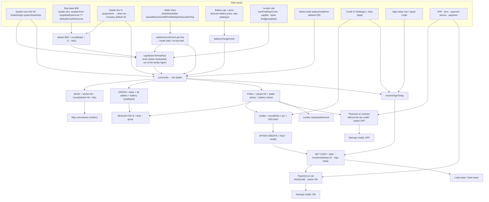

# Solar proposal pricing logic: single source of truth

> **What this is.** A read-only audit of how a solar proposal's money is calculated, written from the code alone. Nothing here changes behaviour. Where the code is ambiguous or contradicts itself, this document says so rather than picking an answer.
>
> **Which code.** `origin/main` at **`c0a1a7e`** (2026-09-15 00:33 CDT), exported read-only. Every `file:line` below refers to that commit.
>
> The shared checkout this file sits in is **34 commits behind `origin/main`**. It also carries another session's uncommitted edits to the pricing files: its `src/lib/solar-money.ts` predates the battery-inside-the-dealer-fee change that is live. **Line numbers will not match that working tree.**
>
> **How it was checked.** Every figure in §4 was produced by running the real pricing functions (`pricePurchase`, `compareOffers`, `financeRowForProduct`, `buildProposalSnapshot`, `resolveSignToday`, …) from that commit on the sample deal, not by hand.
>
> **Scope.** The solar vertical: cash, loan, lease, PPA and storage-only. Roofing is out of scope.

---

## 0. Read this first: units and the vocabulary trap

### Units used by the code

| Kind | Stored as | Example | Evidence |
|---|---|---|---|
| Money | integer **cents** | `6493333` = $64,933.33 | everywhere; e.g. `src/lib/solar-money.ts:394-452` |
| Price per watt | **cents per watt** (Int in the DB; fractional inside breakdowns) | `400` = $4.00/W | `prisma/schema.prisma:4571-4572`; `solar-money.ts:434` |
| Energy rate | **mills per kWh** (1 mill = 0.1¢) | `180` = $0.180/kWh | `solar-money.ts:198`; `schema.prisma:4623` |
| Per-watt adder rate, rep per-watt pay | **mills per watt** | `100` = $0.10/W | `src/lib/solar-adders.ts:182`; `src/lib/solar-pay.ts:476` |
| Payment factor | **millionths** | `5712` = 0.005712 | `src/lib/solar-loan.ts:32,89` |
| Percentages: dealer fee, APR, escalator, credit %, paydown %, lead take | **0–100** (30 means 30%) | `dealerFeePct = 25` | `solar-money.ts:405` (`rawPct / 100`), `:598` (`aprPct / 100 / 12`), `src/lib/solar-credit-ladder.ts:289`, `solar-loan.ts:96`, `solar-pay.ts:326` |
| **Exception:** derate | a **0–1 fraction** | `0.84` | `schema.prisma:3281`; `solar-money.ts:125` |

**No sales tax or use tax exists anywhere.** Searches for sales/use/state tax, tax rate, taxable, VAT, surcharge and similar found nothing in the solar or roofing pricing code. No pricing function reads the address state. The contract price formula has no tax term (`solar-money.ts:423`).

### Business words vs code names (the #1 source of confusion)

| Business word | What it means | Code name(s) | The trap |
|---|---|---|---|
| **Base** | The system alone, before the lender's cut. What the rep prices; what a redline is measured against. | `PurchaseBreakdown.basePriceCents` / `basePpwCents` (`solar-money.ts:287,289`) | The frozen proposal field `financing.basePriceCents` is **not** the base. It is the system **at sticker, fee included** (`src/lib/solar-proposal.ts:1811`). |
| **Sticker** | The customer's $/W for the system, with the dealer fee inside it: `base ÷ (1 − fee)` | `SolarFinance.grossPpwCents` (`schema.prisma:4571-4572`), `PurchaseInput.stickerPpwCents`, snapshot `financing.grossPpwCents`, `CompareRow.grossPpwCents` | Named **"gross"** in the DB and the snapshot, but it **includes the fee** and excludes adders and battery. |
| **Gross** | Base + adders + battery at catalogue price, **before** the fee. "What we keep." | `PurchaseBreakdown.grossPriceCents` / `grossPpwCents` (`solar-money.ts:310,312`) | `CompareRow.netPpwCents` is this figure per watt, but it is called **"net"** (`src/lib/solar-compare.ts:299-300`). |
| **Dealer fee** | The lender's cut: `final − gross` | `PurchaseBreakdown.dealerFeeCents` (`solar-money.ts:315`, computed `:429`) | The schema says "% of **gross**" (`schema.prisma:3303, 3997, 4576`). The arithmetic is a % of **final** (§3.5). |
| **Final / contract** | What the customer signs | `contractPriceCents`, `finalPpwCents` | — |
| **Net cost after credits** | Contract − federal credits − sign-today credit | `CreditLadder.netCostCents`, `CompareRow.netCostAfterCreditsCents`, `Lead.value` | Not a price the customer is invoiced. It is the principal the **headline payment** is calculated on. |

---

## 1. Glossary: one paragraph per number, for a sales rep

**System size (kW DC).** The installed panel wattage, from the roof design (`SolarDesign.systemSizeKwDc`, `schema.prisma:4483`). Every per-watt price is multiplied by `round(kW × 1000)` watts (`solar-money.ts:505`). A storage-only job has no watts, so it is priced **per battery** instead (§3.10).

**Base price ($/W and total).** What the company charges for the system before any lender takes its cut. You type it in the System price card on the proposal builder.
- A new deal opens on the company's *target net $/W* if one is set, otherwise on the *default gross $/W* ($3.50) (`src/app/portal/leads/[id]/solar-proposal/page.tsx:506-508`; see landmine N9).
- On a lender with a price rule (cap or flat), the base you typed is **not** the base you get. It is re-solved backwards from the lender's figure.
- The base is the only price rep commission is measured against.

**Sticker price per watt.** The base with the dealer fee built in: `round(base ÷ (1 − fee%))`, rounded to a whole cent per watt (`solar-money.ts:615-619`).
- This is what is saved on the deal (`SolarFinance.grossPpwCents`).
- It covers the system only; adders and the battery are added separately.
- On cash the sticker equals the base.

**Adders (extra work).** Priced per line (`src/lib/solar-adders.ts:171-191`):
- flat amount
- per unit × count
- per foot × feet
- per watt × system watts (the rate is in mills)
- a custom amount
- a discount (stored positive, subtracted when priced)

Each line is either **inside** the lender's price (the normal case; it carries its share of the dealer fee) or **financed on top** (for example a re-roof on a flat-rate lender; no dealer fee, and not squeezed by the lender's cap). Which one is decided per lender/equipment rule when the line is picked (`src/server/modules/solar/adders.ts:132-140, 219-253`).

**Battery price.** On a deal with panels *and* a battery, the battery is charged for separately: `qty × (the deal's own per-battery price if > 0, else the catalogue price)` (`solar-money.ts:982-1012`). What the customer pays for it (the **battery sticker**) depends on the lender switch `SolarLender.batteryInsideFee` (`schema.prisma:3779`, **default ON**):
- **On:** the battery is grossed up by the dealer fee.
- **Off:** it is added at catalogue price.

On a storage-only deal the battery *is* the system and is not charged a second time (`solar-money.ts:991`).

**Gross price.** Base + all adders (inside and on top) + battery at catalogue price (`solar-money.ts:424`). It is the company's side of the ladder, "what we keep". Divided by watts it is the gross $/W.

**Dealer fee.** The lender's percentage, taken **out of the final price**.
- **Formula:** `final = gross ÷ (1 − fee)`, so a 25% fee means the fee is 25% of what the customer signs (§4 shows exactly 25.0000%).
- **Stored amount:** `final − gross` (`solar-money.ts:429`), so the rows add up to the cent.
- **Where the percentage comes from:** the quoted rate-sheet programme, or the rate typed or stored on the deal, or the company default of 18% (`src/lib/solar-finance-row.ts:151-153`).
- **When it is zero:** always on cash, lease and PPA.
- **Customer visibility:** never shown as its own line on the proposal. It can still leak through an unnamed programme's auto-label (landmine N12).

**Final price / contract price.** What the customer signs: `system sticker + adder sticker + battery sticker` (`solar-money.ts:423`). It is saved on the deal (`SolarFinance.contractPriceCents`) and frozen into every proposal version. **Neither the tax credits nor the sign-today credit ever change it.**

**Final price per watt.** Contract ÷ watts. It includes adders and the battery, so it is higher than the sticker $/W on any deal with extras. The customer's "Price per watt" is this figure rounded for display (`src/components/proposal/solar/index.tsx:403-406`).

**Lender price rule ("Max final $/W").** A per-lender figure (`SolarLender.maxFinalPpwCents`, `schema.prisma:3733`) with two settings.

The **mode** (`finalPpwMode`, `:3742`):
- **cap:** a ceiling. It only lowers a price that would come out above it.
- **flat:** *the* price. It moves the deal up or down to land on it.

The **basis** (`SolarLenderProduct.ppwBasis`, `:4008`) says which rung of the ladder the figure fixes:
- **final:** system + inside adders, fee included.
- **gross:** system + inside adders, fee added on top.
- **base:** system alone, fee and adders on top.

On-top adders and the battery are never squeezed by the rule. The sticker is solved backwards out of the figure (`solar-money.ts:765-867`). Cash is never capped.

**Minimum base $/W (lender floor).** `SolarLender.minBasePpwCents` (`schema.prisma:3759`). If what the company keeps per watt (`sticker × (1 − fee)`, *after* any cap) is below this, proposal generation is **blocked** (`src/lib/solar-validation.ts:528-536`) and a live re-price is refused (`src/server/modules/solar/proposal-reprice-actions.ts:335-340`). It is the only margin rule; the old company-wide $/W band is retired (`schema.prisma:3444-3445`).

**Target net $/W (company setting).** `SolarSettings.targetNetPpwCents` (`schema.prisma:3313`). If set, it does three things:
- A save that sends **no** price derives the sticker from it (`solar-finance-row.ts:163-167`).
- It seeds the builder's base box (`solar-proposal/page.tsx:506-508`).
- It prices the "Pay in full" option (`src/lib/solar-proposal-options.ts:430-440`).

**Federal tax credits.** Three statutory credits, with company-wide percentages (`SolarSettings.creditItcPct / creditEnergyCommunityPct / creditDomesticContentPct`, defaults **30 / 10 / 10**, `schema.prisma:3332-3334`):
- the federal solar tax credit (ITC)
- the energy community bonus
- the domestic content bonus

Each deal ticks which ones it earns (`SolarFinance.claimItc / claimEnergyCommunity / claimDomesticContent`, **all default ON**, `schema.prisma:4603-4605`).
- **Amount:** each credit = `round(final contract × pct ÷ 100)` (`solar-credit-ladder.ts:289`). The credit is therefore calculated on the fee-inclusive, battery-inclusive contract.
- **Price:** the contract does not drop.
- **Payment:** the headline monthly payment is calculated on what is left after them.

**After tax credits.** Contract − the claimed credits, with the credits capped at the contract (`solar-credit-ladder.ts:297-301`).

**"Incentive for signing today" (derived).** Defined as `after credits − quoted price`, floored at zero (`solar-credit-ladder.ts:305-306`). Every proposal generated now passes the contract as the quoted price (`solar-proposal.ts:1576-1577`), so **this is always $0 and never prints**. It is left over from the removed contract-adjustment feature (landmine D2).

**Sign today credit.** A closing credit, set by one of three lender rules (`SolarLender.signTodayMode`, `schema.prisma:3784`; `src/lib/solar-sign-today.ts:106-162`):
- **none:** the rep types it on the deal (`SolarFinance.signTodayCreditCents`).
- **fixed:** the lender's figure on every deal, not editable.
- **above_cap:** whatever the household nets above a $/W cap, derived.

It is taken **off the net after credits**. It is capped at what is left and at $1,000,000 (`solar-sign-today.ts:83`; `solar-credit-ladder.ts:322-326`). **Despite the on-screen copy, it lowers the headline monthly payment and the deal value** (landmine N6).

**Net cost after credits.** `after credits − incentive (always 0) − sign-today credit` (`solar-credit-ladder.ts:327`). Three things use it:
- the principal for the headline ("with credits") payment
- the "Your net cost after credits" row on the proposal
- `Lead.value` (the pipeline deal value)

**Amount financed.** Two figures, one per side of the proposal's tax-credit switch:
- **Switch OFF:** `contract − down payment` (`solar-proposal.ts:1540, 1948`).
- **Switch ON:** `net cost after credits − down payment` (`:2006-2008`).

The down payment is effectively always $0 today, because the builder's Save clears it (`src/components/portal/solar-panels.tsx:1448-1453`).

**Monthly payment on the contract ("without the tax credit").** The loan payment on the full contract.
- **Source:** the rate sheet's payment factor if it publishes one, otherwise standard amortisation of APR and term (`solar-loan.ts:134-151`).
- **Where it appears:**
  - under the headline on the builder
  - as the proposal's payment when the switch is OFF
  - on the "Proposal PAR" PDF filed at signing

**Monthly payment with credits (the headline).** The same programme's payment on the *net cost after credits* (`solar-compare.ts:383-398`; `solar-proposal.ts:1669-1671`). It is the big number on the builder's offer cards and quoted strip, and on the customer proposal, which **opens with the switch ON** (`index.tsx:294`).

**Payment factor, paydown, "without paydown" payment.** Some rate sheets publish a factor instead of an APR: `monthly = amount financed × factor` (`solar-loan.ts:85-100`).
- **Two factors:** most publish one *with* a paydown (usually the ITC, due by a set month) and one *without* it (higher).
- **Headline:** the with-paydown figure (`solar-loan.ts:110-112`).
- **Paydown amount:** `amount financed × paydownPct ÷ 100`.

**Lease monthly / PPA rate / escalator.**
- **Lease:** a fixed monthly = `lease rate per kW-month × kW` (`solar-money.ts:1125-1127`), rising by the escalator % each year in the savings model.
- **PPA:** a price per kWh produced (mills), also escalating.

Neither has a system price, a dealer fee, tax credits, a lender cap or a monthly for credits to lower.

**Cash price ("Pay in full" option).** When a financed deal also offers cash, cash is priced at the company's target net $/W if set, otherwise at `sticker × (1 − the quoted fee)`. In other words, the base with no lender fee, plus adders and battery at catalogue price (`solar-proposal-options.ts:233-251, 430-440`).

**Utility bill afterwards.** `grid kWh still bought × today's rate + the utility's meter fee` ($10/mo default), both rising at the utility escalation rate (`solar-proposal.ts:476-497`). The meter fee is only on the after-solar side.

**Savings, lifetime figure, payback year.** A year-by-year model: the utility cost avoided, minus what the system costs that year (loan payments, the cash price in year 1, or lease/PPA payments), plus battery programme money (`solar-proposal.ts:324-589`).
- **Horizon:** the loan term rounded up to whole years, kept between 25 and 40; 25 for everything else (`:299-313`).
- **Model runs:** twice on a purchase deal, once per switch position.

**Battery programme (VPP) money.** Per-battery annual and enrolment payments from an eligible utility programme, × battery count (`src/server/modules/solar/vpp-credits.ts:131-144`). It only feeds the savings model and the battery card. **Never the price or the payment.**

**Deal value (`Lead.value`).** A pipeline figure (`src/lib/solar-deal-value.ts:68-82`):
- **cash and loan:** the net cost after credits, or the contract if the proposal has no credit ladder
- **lease:** the lease monthly
- **PPA:** the per-kWh rate

It is stamped from the reported proposal version (`src/server/modules/solar/deal-value.ts:38-41`).

**Rep commission.** Worked out at payroll time from the deal's *current* saved finance row (`src/server/modules/payroll/solar-engine.ts:109-149`). The formula depends on the job and lender (`solar-pay.ts:105-203, 435-489`):
- **redline (default):** `max(0, base price − redline $/W × watts)`. Adders and battery are excluded; the base is what survives any lender cap.
- **per watt:** `watts × rate (mills) ÷ 10`.
- **storage jobs:** per-battery redline or a flat amount per battery.

Then two adjustments apply:
- **Company lead take:** on company-provided leads the company keeps a % or a flat amount (`solar-pay.ts:311-349`).
- **Manager override:** a % of the **rep's net commission** (not the contract), $/W, or flat (`solar-pay.ts:389-410`).

**Lender requested amount (submission).** What the lender API is sent (`src/server/modules/solar/lender-submit.ts:991-1016`). It depends on `SolarLender.submissionAmountBasis`:
- **contract_value / customer_obligation:** the proposal's amount financed (switch OFF).
- **after_credits:** that amount minus the credit lines. **The sign-today credit is not subtracted** (landmine L10).

**Sales tax.** None. See §0.

---

## 2. Calculation flow

### 2.1 Diagram



### 2.2 Order of operations, as the code executes it

The order is the same in every pricing path. The saved deal, the builder shelf, generation, the deal page and payroll all call the same functions in this order.

1. **Adder lines → cents.** `adderAmountCents(line, watts)` (`solar-adders.ts:171-191`), summed and split into *inside* and *on top* (`:247-266`). The totals are cached on `SolarFinance.adderTotalCents` / `onTopAdderTotalCents`.
2. **Battery charge.** `batteryChargeCents` (`solar-money.ts:982-995`) = `qty × perBatteryPriceCents` (`:1005-1012`); 0 on storage-only.
3. **Sticker $/W.** Either typed (the builder converts the base with `grossPpwFromNet`, `solar-panels.tsx:995-996`), derived from the target net, or the company default (`solar-finance-row.ts:163-167`). Rounded to a whole cent.
4. **Lender rule.** `capStickerToFinalPpw` → `capStickerToFinalUnit` (`solar-money.ts:765-898`). Adjusts the sticker; floors (cap) or rounds to nearest (flat) to a whole cent.
5. **The ladder.** `priceUnits` (`solar-money.ts:394-452`): base, adder sticker, battery sticker, contract, gross, fee.
6. **Credit ladder.** `buildCreditLadder` (`solar-credit-ladder.ts:255-346`) on the contract. It includes the sign-today credit from `resolveSignToday` (`solar-sign-today.ts:106-162`), which reads the ladder's sticker figures and the credit rates.
7. **Payments.**
   - **The contract payment:** `programmeMonthlyCents` / `monthlyOn(contract − down)`.
   - **The credited payment:** `monthlyOn(netCost − down)` (`solar-proposal.ts:1613-1671`; `solar-compare.ts:331, 383-398`).
8. **Savings.** `savingsModel` twice, OFF and ON (`solar-proposal.ts:1686-1797`).
9. **Freeze.** `buildProposalSnapshot` writes the option list into `SolarProposal.snapshot` (`solar-proposal.ts:2018-2330`). A self-consistency gate refuses a document whose payments or ladder don't reconcile (`src/server/modules/solar/proposal-generate.ts:68-132, 1097-1098`).
10. **Downstream.**
    - `Lead.value` restamped (`proposal-generate.ts:1227`)
    - payroll re-prices from the live row at each run
    - the lender submission reads the snapshot

---

## 3. Formulas as implemented (with rounding and constants)

`f` below is `dealerFeePct / 100`, forced to 0 when the product is cash or the fee is not strictly between 0 and 100 (`solar-money.ts:404-405`). `W` is `round(kW × 1000)`.

### 3.1 Adders — `src/lib/solar-adders.ts:171-191`

```
qty      = floor(line.qty) if > 0, else 1
perWatt  : amount = round(millsPerWatt × W × qty ÷ 10)          // 0 if W ≤ 0
flat/perUnit/perFoot/custom : amount = +round(flatCents) × qty
discount : amount = −round(flatCents) × qty                     // stored positive
inside   = Σ amount where !financedOnTop      (adderTotals, :256-261)
onTop    = Σ amount where  financedOnTop
```

**Legacy branch.** A deal with no adder lines but a stored total above 0 keeps that stored total (`src/server/modules/solar/adders.ts:474-478`).

### 3.2 Battery charge — `solar-money.ts:982-1012`

```
if systemType == "storage": 0
qty = round(batteryQty); if qty ≤ 0: 0
perBattery = round(SolarFinance.stickerPricePerBatteryCents) if > 0 else max(0, round(catalogue priceCents))
battery = qty × perBattery
```

### 3.3 Sticker $/W

- **From a base** (builder shelf, builder price card): `grossPpwFromNet(base, feePct) = round(base ÷ (1 − feePct/100))`. Null if the base is ≤ 0 or the fee is ≥ 100 (`solar-money.ts:615-619`; used at `solar-compare.ts:234-237`, `solar-panels.tsx:995-996`).
- **At save** (`solar-finance-row.ts:163-167`): `derivedGrossPpw = grossPpwFromNet(targetNet, fee)` **only if** it is a purchase, a target net is set, **and no price was sent**. Otherwise the typed `grossPpwCents`, otherwise `SolarSettings.defaultGrossPpwCents` (350).
- **Base recovered from a sticker:** `basePpwFromSticker = round(sticker × (1 − f))` (`solar-money.ts:640-646`). The builder has an inline copy without the fee guard (`solar-panels.tsx:941`).

### 3.4 Lender price rule — `capStickerToFinalUnit`, `solar-money.ts:765-867`

```
if max is null/≤0 or units ≤ 0: unchanged
adderSticker = round(insideAdders ÷ (1 − f))            // on-top adders & battery NOT included
typedSticker = round(units × sticker)
typedBase    = typedSticker − round(typedSticker × f)
pinned       = max × units
actual = final: typedSticker + adderSticker
         gross: typedBase + insideAdders
         base : typedBase
if mode != flat and actual ≤ pinned: unchanged           // cap only bites downward
system = final: pinned − adderSticker
         gross: pinned − insideAdders
         base : pinned
if system ≤ 0: sticker = 0, adderOverrun = true
exact  = (basis == final ? system : system × 100 ÷ (100 − feePct)) ÷ units
sticker = flat ? round(exact) : floor(exact)             // whole cents per unit
```

**Where it runs:**
- the save (`solar-finance-row.ts:178-194`)
- the builder price card (`src/components/portal/solar/system-price.tsx:307-319`)
- the builder live price (via `priceStoredPurchase`, `solar-money.ts:925-950`)
- the shelf (`solar-compare.ts:260-272`)
- the menu (via `financeRowForProduct`, `solar-proposal-options.ts:305-331`)
- generation (`proposal-generate.ts:464-474`, re-priced and written back at `:490-522`)
- the deal page (`src/app/portal/leads/[id]/page.tsx:628-657`)
- payroll (`solar-engine.ts:124-149`)

### 3.5 The ladder — `priceUnits`, `solar-money.ts:394-452`

```
baseSticker    = units × round(stickerPerUnit)
base           = baseSticker − round(baseSticker × f)
up(x)          = f > 0 ? round(x ÷ (1 − f)) : x
adderSticker   = up(insideAdders) + onTopAdders
batterySticker = batteryInsideFee ? up(battery) : battery
contract       = baseSticker + adderSticker + batterySticker
gross          = base + (insideAdders + onTopAdders) + battery
dealerFee      = contract − gross
per-unit rates = cents ÷ units   (NOT rounded in the breakdown)
margin         = equipmentCost given ? gross − equipmentCost : 0   // no pricing caller passes a cost → always 0
```

- **Is the fee added or backed out?** It is **backed out of the price the customer pays**, never added on top of gross: `final = gross ÷ (1 − f)`. `solar-money.ts:467-470` states this explicitly.
- **On-top adders:** at face value in both gross and contract, so the fee ignores them.
- **Battery, `batteryInsideFee` OFF:** at face value on both sides, so the fee ignores it.
- **Battery, `batteryInsideFee` ON:** grossed up, so the fee % is exactly the stated % of the whole contract.

### 3.6 Federal credits — `buildCreditLadder`, `solar-credit-ladder.ts:255-346`

```
contractValue = round(contract);  quoted = round(contract)      // both the contract on every current caller
credit_i      = round(contractValue × pct_i ÷ 100)              // only ticked, pct > 0
creditTotal   = min(contractValue, Σ credit_i)
afterCredits  = contractValue − creditTotal
incentive     = max(0, afterCredits − quoted)                   // → always 0 now
shortfall     = max(0, quoted − afterCredits)                   // → always = creditTotal; read nowhere
signToday     = min(max(0, round(signTodayCredit)), afterCredits − incentive)
netCost       = afterCredits − incentive − signToday
relief        = creditTotal + incentive + signToday
null if contract ≤ 0, or (no credits AND incentive 0 AND signToday 0)
```

- **Validity check:** `ladderReconciles` (`:356-375`); generation refuses to save if it fails (`proposal-generate.ts:82-87`).
- **Built for:** every cash and loan option (`solar-proposal.ts:1574-1584`) and every loan shelf column (`solar-compare.ts:374-382`). Never for lease or PPA.

### 3.7 Sign-today credit — `resolveSignToday`, `solar-sign-today.ts:106-162`

```
fixed     : cents = clamp(fixedCents)                            // not editable
above_cap : if cap null or systemWatts ≤ 0 → 0
            measured = (baseSticker + max(0, batterySticker)) × (1 − claimedCreditRate)   // adders excluded
            cents    = clamp(round(measured) − round(cap × watts))
none      : cents = clamp(typedCents)
clamp(x)  = x ≤ 0 or NaN ? 0 : min(round(x), 100_000_00)
claimedCreditRate = min(1, Σ ticked usable pct ÷ 100)   (solar-credit-ladder.ts:228-240)
```

**Resolved per option or column**, using that option's own lender rule (`solar-compare.ts:355-372`; `solar-proposal.ts:1559-1572`).

### 3.8 Monthly payments

**Amortisation** — `loanPaymentCents`, `solar-money.ts:580-601`:
```
null if term ≤ 0, principal ≤ 0, or APR < 0
APR null or 0 → round(principal ÷ term)
r = APR ÷ 100 ÷ 12;  payment = round(principal × r ÷ (1 − (1 + r)^−term))
```

**Factor** — `factorQuote`, `solar-loan.ts:85-100`:
```
with    = round(amount × factorWithPaydownMicros ÷ 1,000,000)
without = round(amount × factorWithoutPaydownMicros ÷ 1,000,000)
paydown = round(amount × paydownPct ÷ 100)
headline factor payment = with ?? without           (factorMonthlyCents, :110-112)
```

**Precedence, and which functions implement it:**
- **Builder shelf and cards:** `programmeMonthlyCents` (`solar-loan.ts:134-151`). Factor first, then amortisation.
- **Builder quoted strip:** an inline copy of that order (`solar-panels.tsx:1341-1347`) on the contract, plus `programmeMonthlyCents` on the net (`:1360-1361`).
- **Generated proposal:** `monthlyOn` (`solar-proposal.ts:1613-1633`) has three tiers:
  1. `SolarFinance.loanMonthlyPaymentCents`, **scaled** by `principal ÷ contract principal`
  2. factor
  3. amortisation

  Tier 1 is always empty on rows saved since the approval form was removed (`solar-panels.tsx:1448-1453`).

**APR and term source.** The programme's `aprPct` / `termMonths` are copied onto the deal at save (`solar-finance-row.ts:239-240`). Generation reads the **deal row's copy** (`proposal-generate.ts:1001, 1009`) but the **live** programme's factors (`:438-461, 574-582`).

**Which payment is the headline.**
- **Builder:** `creditsApplies = netMonthly < contractMonthly`; the headline is `netMonthly` when true (`solar-compare.ts:386-398`; `solar-panels.tsx:1379`).
- **Customer document:** shows `option.creditsApplied.monthlyCents` while the switch is ON (the default), and `option.monthlyCents` while OFF (`solar-proposal.ts:957-962`; `index.tsx:294, 357-360`).

**No buydown, no escalator on loans.** There is no APR buydown calculation; the only related comment says a 0% APR is what a high dealer fee buys (`solar-validation.ts:622-628`). Escalators exist only on lease and PPA (`solar-money.ts:1172`; `solar-proposal.ts:535-541`).

### 3.9 What the frozen proposal holds per option — `priceOption`, `solar-proposal.ts:1799-2016`

| Snapshot field | Formula | Line |
|---|---|---|
| `contractPriceCents` | ladder `contractPriceCents` | 1802 |
| `grossPpwCents` | the **input sticker** (system only, fee in); null on storage | 1805 |
| `basePriceCents` | ladder **`baseStickerCents`** (system at sticker) | 1811 |
| `adderTotalCents` | ladder **`adderStickerCents`** (grossed up + on top); null if 0 | 1819-1820 |
| `adders[].amountCents` | inside lines: `apportionCents(adderSticker − onTop, catalogue amounts)` (largest remainder); on-top lines at face | 1847-1869; `solar-money.ts:545-560` |
| `batteryPriceCents` | ladder **`batteryStickerCents`** | 1886 |
| `finalPpwCents` | `round(contract ÷ W)` | 1895-1900 |
| `loanMonthlyPaymentCents` | `monthlyOn(contract − down)` | 1656, 1912 |
| `loanMonthlyWithoutPaydownCents`, `loanPaydownCents` | `factorQuote` on **contract − down** | 1586-1589, 1926-1927 |
| `financedAmountCents` | `contract − down` | 1540, 1948 |
| `creditLadder` | §3.6 | 1574-1584, 1957 |
| `creditsApplied.monthlyCents` | `monthlyOn(netCost − down)` (cash: null) | 1669-1671, 1994-1999 |
| `creditsApplied.totalCents` | `ladder.quotedPriceCents` (= contract) | 2002 |
| `creditsApplied.financedAmountCents` | `netCost − down` | 2006-2008 |
| `monthlyCents` (menu) | loan → contract payment; lease → monthly; PPA → `round(year1 solar payment ÷ 12)`; cash → null | 1968-1977 |
| `postSolarMonthlyCents` | `round(year1 (residual grid + meter fee) ÷ 12)` | 2015 |
| `itcEstimateCents`, `itcPct`, `stateIncentiveNote` | always null (legacy) | 1960-1962 |

### 3.10 Storage-only deals

The same ladder over batteries:
- **Pricing:** `priceStoragePurchase` / `priceStorageStored` (`solar-money.ts:1026-1080`), converted to the per-watt shape by `purchaseFromUnits` with every $/W set to 0 (`:1097-1118`).
- **Sticker:** `SolarFinance.stickerPricePerBatteryCents`.
- **Lender rule:** the per-battery twins `maxFinalPricePerBatteryCents` / `finalBatteryPriceMode` / `batteryPriceBasis`.
- **Validation:** lease and PPA are blocked; the programme must be `financesStorageOnly` (`solar-validation.ts:476-513`).
- **Menu:** alternatives re-gross the deal's own per-battery base with each programme's fee (`solar-proposal-options.ts:223-225, 343-354`).

### 3.11 Lease and PPA

- **Lease monthly:** `leaseMonthlyCents = round(ratePerKwMonth × kW)` (`solar-money.ts:1125-1127`), stored on the deal at save (`solar-finance-row.ts:227-232`).
- **Totals:** `priceThirdParty` (`solar-money.ts:1165-1193`):
  ```
  lease: yearCost = monthly × 12 × (1 + esc%)^(year−1)
  PPA:   yearCost = kWh_year × mills × (1 + esc%)^(year−1) ÷ 10
  ```
- **Term:** the programme's term; the proposal falls back to 25 years if none (`solar-proposal.ts:1516`).
- **Validation:** term 5–30 years, escalator 0–5%, PPA rate ≤ 400 mills (`solar-validation.ts:656-667`).

### 3.12 Savings model, per year — `solar-proposal.ts:476-577`

```
production_y   = year1Kwh × (1 − degradation%)^(y−1)
rate_y         = currentRateMills × (1 + utilityEscalation%)^(y−1)
utilityCost_y  = round(usage × rate_y ÷ 10)
residualGrid_y = round(max(0, usage − production_y) × rate_y ÷ 10)
meterFee_y     = round(meterFeeCents × 12 × (1 + utilityEscalation%)^(y−1))
solarPayment_y = loan: payment × monthsPaid_y (+ down in year 1)
                 cash (or loan with no schedule): contract in year 1, 0 after
                 lease/PPA: see 3.11 within term
vpp_y          = Σ annual (+ Σ upfront in year 1)
relief_y       = year 1 only, cash with switch ON: ladder.reliefCents
solarCost_y    = residualGrid_y + meterFee_y + solarPayment_y − vpp_y − relief_y
cumulative    += utilityCost_y − solarCost_y;  payback = first year cumulative > 0
```

- **Year-1 production:** `round(kW × kwhPerKwYear × derate × TSRF% × 0.95)` (`solar-money.ts:117-127`), or the per-array or PVWatts equivalents.
- **Current rate:** `round(bill × 12 ÷ usage × 10)` mills unless a rate is typed (`solar-money.ts:192-199`; `resolveUtilityRateMills`, `src/lib/solar-energy.ts:93`).

### 3.13 Rounding summary

| Where | What is rounded | To | Before/after |
|---|---|---|---|
| `grossPpwFromNet` (`solar-money.ts:618`) | sticker from base | whole ¢/W | **before** × watts, so base × watts ≠ recovered base (§4.3) |
| cap solve (`:856-857`) | solved sticker | whole ¢/W: **floor** on cap, **nearest** on flat | before × watts, so the contract lands up to ~0.5–1 ¢/W off the lender figure |
| `priceUnits` (`:409-410, 406`) | `baseSticker × f`; each `÷ (1 − f)` gross-up | ¢ | per component; the fee is a remainder, so gross + fee = final exactly |
| adder lines (`solar-proposal.ts:1851`) | grossed-up lines | ¢, largest remainder | lines sum exactly to the adder sticker |
| credits (`solar-credit-ladder.ts:289`) | each credit | ¢ | per credit, before summing |
| loan payment (`solar-money.ts:596, 600`) | payment | ¢ | final |
| factor payment (`solar-loan.ts:89`) | payment | ¢ | final |
| `finalPpwCents` snapshot (`solar-proposal.ts:1898`) | contract ÷ W | whole ¢ | display field, not used on the document |
| customer "Price per watt" (`index.tsx:405`) | total ÷ W | 0.01 ¢, then printed `toFixed(2)` dollars | display |
| Pay chapter headline (`pay.tsx:138`) | monthly | **whole dollars** | display; the battery card on the same page prints cents (`battery-credit.tsx:119`) |

### 3.14 Hard-coded constants

| Constant | Value | Where | Meaning |
|---|---|---|---|
| `PRODUCTION_MARGIN_PCT` | 5 | `solar-money.ts:78` | every kWh quoted 5% under the model |
| `SOLAR_ASSUMPTION_DEFAULTS` | derate 0.84, degradation 0.5%, utility escalation 3.5%, 1450 kWh/kW/yr, meter fee $10/mo, default sticker $3.50/W, default fee 18%, offset 0–150% | `src/server/modules/solar/settings.ts:18-28` | company with no settings row |
| `CREDIT_RATES_DEFAULT` | 30 / 10 / 10 | `solar-credit-ladder.ts:194-198`; schema `:3332-3334` | statute defaults |
| `CREDIT_CLAIMS_DEFAULT` | all true | `solar-credit-ladder.ts:187-191`; schema `:4603-4605`; builder `solar-proposal/page.tsx:514-516` | a new deal claims 50% |
| `SIGN_TODAY_MAX_CENTS` | $1,000,000 | `solar-sign-today.ts:83` (copied in `credit-claims.tsx`) | clamp |
| `MAX_PAYMENT_OPTIONS` | 6 | `solar-proposal-options.ts:110` | menu size, one per lender |
| savings horizon | 25 min / 40 max | `solar-proposal.ts:296-297` | years modelled |
| third-party term fallback | 25 | `solar-proposal.ts:1516` | lease/PPA with no term |
| credit step-down month default | 12 | `solar-proposal.ts:474` | unused by current callers (they pass `afterCreditMonthlyCents: null`) |
| `monthlyReconciles` | floor 0.9×, ceiling 1.35× + $1 | `solar-loan.ts:207, 218` | generation sanity gate |
| dealer-fee typo guard | ≥ 50% blocks, unless from a rate sheet | `solar-validation.ts:556` | |
| fee input | 0–100; APR ≤ 50; lease escalator ≤ 10 (form) / 5 (validation) | `src/server/modules/solar/actions.ts:670, 675, 677`; `solar-validation.ts:659` | |
| `PRICING_CALCULATION_VERSION` | 6 | `solar-proposal.ts:1314` | stamped on snapshots |
| default battery count | 2 | `settings.ts:116`; schema `:3368` | first battery pick |

---

## 4. Worked example: one deal through every formula

All figures below come from running the functions at `c0a1a7e`.

### 4.1 Inputs (illustrative)

| Input | Value |
|---|---|
| System | 10.0 kW DC (W = 10,000) |
| Product | Loan, 25 years (300 months), 6.99% APR, **no payment factor** |
| Dealer fee | 25% (programme) |
| Lender rule | none (`maxFinalPpwCents` null); `batteryInsideFee` = ON (default); sign-today mode `none`, nothing typed |
| Rep base | $3.00/W |
| Adders (inside) | Main panel upgrade $2,700 flat; Steep roof $0.10/W (100 mills) |
| Battery | 1 × $15,000 catalogue |
| Credits | ITC 30% ticked; energy community and domestic content **unticked** (the default would tick all three) |
| Home | 12,000 kWh/yr, average bill $180/mo; company defaults for production |

### 4.2 Step by step

| # | Step | Formula | Result |
|---|---|---|---|
| 1 | Steep-roof adder | round(100 × 10,000 × 1 ÷ 10) | **$1,000.00** |
| 2 | Inside adders | 2,700 + 1,000 | **$3,700.00**; on top $0 |
| 3 | Sticker $/W | round(300 ÷ 0.75) | **400¢ = $4.00/W** |
| 4 | Lender rule | no max | sticker unchanged |
| 5 | System at sticker | 10,000 × 400 | **$40,000.00** (proposal "System price") |
| 6 | Base | 4,000,000 − round(4,000,000 × 0.25) | **$30,000.00** ($3.00/W) |
| 7 | Adder sticker | round(370,000 ÷ 0.75) + 0 | **$4,933.33** |
| 8 | Battery sticker (inside fee) | round(1,500,000 ÷ 0.75) | **$20,000.00** |
| 9 | **Final / contract** | 40,000.00 + 4,933.33 + 20,000.00 | **$64,933.33** |
| 10 | Gross | 30,000 + 3,700 + 15,000 | **$48,700.00** ($4.87/W; the shelf's `netPpwCents` = 487) |
| 11 | **Dealer fee** | 64,933.33 − 48,700.00 | **$16,233.33** = 25.0000% of final |
| 12 | Final $/W | 6,493,333 ÷ 10,000 | 649.33¢ → breakdown 649.3333, snapshot 649, customer sees **$6.49/W** |
| 13 | Adder lines on the proposal | apportion 493,333 by 2,700 : 1,000 | Main panel upgrade **$3,600.00**, Steep roof **$1,333.33** |
| 14 | ITC | round(6,493,333 × 30 ÷ 100) | **$19,480.00** |
| 15 | After credits | 64,933.33 − 19,480.00 | **$45,453.33** |
| 16 | Incentive for signing today | max(0, 45,453.33 − 64,933.33) | **$0** (row dropped); `shortfallCents` = $19,480.00, unused |
| 17 | Sign today | mode none, typed 0 | **$0** |
| 18 | **Net cost after credits** | 45,453.33 − 0 − 0 | **$45,453.33** (= `Lead.value` if this version is reported) |
| 19 | Payment on contract (OFF / "without the tax credit") | amortise $64,933.33 @ 6.99%, 300 mo | **$458.52/mo**; amount financed $64,933.33 |
| 20 | **Headline payment (ON)** | amortise $45,453.33 @ 6.99%, 300 mo | **$320.96/mo**; amount financed $45,453.33 |
| 21 | Shelf total paid | 320.96 × 300 (credits applied, so no paydown added) | $96,288.00 |
| 22 | "Pay in full" option | sticker × (1 − fee) = $3.00/W; fee 0; battery and adders at catalogue | contract **$48,700.00**; ITC $14,610; net $34,090.00 |
| 23 | Year-1 production | round(10 × 1450 × 0.84 × 0.95) | 11,571 kWh (offset 96.4%) |
| 24 | Utility rate | round(18,000 × 12 ÷ 12,000 × 10) | 180 mills = $0.180/kWh |
| 25 | Year-1 utility cost avoided side | 12,000 × 180 ÷ 10 | $2,160.00 |
| 26 | Year-1 bill afterwards | residual 429 kWh → $77.22, + meter fee $120.00 | $197.22/yr → **$16.44/mo** |
| 27 | Year-1 solar payment | OFF 458.52 × 12 / ON 320.96 × 12 | $5,502.24 / $3,851.52 |
| 28 | 25-year result | model | OFF: paid $137,556.00, net −$66,467.57. ON: paid $96,288.00, net −$25,199.57. No payback in either |

Step 28 is negative because this illustrative payment is larger than the $180 bill. The savings model is not a pricing input.

**Same deal with `batteryInsideFee` OFF.** Contract $59,933.33, gross $48,700.00, fee $11,233.33. The labelled "25%" is then 18.74% of final.

### 4.3 The same deal on a lender price rule

A $5.50/W lender, 30% fee, 10 kW, $2,700 adder inside, $7,000 roof **on top**, no battery.

| Mode | Basis | Rep's sticker $4.00 → | Rep's sticker $10.00 → |
|---|---|---|---|
| cap | final | unchanged: contract $50,857.14 ($5.09/W) | sticker **511¢**: contract **$61,957.14** |
| cap | gross | unchanged: $50,857.14 | sticker 747¢: $85,557.14 |
| cap | base | unchanged: $50,857.14 | sticker 785¢: $89,357.14 |
| flat | final | sticker 511¢: **$61,957.14** | 511¢: $61,957.14 |
| flat | gross | 747¢: $85,557.14 (base + adder = $54,990) | 747¢: $85,557.14 |
| flat | base | 786¢: $89,457.14 (base $55,020) | 786¢: $89,457.14 |

**Final / flat.** The system + inside adder lands on $54,957.14, $42.86 under $55,000. That gap is whole-cent sticker granularity. The $7,000 roof then rides on top at face value.

### 4.4 Sign-today "above cap" on the §4.2 deal

- **What is measured:** (system sticker $40,000 + battery sticker $20,000) × (1 − 0.30) = **$42,000** ($4.20/W). Adders are excluded.
- **Cap $6.00/W:** $42,000 − $60,000 < 0, so **$0**.
- **Cap $2.50/W:** $42,000 − $25,000 = **$17,000**. The net cost drops to $28,453.33 and **the headline payment drops from $320.96 to $200.92/mo**. The lender's `after_credits` amount would still be $45,453.33.
- **Cap $2.00/W:** $22,000.

### 4.5 Base round-trip drift (whole-cent stickers)

| Typed base | Fee | Size | Sticker | Base the ladder keeps | Drift |
|---|---|---|---|---|---|
| $2.87/W | 18% | 10 kW | 350¢ | $28,700.00 | $0.00 |
| $1.93/W | 65% | 11 kW | 551¢ | $21,213.50 | **−$16.50** |
| $3.01/W | 18% | 12.345 kW | 367¢ | $37,151.04 | −$7.41 |

---

## 5. Conditional rules

| Rule | When it applies | What it is applied to | Code |
|---|---|---|---|
| **No dealer fee** | product = cash; also lease/PPA (fee stored as 0) | the whole ladder (`f = 0`) | `solar-money.ts:404`; `solar-finance-row.ts:151-153`; block if a cash row carries one: `solar-validation.ts:538-540` |
| Fee stands down | fee ≤ 0 or ≥ 100 | treated as 0 | `solar-money.ts:405` |
| **Fee source** | loan | programme `dealerFeePct` → deal's typed/stored % → `SolarSettings.defaultDealerFeePct` (18). Builder: programme → form → 0 (`solar-panels.tsx:992-994`). **Generation: the deal row's stored %** (`proposal-generate.ts:470, 981`) | `solar-finance-row.ts:151-153` |
| Fee varies by | lender **programme** (each has its own term, APR, fee); **not** by state | — | `schema.prisma:3995-3998` |
| **Fee on the system** | loan | built into the sticker (backed out: base = sticker × (1 − f)) | `solar-money.ts:409-410` |
| **Fee on adders** | adder is *not* `financedOnTop` | grossed up `÷ (1 − f)` | `solar-money.ts:416` |
| No fee on an adder | `SolarDealAdder.financedOnTop` = true (copied at pick time from `SolarLenderAdderRule`, else catalogue; restamped on lender change) | added at face; also excluded from the lender rule | `solar-money.ts:416`; `adders.ts:132-140, 168-216` |
| **Fee on battery** | `SolarLender.batteryInsideFee` of the **quoted programme's** lender = true (default); false when no programme is quoted (cash, hand-quoted loan) | battery grossed up `÷ (1 − f)` | `solar-money.ts:422`; `proposal-generate.ts:462`; `solar-finance-row.ts:206` |
| Battery charged at all | design has a battery, qty > 0, system type ≠ storage | deal per-battery price, else catalogue | `solar-money.ts:982-1012` |
| **Lender cap** | loan; lender `maxFinalPpwCents` > 0; mode `cap`; the deal's figure on the chosen basis is above it | the system sticker, solved down | `solar-money.ts:813-822` |
| **Lender flat** | as above, mode `flat` | the system sticker, solved to land on it, up or down | `solar-money.ts:822, 857` |
| Basis final / gross / base | per programme `ppwBasis` (default `final`); no programme → `final` | which rung the figure pins | `solar-money.ts:813-835` |
| Adder overrun | inside adders alone exceed the figure | sticker 0, contract above the figure, flagged | `solar-money.ts:836-838` |
| **Lender floor** | lender `minBasePpwCents` > 0 and kept base (after cap) < floor | **blocks generation**; refuses re-price; warning on the price card | `solar-validation.ts:528-536`; `proposal-reprice-actions.ts:335-340`; `system-price.tsx:431-437` |
| Fee typo guard | fee ≥ 50% **and** not quoted from a rate sheet | blocks generation | `solar-validation.ts:556-563` |
| **Target net** | `SolarSettings.targetNetPpwCents` set **and** the save sent no price | derives the sticker | `solar-finance-row.ts:163-167` |
| Default sticker | no price sent, no target | `defaultGrossPpwCents` (350) | `solar-finance-row.ts:167` |
| **Federal credits** | every cash/loan option (not lease/PPA); each credit only if ticked on the deal and % > 0 | `round(final contract × pct ÷ 100)`, total capped at the contract | `solar-proposal.ts:1574-1584`; `solar-credit-ladder.ts:269-301` |
| Credits change the price? | never | contract and "Total price" unchanged | `solar-proposal.ts:1576-1577, 2002` |
| **Credits drive the headline payment** | builder: when the credited payment < the contract payment; document: switch ON | payment principal = net cost − down | `solar-compare.ts:386-398`; `solar-proposal.ts:1669-1671` |
| Credit switch default | customer link and preview: **ON**; print route: OFF unless `?credits=1`; at signing both are filed ("Proposal" = ON, "Proposal PAR" = OFF) | whole document scenario | `index.tsx:294`; `src/app/proposal/print/[sig]/page.tsx:56`; `src/server/modules/solar/proposal-file-copy.ts:163-164` |
| Credit ladder printed | purchase option and switch ON (or a document with no switch) | cost chapter block | `src/components/proposal/solar/chapters/cost.tsx:156` |
| Cash with credits ON | cash option | year-1 lump relief in savings (no payment to lower) | `solar-proposal.ts:1792-1795` |
| **Sign today: none** | lender mode `none` (or cash / no lender) | the rep's typed figure | `solar-sign-today.ts:161` |
| Sign today: fixed | lender mode `fixed` | the lender's figure, read-only | `solar-sign-today.ts:131-139` |
| Sign today: above cap | lender mode `above_cap`, cap set, watts > 0 | (system sticker + battery sticker) × (1 − claimed credit %) − cap × W | `solar-sign-today.ts:141-160` |
| Sign today is per column | builder shelf and proposal menu | each programme uses **its own** lender's rule | `solar-compare.ts:355-372`; `solar-proposal-options.ts:365-369` |
| **Payment source** | loan | approval (scaled, legacy) → factor (with paydown, else without) → amortise APR/term; 0% APR → P ÷ n | `solar-proposal.ts:1613-1633`; `solar-loan.ts:134-151` |
| Paydown pair printed | factor programme **and switch OFF** | on the contract principal | `pay.tsx:229-251`; `solar-proposal.ts:1586-1589` |
| Loan payment blocked | loan with no factor **and** no APR+term (and no stored approval) | blocks generation | `solar-validation.ts:611-621` |
| **Savings horizon** | loan with term | ceil(months ÷ 12), clamped 25–40; else 25 | `solar-proposal.ts:299-313` |
| **Storage-only** | `systemType = storage` | per-battery ladder; lease/PPA blocked; only `financesStorageOnly` programmes; `above_cap` sign-today = 0 | `solar-money.ts:1026-1118`; `solar-validation.ts:476-513`; `solar-proposal-options.ts:270-274`; `solar-sign-today.ts:143-148` |
| Lease / PPA | product lease/ppa | no sticker/fee/credits/cap; lease monthly = rate × kW; escalator compounding | `solar-finance-row.ts:224-237`; `solar-money.ts:1165-1193` |
| **Escalator** | lease/PPA only; utility escalation on the utility side | `(1 + pct/100)^(year−1)` | `solar-proposal.ts:480, 493, 535` |
| **Rep pay basis** | storage → rep's battery plan; lease/PPA → per watt; else lender `repPayMode` (default redline) | redline: base price only | `solar-pay.ts:105-203, 435-489` |
| Company lead take | `SolarDealComp.companyProvidedLead` = true and mode ≠ none | % (0–100) or flat off the rep's gross commission | `solar-pay.ts:311-349`; `solar-engine.ts:426-432` |
| Manager override | override row exists | % of the **rep's net** commission, or $/W, or flat | `solar-pay.ts:389-410` |
| **Deal value** | reported proposal exists | cash/loan: net after credits (else contract); lease: monthly; PPA: rate | `solar-deal-value.ts:68-82, 140-149`; `deal-value.ts:38-41` |
| **Lender requested amount** | lender submission | `contract_value` / `customer_obligation`: amount financed (switch OFF); `after_credits`: that − Σ credit lines; no snapshot → live contract − down | `lender-submit.ts:764-776, 991-1016` |
| Meter fee | every savings model | after-solar side only, escalated | `solar-proposal.ts:492-497` |
| VPP money | provider eligible for this battery and financing | savings and battery card only | `vpp-credits.ts:131-144` |
| **Sales / use tax** | never | — | §0 |

---

## 6. Landmines (Step 4 findings)

### 6.1 Same figure, different formulas

- **L1. Two different "without paydown" payments on one builder screen.**
  - Quoted strip: calculated on the **net after credits** (`solar-panels.tsx:1373-1376`).
  - Comparison column "If the paydown is skipped": calculated on the **contract** (`solar-compare.ts:321, 415`).
  - Proposal's OFF-only paydown pair: also calculated on the contract (`solar-proposal.ts:1586-1589`).
- **L2. Builder price-card "Gross" and "Dealer fee" rungs use inline arithmetic.**
  - Gross = the *typed* base × watts + adders + battery (`system-price.tsx:251, 360, 372-374`); fee = contract − that (`:393-396`).
  - The ladder instead uses the base recovered from the rounded sticker (`solar-money.ts:409-410`).
  - Example: $3.00 base, 28% fee, 10 kW. The card shows gross $30,000 / fee $11,700; the ladder has $30,024 / $11,676.
  - The storage card (`system-price.tsx:1157-1161`) and the shelf (`solar-compare.ts:299-300`) use the ladder.
- **L3. The monthly-payment precedence is written three times.**
  - `programmeMonthlyCents` (`solar-loan.ts:134-151`)
  - the builder's inline copy, without the principal guard (`solar-panels.tsx:1341-1347`)
  - the proposal's `monthlyOn`, with an extra scaled-approval tier (`solar-proposal.ts:1613-1633`)
- **L4. "Base from sticker" is written three times.**
  - `basePpwFromSticker` (`solar-money.ts:640-646`)
  - the builder's inline copy without the fee guard (`solar-panels.tsx:941`)
  - `cashPpwCents` (`solar-proposal-options.ts:437-439`)
- **L5. Price per watt has four versions.**
  - the breakdown, unrounded (`solar-money.ts:447`)
  - snapshot `finalPpwCents`, whole cents, not rendered (`solar-proposal.ts:1898`)
  - `quotedPpwCents`, whole cents (`:1010-1014`)
  - the customer page, 0.01 ¢ (`index.tsx:403-406`)
- **L6. The Settings → Lenders worked examples use their own arithmetic, not the pricing functions.**
  - `quotedOn` grosses up the total rather than per watt (`src/components/portal/solar-lender/detail.tsx:91-95`).
  - The sign-today example nets the lender's $/W with **all three** credits, **no battery** and **no clamp** (`detail.tsx:269-275, 987-992`). The engine measures system + battery sticker with the deal's own ticks (`solar-sign-today.ts:150-157`).
  - On gross/base-basis programmes the example understates what is handed back.
- **L7. "Today's price" has three different recipes.**
  - **Builder:** the programme's *live* fee, live adder lines, the cap from the *quoted programme's* lender (`solar-panels.tsx:992-996, 969-980`).
  - **Deal page:** the *stored* fee and adder totals, the cap from the *design* lender even when no programme is quoted (`leads/[id]/page.tsx:628-657`).
  - **Generation:** the stored fee, the design lender's cap, but the basis and battery-fee flag from the quoted programme (`proposal-generate.ts:464-506`).
- **L8. The storage price card guesses the product from the fee** (`product: fee > 0 ? "loan" : "cash"`, `system-price.tsx:1096`). Everything else uses the real product.
- **L9. The deal page runs storage-only deals down the per-watt path.** `workingPrice` has no storage branch (`leads/[id]/page.tsx:628-657`), and storage rows store `grossPpwCents = 0` (`actions.ts:819`). The working ladder therefore prices only adders. What the page renders from this was not determined.
- **L10. The lender's `after_credits` amount ignores the sign-today credit.**
  - Lender side: amount financed − Σ credit lines, with no clamp (`lender-submit.ts:1000-1007`).
  - Proposal side: the credited amount financed is `netCost − down`, which subtracts the sign-today credit (`solar-proposal.ts:2006-2008`).
  - §4.4: the proposal shows $28,453.33 financed; the lender would be asked for $45,453.33.
- **L11. "contract_value" sent to the lender is actually the amount financed** (contract − down payment, `lender-submit.ts:992`). Identical today only because the down payment is always cleared.
- **L12. Payroll prices from the live deal row at each payroll run, not from the signed or approved proposal** (`solar-engine.ts:109-149`). It also uses the stored fee and the design lender's cap. If the deal is edited after signing, commission follows the edit.
- **L13. The credit total on the cost chapter is summed again without the cap** (`cost.tsx:138`), instead of reading the frozen `creditTotalCents` (`solar-credit-ladder.ts:297-300`). They differ only if the percentages add up past 100.
- **L14. The same payment is printed at two precisions on one page.** The Pay chapter headline rounds to whole dollars (`pay.tsx:138`); the battery card prints cents (`battery-credit.tsx:119`).

### 6.2 Dead, never displayed, or always constant

- **D1. `CreditLadder.shortfallCents`.** Computed (`solar-credit-ladder.ts:307`) and read nowhere in `src/`. On every current deal it equals the full credit total.
- **D2. "Incentive for signing today" is always $0.**
  - Every caller passes the contract as both the contract value and the quoted price (`solar-proposal.ts:1576-1577`; `solar-compare.ts:376-377`).
  - As a result, the Settings label `creditIncentiveLabel` has no visible effect, and the last clause of `ladderReconciles` can never be tested.
- **D3. `SolarFinance.itcEstimateCents` is always written as 0** (`solar-finance-row.ts:220-222`). The snapshot's `itcEstimateCents`, `itcPct` and `stateIncentiveNote` are always null (`solar-proposal.ts:1960-1962`); `netMonthlyPaymentCents` is legacy (`:849-855`).
- **D4. `SolarFinance.loanMonthlyPaymentCents` and `downPaymentCents` are cleared by every builder Save** (`solar-panels.tsx:1448-1453`), yet still read in three places:
  - as the **top** payment source at generation (`solar-proposal.ts:1618-1621`)
  - as the deal page's only loan "Monthly payment" row, so **loan deals show no monthly payment on the deal page** (`src/components/portal/solar/financing-terms.tsx:105-107`)
  - to set `loanPaymentApproved`, which is therefore always false, so the proposal always says "Estimated monthly payment" (`pay.tsx:130-132`)
- **D5. `marginCents` is always 0 in pricing.** No pricing caller passes `equipmentCostCents` (`solar-compare.ts:276-285`, `solar-finance-row.ts:198-207`, `solar-proposal.ts:1498-1507`, `proposal-generate.ts:497-506`). `solarCommissionCents` (`solar-money.ts:1216-1254`) is only called from a test.
- **D6. Payroll works out the contract price and never uses it** (`solar-engine.ts:171`; overrides use rep net, `solar-pay.ts:405-408`). The battery and `batteryInsideFee` inputs to payroll therefore affect no pay.
- **D7. Retired settings columns.** `SolarSettings.minPpwCents` / `maxPpwCents` (`schema.prisma:3444-3445`), `targetOffsetPct` (`:3298`), `federalItcPct` (`:3320`).
- **D8. `SolarLender.batteryPayMode` does not decide pay.** `resolveSolarPay` never reads it (`solar-pay.ts:105-161`), but it is still editable in Settings.
- **D9. Frozen but never shown.** `CreditLadder.reliefCents` and `creditTotalCents`; `SavingsModel.solarPaidCents`, `totalSavingsCents` (same as `netSavingsCents`, `solar-proposal.ts:583-584`) and `creditReliefTotalCents`.

### 6.3 Names or copy that contradict behaviour

- **N1. `grossPpwCents` means two different things.** On `SolarFinance`, the snapshot, the finance input and `CompareRow` it is the **sticker** (fee in, system only). On `PurchaseBreakdown` it is the **pre-fee gross including adders and battery** (`schema.prisma:4571-4572` vs `solar-money.ts:311-312`).
- **N2. Snapshot `basePriceCents` is the system at sticker, not the base** (`solar-proposal.ts:1811`).
- **N3. Snapshot `adderTotalCents` and `batteryPriceCents` are sticker amounts, not catalogue** (`solar-proposal.ts:1819-1820, 1886`). `SolarFinance.adderTotalCents` is catalogue price and inside-only.
- **N4. `CompareRow.netPpwCents` is gross ÷ watts** (`solar-compare.ts:299-300`).
- **N5. The fee is described as "% of gross" but calculated as % of final.**
  - "% of gross": `schema.prisma:3303, 3997, 4576`, and the `grossPpwFromNet` docblock (`solar-money.ts:606`).
  - "% of final": `pricePurchase` says so (`:467`), and that is the arithmetic.
- **N6. The sign-today credit is described as "display only", but it changes the headline payment and the deal value.**
  - **The copy says:**
    - "DISPLAY ONLY … The contract price, the monthly payment, the deal's value and the rep's commission are all untouched" (`schema.prisma:4615-4618`)
    - "never off the price, the payment, the contract or the rep's commission" (`solar-sign-today.ts:4-6`; Settings copy `detail.tsx:918`)
    - "never off the price" (`credit-claims.tsx:440`)
  - **The code does:**
    - It lowers `netCostCents` (`solar-credit-ladder.ts:322-327`).
    - That figure is the principal of the headline payment (`solar-compare.ts:383-398`; `solar-proposal.ts:1669-1671, 1994-1999`; `solar-panels.tsx:1360-1361, 1379`).
    - It is also the value stamped into `Lead.value` (`solar-deal-value.ts:145`; `deal-value.ts:40`).
  - Verified in §4.4: the payment went from $320.96 to $200.92. The price and the commission really are untouched.
- **N7. The sign-today cap is documented as "system price… adders and battery excluded"** (`schema.prisma:3789-3793`; comment at `solar-proposal.ts:1553-1556`). The code **includes the battery sticker and nets the credits** first (`solar-sign-today.ts:150-155`; `solar-proposal.ts:1561-1571`).
- **N8. Payroll comments say an override is "a percentage of what the household signs"** (`solar-engine.ts:63-65, 133-137, 163-171`). The code calculates it as a % of the rep's net commission (`solar-pay.ts:405-408`).
- **N9. `defaultGrossPpwCents` (350) is used as a sticker in one place and a base in another.**
  - The save uses it as a **sticker** (`solar-finance-row.ts:167`).
  - The builder seeds it as a **base** (`solar-proposal/page.tsx:506-508`) and grosses it up again (`solar-panels.tsx:995-996`).
  - At 18%, the same setting means $3.50/W in one path and $4.27/W in the other.
- **N10. `SolarFinance.loanMonthlyPaymentCents` is "the lender's own figure, never derived"** (`schema.prisma:4636-4640`). The snapshot field with the same name **is** derived (`solar-proposal.ts:1912`).
- **N11. Comments still say the credit switch defaults to OFF** (for example `solar-proposal.ts:905-906`). It defaults to ON on the customer link (`index.tsx:294`).
- **N12. The dealer fee can reach the customer, although the deal page hides it on purpose** (`financing-terms.tsx:97-101`).
  - `lenderProductLabel()` builds "25 yr · 6.99% · fee 25%" for an unnamed programme (`src/lib/solar-lender-product.ts:36-43`).
  - That label is printed in the Pay chapter lede (`pay.tsx:77`) and in the payment menu and option labels (`solar-proposal-options.ts:358`).

### 6.4 Sequence effects: fee → credit → payment

- **S1. Credits are calculated on the fee-inclusive contract** (`solar-proposal.ts:1576`). A higher dealer fee or a grossed-up battery raises the credit dollars and lowers the after-credit payment in the same step. The fee and the credit are never applied to different bases.
- **S2. `batteryInsideFee` defaults ON** (`schema.prisma:3779`). At 25% it adds $5,000 to a $15,000 battery (§4.2). At a 65% programme a $15,000 battery becomes $42,857.
- **S3. On-top adders skip the fee and the lender rule** but are inside the contract, the credits and the financed principal.
- **S4. A lender cap or flat price is solved to a whole-cent sticker**, so the contract lands up to ~0.5 ¢/W (flat) or just under 1 ¢/W (cap) off the lender's figure ($42.86 on §4.3).
- **S5. Generation writes the deal row before its last check can fail.**
  - Generation re-prices and **writes** `SolarFinance` (`proposal-generate.ts:508-521`) before the reconciliation gate (`:1097-1098`). A refused document still leaves the row re-priced.
  - The live re-price calls `financeRowForProduct` **without `batteryPriceCents`** (`proposal-reprice-actions.ts:293-312`) and writes that battery-less contract (`:343`). Only a *successful* generation writes the battery back. On failure the action returns `dealUpdated: true` (`:356-364`).
- **S6. Fee staleness is mixed inside one proposal.** The quoted option is priced on the fee **stored at the deal's last save** (`proposal-generate.ts:470, 981`); alternatives use each programme's **current** fee (`solar-proposal-options.ts:305-331`). Likewise APR and term come from the deal row (`:1001, 1009`), while payment factors come from the live programme (`:438-461`).
- **S7. The credited payment assumes the credit is applied from month 1** (`solar-proposal.ts:1787-1797`). The OFF model bills the with-paydown factor payment for the whole term (`:1759-1767`), although OFF is described as the credit never being claimed. On a factor programme that payment would really be the without-paydown one.
- **S8. A typed base does not survive the round trip exactly** (§4.5; up to −$16.50 on an 11 kW, 65% deal).

### 6.5 Cannot be determined from the code

- **U1.** Whether the business intends federal credits to be calculated on the **dealer-fee-inclusive, battery-sticker-inclusive** contract (the code does), or on another basis. This is a tax and policy question.
- **U2.** Which production rate-sheet rows have a `name`. Unnamed ones print the fee to customers (N12).
- **U3.** The live production configuration: each lender's cap vs flat mode, basis, `batteryInsideFee`, sign-today mode and cap, `submissionAmountBasis`, and the company's `targetNetPpwCents`. That is data, not code.
- **U4.** What the deal page actually renders for a storage-only deal from its per-watt working price (L9).
- **U5.** Whether anything stops a deal's financing from being edited after signing. Payroll would follow the edit (L12). The re-price action refuses signed proposals; the builder Save path was not traced for this.
- **U6.** Whether any production deal still carries a legacy typed adder total with no adder lines (`adders.ts:474-478`).
- **U7.** Production modelling (PVWatts, orientation, the monthly curve) and VPP eligibility rules were not traced beyond the figures they hand to pricing.

---

## 7. Open questions / suspected bugs

Ordered by customer-facing impact. "Suspected" means the code contradicts its own docs or a sibling calculation; whether it is *wrong* is a business call.

1. **The sign-today credit lowers the headline monthly payment, the "amount financed (with credits)" and `Lead.value`**, while the schema, library docblock, Settings copy and builder hint all say it never touches the payment or the deal value (N6, §4.4).
   - **Decide:** should it only lower the displayed net cost, or also the payment? Then fix either the code or the four pieces of copy.
2. **The lender "after credits" requested amount ignores the sign-today credit**, so the lender is asked for more than the proposal says is financed (L10). If item 1 stays as coded, this is a mismatch the lender will see.
3. **The live re-price writes a contract with no battery** and depends on generation succeeding to restore it. A failed generation leaves the deal row understated (S5).
4. **The builder shows two different "without paydown" payments for the same programme**: one on the net, one on the contract (L1).
5. **The builder's default base price is seeded from a sticker setting** ($3.50 "gross" used as a base, so $4.27/W at 18%) when no target net is set (N9).
6. **Generation prices the quoted option on the fee saved at the deal's last save**, while the menu uses the rate sheet's current fee. A programme whose fee changed after the deal was saved quotes two different fees in one document (S6).
7. **Loan deals show no monthly payment on the deal page**, because the only field it reads is cleared on every Save (D4).
8. **The dealer fee prints on customer proposals whenever the quoted programme has no name** (N12).
9. **Commission is calculated from the live deal row, not the signed proposal**, so post-signature edits change pay (L12, U5).
10. **The builder price card's Gross and Dealer fee rungs** can be off from the ladder by rounding, and disagree with the shelf's "You keep" (L2).
11. **Storage-only deals on the deal page** go down the per-watt working-price path (L9, U4).
12. **"Incentive for signing today" is dead** (always $0) but still configurable in Settings, and `shortfallCents` is computed and never read. Remove, or re-wire intentionally (D1, D2).
13. **The OFF scenario on factor programmes** models the with-paydown payment for the whole term, although OFF means "never claimed" (S7).
14. **Settings → Lenders worked examples** use their own arithmetic and can disagree with real quotes (L6).
15. **Utility escalation above 10% is silently dropped from the lender payload**, while Settings allow up to 15% (`src/server/modules/solar/amos-payload.ts:460-463` vs `actions.ts:30`).
16. **The battery card shows `Math.abs` of the net year**, so a year where the programme pays more than the payments prints as a positive cost (`src/components/proposal/battery-credit.tsx:125`).
17. **Stale docs and comments.** "% of gross" (N5), sign-today cap basis (N7), override basis (N8), switch default (N11), `SolarLender.batteryPayMode` still editable but unused (D8).

---

## Appendix A: Field inventory

**S** = stored in the DB · **C** = computed in memory only · **F** = frozen into `SolarProposal.snapshot` (JSON). Money is integer cents unless noted.

### A.1 Stored inputs and results

| Field | Defined | Type / units | S/C/F |
|---|---|---|---|
| `SolarSettings.defaultGrossPpwCents` | `schema.prisma:3302` | Int ¢/W, default 350 | S |
| `SolarSettings.defaultDealerFeePct` | `schema.prisma:3305` | Float 0–100, default 18 | S |
| `SolarSettings.targetNetPpwCents` | `schema.prisma:3313` | Int? ¢/W | S |
| `SolarSettings.creditItcPct` / `creditEnergyCommunityPct` / `creditDomesticContentPct` | `schema.prisma:3332-3334` | Float 0–100; 30/10/10 | S |
| `SolarSettings.utilityMeterFeeCents` | `schema.prisma:3293` | Int ¢/month, 1000 | S |
| `SolarSettings.derateFactor` / `annualDegradationPct` / `utilityEscalationPct` / `kwhPerKwYear` | `schema.prisma:3281-3287` | 0–1 fraction / % / % / kWh | S |
| `SolarSettings.minPpwCents` / `maxPpwCents` | `schema.prisma:3444-3445` | Int ¢/W, **retired** | S (dead) |
| `SolarLender.maxFinalPpwCents` / `finalPpwMode` | `schema.prisma:3733, 3742` | Int? ¢/W; enum cap/flat | S |
| `SolarLender.minBasePpwCents` | `schema.prisma:3759` | Int? ¢/W | S |
| `SolarLender.minBasePricePerBatteryCents` / `maxFinalPricePerBatteryCents` / `finalBatteryPriceMode` | `schema.prisma:3763-3765` | Int? ¢/battery; enum | S |
| `SolarLender.batteryInsideFee` | `schema.prisma:3779` | Boolean, default **true** | S |
| `SolarLender.signTodayMode` / `signTodayFixedCents` / `signTodayCapPpwCents` | `schema.prisma:3784-3794` | enum; Int? ¢; Int? ¢/W | S |
| `SolarLender.repPayMode` / `batteryPayMode` | `schema.prisma:3704, 3711` | enum (batteryPayMode unused, D8) | S |
| `SolarLender.submissionAmountBasis` / `submissionSavingBasis` / `submissionSavingHorizon` | `schema.prisma:3842-3850` | enums | S |
| `SolarLenderProduct.dealerFeePct` / `aprPct` / `termMonths` | `schema.prisma:3995-3998` | Float 0–100 / Float % / Int months | S |
| `SolarLenderProduct.ppwBasis` / `batteryPriceBasis` | `schema.prisma:4008-4009` | enum final/gross/base | S |
| `SolarLenderProduct.factorWithPaydownMicros` / `factorWithoutPaydownMicros` / `paydownPct` / `paydownMonths` | `schema.prisma:4022-4029` | Int? millionths / Float % / Int months | S |
| `SolarLenderProduct.leaseRateCentsPerKwMonth` / `rateMillsPerKwh` / `escalatorPct` / `termYears` / `financesStorageOnly` | `schema.prisma:4034-4048` | ¢/kW-month / mills / % / years / Boolean | S |
| `SolarLenderAdderRule.financedOnTop` | `schema.prisma:4189` | Boolean | S |
| `SolarEquipment.priceCents` / `costCents` / `priceMillsPerWatt` / `adderBasis` / `financedOnTop` | `schema.prisma:4218-4264` | ¢ / ¢ / mills per W / enum / Boolean | S |
| `SolarDealAdder.basis` / `flatCents` / `millsPerWatt` / `qty` / `financedOnTop` | `schema.prisma:4927-4941` | enum / ¢ (per unit, per foot, or whole) / mills per W / count / Boolean (copied at pick) | S |
| `SolarDesign.systemSizeKwDc` / `batteryQty` / `systemType` / `lenderId` | `schema.prisma:4483, 4469, 4351, 4441` | Float kW / Int / enum / id | S |
| `SolarDesign.avgMonthlyBillCents` / `utilityRateMills` | `schema.prisma:4425, 4361` | ¢/month / mills | S |
| `SolarFinance.product` / `lenderProductId` | `schema.prisma:4561, 4567` | enum / id | S |
| `SolarFinance.grossPpwCents` | `schema.prisma:4572` | Int **sticker** ¢/W | S |
| `SolarFinance.stickerPricePerBatteryCents` | `schema.prisma:4575` | Int ¢/battery (sticker on storage; typed catalogue override on PV+storage) | S |
| `SolarFinance.dealerFeePct` | `schema.prisma:4577` | Float 0–100 (copied from programme at save) | S |
| `SolarFinance.adderTotalCents` / `onTopAdderTotalCents` | `schema.prisma:4581, 4590` | Int ¢ catalogue, **cache** of adder lines | S |
| `SolarFinance.contractPriceCents` | `schema.prisma:4592` | Int ¢ (re-written at save and generation) | S+C |
| `SolarFinance.itcEstimateCents` | `schema.prisma:4594` | Int ¢, always 0 | S (dead) |
| `SolarFinance.claimItc` / `claimEnergyCommunity` / `claimDomesticContent` | `schema.prisma:4603-4605` | Boolean, default true | S |
| `SolarFinance.signTodayCreditCents` | `schema.prisma:4619` | Int ¢ | S |
| `SolarFinance.rateMillsPerKwh` / `monthlyPaymentCents` / `escalatorPct` / `termYears` | `schema.prisma:4623-4628` | mills / ¢ lease / % / years | S |
| `SolarFinance.aprPct` / `loanTermMonths` / `downPaymentCents` / `loanMonthlyPaymentCents` | `schema.prisma:4631-4640` | % / months / ¢ (cleared) / ¢ (cleared) | S |
| `SolarProvider.vppAnnualCents` / `vppUpfrontCents` / `buybackRateMills` / `touPeakRateMills` / `touOffPeakRateMills` | `schema.prisma:712-733` | ¢ per battery / ¢ / mills | S |
| `User.solarRedlineCentsPerWatt` / `solarPerWattMills` / `solarRedlinePerBatteryCents` / `solarPerBatteryFlatCents` | `schema.prisma:527, 547, 536, 542` | ¢/W / mills per W / ¢ / ¢ | S |
| `User.solarCompanyLeadTakePct` / `solarCompanyLeadFlatCents` / `solarLeadAdjustMode` | `schema.prisma:557, 565, 562` | Float 0–100 (company's share) / ¢ / enum | S |
| `SolarDealComp.*` (rates frozen at signing) | `schema.prisma:5122-5144` | as the `User` columns | S |
| `Commission.baseAmount` / `amount` / `solar*` snapshots | `schema.prisma:1986-2026` | ¢ | S |
| `CommissionOverride.percent` / `flatAmount` / `perWattMills` | `schema.prisma:2136-2141` | % of rep net (solar) / ¢ / mills per W | S |
| `Lead.value` | `schema.prisma:1013` | Int ¢; for solar = reported net after credits | S (denormalised) |
| `Project.contractValue` | `schema.prisma:1145` | Int ¢; **0 on every solar row** | S (unused for solar) |

### A.2 Computed in memory

| Field | Defined | Units | Notes |
|---|---|---|---|
| `adderAmountCents` / `AdderTotals.financedInCents` / `onTopCents` / `ppwCents` | `solar-adders.ts:171, 211-237` | ¢; ¢/W unrounded | |
| `batteryChargeCents` | `solar-money.ts:982` | ¢ | |
| `PurchaseBreakdown.basePriceCents` / `basePpwCents` | `solar-money.ts:287, 289` | ¢; ¢/W unrounded | pre-fee system |
| `PurchaseBreakdown.adderTotalCents` / `onTopAdderTotalCents` | `solar-money.ts:292, 294` | ¢ catalogue | |
| `PurchaseBreakdown.batteryPriceCents` / `batteryStickerCents` | `solar-money.ts:301, 307` | ¢ catalogue / ¢ customer | |
| `PurchaseBreakdown.grossPriceCents` / `grossPpwCents` | `solar-money.ts:310, 312` | ¢ / ¢/W | pre-fee incl. adders + battery |
| `PurchaseBreakdown.dealerFeeCents` | `solar-money.ts:315` | ¢ | final − gross |
| `PurchaseBreakdown.contractPriceCents` / `finalPpwCents` | `solar-money.ts:318, 320` | ¢ / ¢/W unrounded | |
| `PurchaseBreakdown.baseStickerCents` / `adderStickerCents` | `solar-money.ts:325, 336` | ¢ | customer lines |
| `PurchaseBreakdown.marginCents` | `solar-money.ts:339` | ¢ | always 0 in pricing (D5) |
| `FinalPpwCap.stickerPpwCents` / `capped` / `adderOverrun` | `solar-money.ts:690-702` | ¢/W / Boolean | |
| `CreditLadder.*` | `solar-credit-ladder.ts:121-154` | ¢ | contract, credits, after credits, incentive (0), sign today, shortfall (unused), net cost, relief |
| `SignToday.cents` / `source` / `editable` / `capPpwCents` | `solar-sign-today.ts:73-79` | ¢ | |
| `FactorQuote.*` | `solar-loan.ts:62-72` | ¢ | with / without paydown, paydown |
| `CompareRow.monthlyCents` / `withoutCreditsMonthlyCents` / `monthlyWithoutPaydownCents` | `solar-compare.ts:168, 182, 170` | ¢ | headline (credited) / contract / without paydown on contract |
| `CompareRow.netCostAfterCreditsCents` / `contractPriceCents` / `grossPpwCents` / `netPpwCents` | `solar-compare.ts:184, 192, 190, 202` | ¢ / ¢ / sticker ¢/W / **gross** ¢/W | |
| `CompareRow.totalPaidCents` / `totalPaidWithoutPaydownCents` / `paydownCents` | `solar-compare.ts:212, 214, 186` | ¢ | |
| `ThirdPartyBreakdown.year1CostCents` / `lifetimeCostCents` / `effectiveRateMills` | `solar-money.ts:1154-1162` | ¢ / ¢ / mills | |
| `SolarPayResult.amountCents` / `basisCents` / `basePpwCents` / `overageCentsPerWatt` | `solar-pay.ts:412-421` | ¢ | |
| `SolarRepPayout.grossCents` / `companyTakeCents` / `netCents` | `solar-pay.ts:247-260` | ¢ | |
| `ManagerOverrideResult.amountCents` | `solar-pay.ts:383-387` | ¢ | |

### A.3 Frozen into the proposal snapshot

| Field | Defined | Units | Notes |
|---|---|---|---|
| `SnapshotFinancing.contractPriceCents` | `solar-proposal.ts:710` | ¢ | |
| `SnapshotFinancing.grossPpwCents` | `solar-proposal.ts:711` | ¢/W | **sticker** |
| `SnapshotFinancing.basePriceCents` | `solar-proposal.ts:712` | ¢ | **system at sticker** |
| `SnapshotFinancing.adderTotalCents` / `adders[]` | `solar-proposal.ts:713, 727` | ¢ | sticker, apportioned |
| `SnapshotFinancing.batteryPriceCents` / `batteryLabel` / `batteryQty` | `solar-proposal.ts:753-756` | ¢ | battery **sticker** |
| `SnapshotFinancing.finalPpwCents` | `solar-proposal.ts:757` | ¢/W whole | not rendered |
| `SnapshotFinancing.monthlyPaymentCents` / `rateMillsPerKwh` / `escalatorPct` / `termYears` / `aprPct` | `solar-proposal.ts:759-763` | ¢ / mills / % / yr / % | |
| `SnapshotFinancing.loanMonthlyPaymentCents` / `loanTermMonths` / `loanPaymentApproved` | `solar-proposal.ts:765, 771, 777` | ¢ / months / Boolean (always false now) | contract payment |
| `SnapshotFinancing.loanMonthlyWithoutPaydownCents` / `loanPaydownCents` / `loanPaydownMonths` / `loanPaydownPct` | `solar-proposal.ts:786-789` | ¢ / ¢ / months / % | on contract |
| `SnapshotFinancing.financedAmountCents` | `solar-proposal.ts:834` | ¢ | contract − down |
| `SnapshotFinancing.creditLadder` | `solar-proposal.ts:847` | `CreditLadder` | |
| `SnapshotFinancing.netMonthlyPaymentCents` / `itcEstimateCents` / `itcPct` / `stateIncentiveNote` | `solar-proposal.ts:855-863` | legacy, null | dead |
| `ProposalPaymentOption.monthlyCents` | `solar-proposal.ts:895` | ¢ | switch OFF |
| `ProposalPaymentOption.creditsApplied.monthlyCents` / `totalCents` / `financedAmountCents` / `savings` | `solar-proposal.ts:912-936` | ¢ | switch ON |
| `ProposalPaymentOption.postSolarMonthlyCents` | `solar-proposal.ts:946` | ¢ | year-1 bill afterwards ÷ 12 |
| `SavingsYear.*` | `solar-proposal.ts:165-212` | ¢ / kWh | utility cost, residual grid, meter fee, solar payment, VPP, credit relief, solar cost, cumulative |
| `SavingsModel.*` | `solar-proposal.ts:240-270` | ¢ | utility avoided, solar paid, net savings, total savings (duplicate), VPP total, relief total, payback year |
| `snapshot.energy.currentAnnualCostCents` | `solar-proposal.ts:2284-2287` | ¢ | usage × rate ÷ 10 |
| `snapshot.calculationVersion` | `solar-proposal.ts:2260` | Int (6) | |
